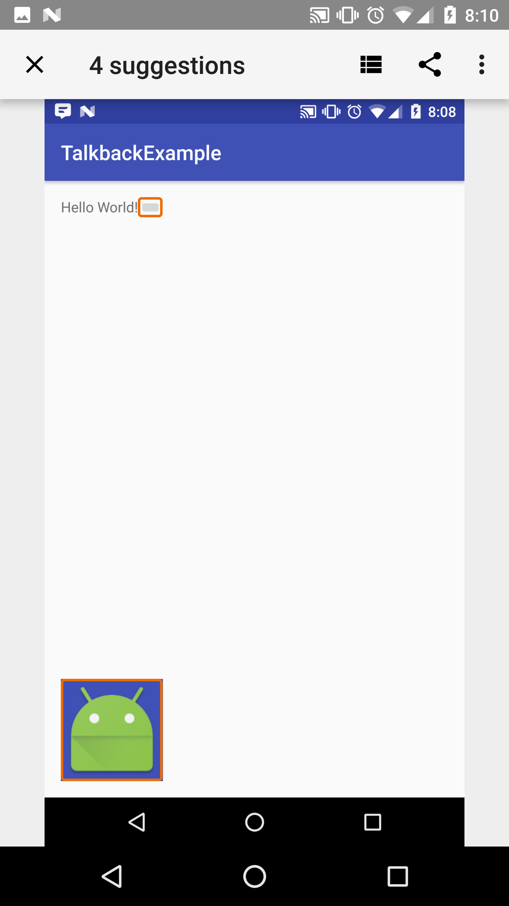
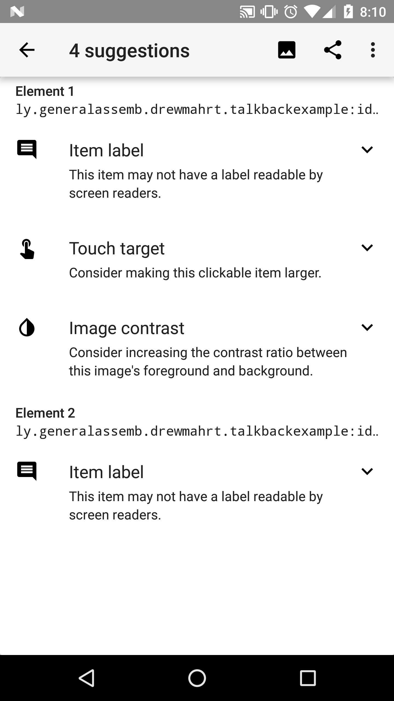

#  Building Accessible Apps

### LEARNING OBJECTIVES
*After this lesson, you will be able to:*
* Discuss app accessibility
* Add contentDescription to views
* Understand the focusable attribute
* Learn to use the Scanner app

### STUDENT PRE-WORK
*Before this lesson, you should:*
- Review the following lessons: Views 101, 102, 103.

### INSTRUCTOR PREP
*Before this lesson, instructors will need to:*
- Install Facebook on the phones/devices provided for the students in class.

### LESSON GUIDE

| TIMING  | TYPE  | TOPIC  |
|:-:|---|---|
| 5 min  | [Opening](#opening-why-to-build-accessible-apps-5-mins)  | Discuss lesson objectives |
| 15 min  | [Introduction](#introduction-accessibility-services-15-mins)  | Accessibility Services |
| 15 min  | [Guided Practice](#guided-practice-explore-talkback-15-mins)  | Explore TalkBack |
| 10 min  | [Introduction](#introduction-labeling-user-interface-elements-10-mins)  | Labeling User Interface Elements |
| 10 min  | [Independent Practice](#independent-practice-add-description-10-mins)  | Add description |
| 15 min  | [Introduction](#introduction-enabling-focus-navigation-15-mins)  | Enabling Focus Navigation |
| 10 min  | [Independent Practice](#independent-practice-add-focus-10-mins)  | Add focus |
| 5 min  | [Conclusion](#conclusion-5-mins)  | Review / Recap |

## Opening: Why to build accessible apps? (5 mins)

Many Android users have different abilities that require them to interact with their Android devices in different ways. These include
users who have visual, physical or age-related limitations that prevent them from fully seeing or using a touchscreen, and users with
hearing loss who may not be able to perceive audible information and alerts. Android provides accessibility features and services for
helping these users navigate their devices more easily, including text-to-speech, haptic feedback, gesture navigation, trackball and
directional-pad navigation. Android application developers can take advantage of these services to make their applications more accessible.

Let's go over some important vocabulary for this lesson:

**Haptic** - relating to the sense of touch. In particular, the perception and manipulation of objects using the senses of touch and proprioception.

## Introduction: Accessibility Services (15 mins)
A number of Accessibility Services are available to aid in navigating your Android device. Each can be enabled or disabled via the Accessibility menu under Settings. The most popular services are described below:

###### TalkBack  
TalkBack is one of the official accessibility services provided by Google. It uses synthesized speech to describe the results of actions, such as moving to a new control with the directional pad or clicking on a control, and events such as a notification or incoming call. TalkBack comes pre-installed on most Android phones.

###### Spiel  
Spiel is a third-party accessibility service that provides an alternative to TalkBack. It also uses synthesized speech to describe actions and events, but it has its own rules for speaking that may differ from TalkBack's. You can have both TalkBack and Spiel installed at the same time, and then enable whichever one you want to use. While it's perfectly safe to have both of them enabled, only one will actually work at a time. Spiel and TalkBack work very much the same way, so you shouldn't expect major differences.

###### Voice Readouts  
Voice Readouts is the Motorola accessibility service that is analogous to TalkBack and Spiel. It also uses synthesized speech to describe actions and events according to a set of rules. Voice Readouts comes pre-installed on the Droid 2 and Droid X devices. You can enable or disable it via the Accessibility menu under Settings.

###### KickBack  
KickBack is one of the official accessibility services provided by Google. It provides haptic feedback by vibrating the device briefly when you perform an action on the phone. It can be especially useful when using the touch screen. The feedback will inform you when you have found a valid control, like the slide-to-unlock handle. Additionally, it can be useful when navigating your device using a directional controller, as you know when your movement has resulted in an action. On devices running Android 4.0 and above, the functionality of KickBack is included in TalkBack.

###### SoundBack
SoundBack is one of the official accessibility services provided by Google. It plays a short sound when you perform an action on the phone, such as moving to a different control using the directional controller, or clicking on a control that performs an action. On devices running Android 4.0 and above, the functionality of SoundBack is included in TalkBack.


## Guided Practice: Explore TalkBack (15 mins)
In pairs, take a phone, go to the Settings in the phone, and turn on TalkBack (if it is not included in the settings, it is available for free on Google Play). Open Facebook and navigate through the app.

Try the following:

1. tap on the widget or tab to set focus
2. to perform a click or selection, use double tap
3. to scroll use two fingers
4. to exit the TalkBack, scroll the settings window from the top using two fingers, go to Settings and disable TalkBack.


## Introduction: Labeling User Interface Elements (10 mins)  

Many user interface controls depend on visual cues to indicate their meaning and usage. For example, a note-taking application might use an ImageButton with a picture of a plus sign to indicate that the user can add a new note. An EditText component may have a label near it that indicates its purpose. A user with impaired vision can't see these cues well enough to follow them, which makes them useless.

You can make these controls more accessible with the ```android:contentDescription``` XML layout attribute.  The text in this attribute does not appear on screen, but if the user enables accessibility services that provide audible prompts, then when the user navigates to that control, the text is spoken.

Let's look at an example:

```xml
<ImageButton
    android:id=”@+id/add_note_button”
    android:src=”@drawable/add_note”
    android:contentDescription=”@string/add_note”/>
```

Every ```ImageButton```, ```ImageView```, ```CheckBox``` in your application's user interface should have a ```contentDescription``` attribute. By including the description, an accessibility service that provides spoken feedback can announce "Add note" when a user moves focus to this button or hovers over it. For ```EditText``` fields, provide an ```android:hint``` attribute instead of a ```contentDescription```, to help users understand what content is expected when the text field is empty.


**If an item you can't interact with by default (ie ImageView) doesn't contain text, and has no content description, TalkBack will not announce it.** You can set the focusable and focusableInTouchMode attributes to true, but then it will just read as "unlabeled".

To force TalkBack to not announce something, add the following attribute to it.

```xml
android:importantForAccessibility="no"
```


## Independent Practice: Add description (10 mins)

Open your most recently created app and add the necessary attributes to the views to make the app more accessible.


## Introduction: Enabling Focus Navigation (15 mins)

**Briefly go over this section since we don't have access to this type of device.**

Focus navigation allows users with disabilities to step through user interface controls using a directional controller. Directional controllers can be physical, such as a trackball, directional pad (D-pad) or arrow keys, or virtual, such as the Eyes-Free Keyboard, or the gestures navigation mode available in Android 4.1 and higher. Directional controllers are a primary means of navigation for many Android users.

To ensure that users can navigate your application using only a directional controller, verify that all user interface (UI) input controls
in your application can be reached and activated without using the touchscreen.

A user interface element is reachable using directional controls when its ```android:focusable``` attribute is set to ```true```. Android
provides several APIs that let you control whether a user interface control is focusable and even request that a control be given focus:

* setFocusable()

* isFocusable()

* requestFocus()

##### Controlling focus order

When users navigate in any direction using directional controls, focus is passed from one user interface element (view) to another, as
determined by the focus order. This order is based on an algorithm that finds the nearest neighbor in a given direction. In rare cases,
the algorithm may not match the order that you intended or may not be logical for users. In these situations, you can provide explicit
overrides to the ordering using the following XML attributes in your layout file:

* `android:nextFocusDown` - Defines the next view to receive focus when the user navigates down.

* `android:nextFocusLeft` - Defines the next view to receive focus when the user navigates left.  

* `android:nextFocusRight` - Defines the next view to receive focus when the user navigates right.

* `android:nextFocusUp` - Defines the next view to receive focus when the user navigates up.


## Introduction: Accessibility Scanner (10 mins)

While screen readers are a major component of accessibility services, there are other requirements as well. ADA guidelines specify that elements you interact with (such as buttons) must be at least a minimum size, and meet a contrast ratio threshold with its colors.

Luckily, Google provides an accessibility scanner app that can analyze your app and point out its problems.

[Link to Scanner](https://play.google.com/store/apps/details?id=com.google.android.apps.accessibility.auditor&hl=en)







## Independent Practice: Accessibility Scanner (10 mins)

Open up another app from a previous lesson or lab, and use the Scanner tool on it. Identify any accessibility flaws, and try fixing them. Confirm you have fixed the problems by running it through the scanner again.


## Conclusion (5 mins)
To target as many users as possible, you have to think about the features that will make your app accessible. There are various accessibility services designed to complement one another. Your task as a developer is to make your app work well with such services. In most cases, implementing accessibility isn’t about radically restructuring your application, but rather working through the subtle details of accessibility. Making sure your application is accessible is an opportunity to look at your app from a different perspective, improve the overall quality of your app and ensure that all your users have a great experience.

- Why is building accessible apps important?
- What views require a special attention when building accessible apps?
