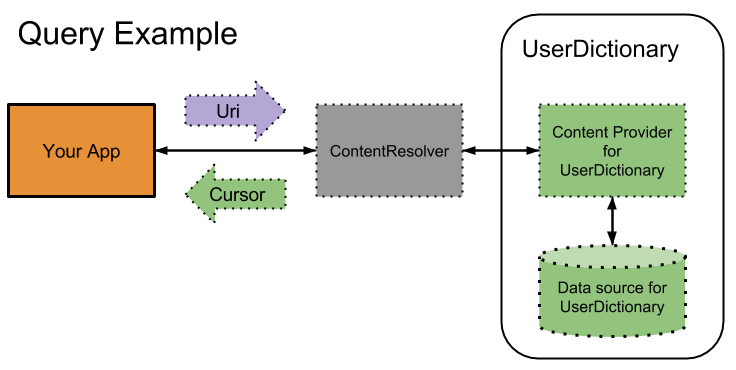

#  Content Providers

### Objectives
*After this lesson, students will be able to:*

* Describe what a content provider is
* Create a content provider and use it in the application

### Preparation
*Before this lesson, students should review the following lessons:*


### STUDENT PRE-WORK
*Before this lesson, you should already:*
- Read over lesson relating to SQLite and Threading

### INSTRUCTOR PREP
*Before this lesson, instructors will need to:*
- Open and test the provided starter and solution code


### LESSON GUIDE

| TIMING  | TYPE  | TOPIC  |
|:-:|---|---|
| 10 min  | [Opening](#opening-10-mins)  | Discuss lesson objectives |
| 10 min  | [Introduction](#introduction-uri-and-registering-content-provider-10-mins)  | URI and Registering Content Provider |
| 5 min  | [Demo](#demo-uri-matcher-5-mins)  | URI Matcher |
| 5 min  | [Guided Practice](#guided-practice-uri-matcher-5-mins)  | URI Matcher |
| 10 min  | [Demo](#demo-creating-a-content-provider-10-mins)  | Creating a Content Provider |
| 10 min  | [Introduction](#introduction-implementing-methods,-content-resolver-10-mins)  | Implementing Methods, Content Resolver |
| 15 min  | [Demo](#demo-implementing-methods-15-mins)  | Implementing Methods |
| 10 min  | [Guided Practice](#guided-practice-completing-the-content-provider-10-mins)  | Completing the Content Provider |
| 5 min  | [Demo](#demo-using-your-content-provider-5-mins)  | Using your Content Provider |
| 10 min  | [Independent Practice](#independent-practice-refactor-the-code-10-mins)  | Refactor the code |
| 5 min  | [Conclusion](#conclusion-5-mins)  | Review / Recap |

## Opening (10 mins)

#### What is a content provider?

Android provides multiple ways for different apps to communicate on the platform; in other words, an Android app can share its data with other apps or parts of the Android system! For example, an email app might need to query a person's contact details details in the phone book app.

In Android, the recommended way to share data is through content providers. A content provider is an owner of particular content, and it provides well-defined APIs to read, insert, update and delete that data. The content provider can internally use any place to store its data, like a local file, local database or some remote service. This flexibility of data storage is extremely useful, because it allows you to change where data is stored without modifying the overall logic of your app.

Before you start building a provider, decide if you need a content provider.

You'll need to build a content provider if you want to provide one or more of the following features:

* offer complex data or files to other applications
* allow users to copy complex data from your app into other apps
* provide custom search suggestions using the search framework
* Sync Adapters (this will be covered in a later lesson)

Today we are going to be working with our content provider within our own app. Tomorrow, we will show how content providers can be accessed externally by other apps.


## Introduction: URI and Registering Content Provider (10 mins)

Every content provider is associated with a content Uniform Resource Identifier (URI). A content URI is a URI that identifies data in a provider. It consists of:

* The scheme, which is always `content://` for a content URI
* The authority, which is a unique string identifying the specific content provider
* The path, which identifies a particular record or collection of records managed by the provider


#### URI anatomy


Let's look at the URI, `content://user_dictionary/words`:

* *content://* — the scheme identifying this as a content URI
* *user_dictionary* — the authority of the system user dictionary provider
* *words* — the path corresponding to the “words” table

A Content Provider uses the path to choose the table to access. A provider usually has a path for each table it exposes. Many providers allow you to access a single row in a table by appending an ID value to the end of the URI.

For example, to retrieve a row with an ID of 4 from user dictionary, you can use this content URI:  

**content://user_dictionary/words/4**


#### URI Matcher

To help you choose what action to take for an incoming content URI, the provider API includes the convenience class UriMatcher that maps content URI "patterns" to integer values.

A content URI pattern matches content URIs using wildcard characters:

- `*`: Matches a string of any valid characters of any length.
- `#`: Matches a string of numeric characters of any length.

## Demo: URI Matcher (5 mins)  

As an example of designing and coding content URI handling, consider a provider with the authority `com.example.app.provider` that recognizes the following content URIs pointing to tables:

* `content://com.example.app.provider/table1`: A table called table1.  
* `content://com.example.app.provider/table2/dataset1`: A table called dataset1.  
* `content://com.example.app.provider/table2/dataset2`: A table called dataset2.  
* `content://com.example.app.provider/table3`: A table called table3.

The provider also recognizes these content Uris if they have a row ID appended to them, as for example
`content://com.example.app.provider/table3/1` for the row identified by 1 in table3.

The snippet below is the example of how a Uri is declared in the Java class and how UriMatcher works:


## Guided Practice: URI Matcher (5 mins)

In pairs, take some time to look at the examples and discuss what these Uris match:

```java
"content://com.example.app.provider/*"
// for example: Matches any content URI in the provider.  
```

```java
"content://com.example.app.provider/table3/#"
```

```java
"content://com.example.app.provider/table3/6"
```  

```java
"content://com.example.app.provider/table3/#"
```

```java
"content://com.example.app.provider/table1/#/#"
```


## Demo: Creating a Content Provider (10 mins)


When we create a content provider, we have to register it in the Manifest file.

```xml
<provider
        android:name=".ProductsContentProvider"
        android:authorities="com.example.database.provider.ProductsContentProvider" />
```


Now we need to create our actual Content Provider

```java
public class ProductsContentProvider extends ContentProvider {

  private ProductsDBHandler mProductsDBHandler;

  public static final int PRODUCTS = 1;
  public static final int PRODUCTS_ID = 2;

  private static final UriMatcher sURIMatcher = new UriMatcher(UriMatcher.NO_MATCH);

  static {
    sURIMatcher.addURI(ProductsContract.AUTHORITY, ProductsDBHandler.TABLE_PRODUCTS, PRODUCTS);
    sURIMatcher.addURI(ProductsContract.AUTHORITY, ProductsDBHandler.TABLE_PRODUCTS + "/#", PRODUCTS_ID);
  }
}
```

In the above example we configured our UriMatcher. The UriMatcher takes a given Uri, and returns a value if it matches a provided Uri pattern. For instance, this matcher returns a value of 1 when the URI references the entire products table, and a value of 2 when the URI references the ID of a specific row in the products table.

The method `addURI()` maps an authority and path to an integer value.  The UriMatcher instance (named `sURIMatcher`) is now primed to return the value of PRODUCTS when just the products table is referenced in a URI and PRODUCTS_ID when the URI includes the ID of a specific row in the table.


## Introduction: Contracts

Contracts are used to define the properties involved with your ContentProvider, making it easily accessible for anyone that requires it. This includes things such as the authority, column names, and MIME types.

```java
public final class ProductsContract {
    public static final String AUTHORITY = "generalassembly.yuliyakaleda.contentprovider.ProductsContentProvider";
    public static final Uri BASE_CONTENT_URI = Uri.parse("content://" + AUTHORITY);

    public static final class Products implements BaseColumns{
        public static final String TABLE_PRODUCTS = "products";
        public static final String COLUMN_PRODUCTNAME = "productname";
        public static final String COLUMN_QUANTITY = "quantity";

        public static final Uri CONTENT_URI = Uri.withAppendedPath(BASE_CONTENT_URI,"products");

        public static final String CONTENT_TYPE = ContentResolver.CURSOR_DIR_BASE_TYPE
                + "/vnd.generassembly.yuliyakaleda.products";

        public static final String CONTENT_ITEM_TYPE = ContentResolver.CURSOR_ITEM_BASE_TYPE
                + "/vnd.generassembly.yuliyakaleda.products";
    }
}
```

## Introduction: Implementing Methods, Content Resolver (10 mins)

A **Content Resolver** object is used to access data in a content provider. You don't directly access a Content Provider to retrieve its data. The Content Resolver object sends requests to the Content Provider implementation’s object. This makes the provider perform the requested actions and return results.

<p align="center">
  
</p>

The abstract class ContentProvider defines six abstract methods that you must implement as part of your own concrete subclass. All of these methods except `onCreate()` are called by a client application that is attempting to access your content provider.

- onCreate
- query
- insert
- update
- delete
- getType

[Link to  Content Provider Documentation](http://developer.android.com/reference/android/content/ContentProvider.html)

With a partner, take one minute to predict the method functionality of these six methods.

If you couldn't get all of them, that's ok!  Let's talk about them together.

##### query()

This method retrieves data from your provider. You need to use the arguments to select the table to query, the rows and columns to return, and the sort order of the result. **The method returns the data as a Cursor object.** When called, this method is passed some or all of the following arguments:

* __URI__ – The URI specifying the data source on which the query is to be performed. This can take the form of a general query with multiple results, or a specific query targeting the ID of a single table row.
* __Projection__ – A row within a database table can comprise multiple columns of data. The projection argument is simply a String array containing the name for each of the columns that is to be returned in the result data set.
* __Selection__ – The “where” element of the selection to be performed as part of the query. This argument controls what rows are selected from the specified database. For example, if the query was required to select only products named “Cat Food” then the selection string passed to the `query()` method would read productName = “Cat Food”.
* __Selection Args__ – Any additional arguments that need to be passed to the SQL query operation to perform the selection.
* __Sort Order__ – The sort order for the selected rows.

##### insert()

This method inserts a new row into your provider. You need to use the arguments to select the destination table and to get the column values to use. **It returns a content URI for the newly-inserted row.**

##### update()

It updates existing rows in your provider. You need to use the arguments to select the table and rows to update and to get the updated column values. **It returns the number of rows updated.**  

##### delete()

It deletes rows from your provider. You need to use the arguments to select the table and the rows to delete. **The method returns the number of rows deleted.**

##### getType()

**It returns the MIME type corresponding to a content URI.** For instance, it could return plain text, images, raw data, etc.

##### onCreate()

It initializes your provider. The Android system calls this method immediately after it creates your provider. Notice that your provider is not created until a ContentResolver object tries to access it.

## Demo: Implementing Methods (15 mins)

Using the project from earlier, let's look at what each of these methods looks like in action.

##### onCreate()

The Android system calls `onCreate()` when it starts up the provider. You should perform only fast-running initialization tasks in this method, and defer database creation and data loading until the provider actually receives a request for the data. If you do lengthy tasks in `onCreate()`, you will slow down your provider's startup. In turn, this will slow down the response from the provider to other applications.

For example, if you are using a SQLite database, you can create a new SQLiteOpenHelper object in `ContentProvider.onCreate()`, and then create the SQL tables the first time you open the database. To facilitate this, the first time you call `getWritableDatabase()`, it automatically calls the `SQLiteOpenHelper.onCreate()` method.

```java
@Override
    public boolean onCreate() {
        mProductsDBHandler = ProductsDBHandler.getInstance(getContext());
        return false;
    }
```


#### getType()

The type returned should represent the data stored in your application. Ours will look like the following:

```java
@Nullable @Override
  public String getType(Uri uri) {
    int uriType = sURIMatcher.match(uri);
    switch (uriType){
      case PRODUCTS:
        return ProductsContract.Products.CONTENT_TYPE;
      case PRODUCTS_ID:
        return ProductsContract.Products.CONTENT_ITEM_TYPE;
    }
    return null;
  }
```

##### insert()

Passed as arguments to the method are a URI specifying the destination of the insertion and a ContentValues object containing the data to be inserted.
This method needs to perform the following tasks:

* Use the sUriMatcher to identify the URI type.
* Throw an exception if the URI is not valid.
* Perform a SQL insert operation to insert the data into the database table.
* Notify the corresponding content resolver that the database has been modified (we will see this used when we cover sync adapters).
* Return the URI of the newly added table row.

```java
@Override
  public Uri insert(Uri uri, ContentValues values) {
    int uriType = sURIMatcher.match(uri);

    long id = 0;
    switch (uriType) {
      case PRODUCTS:
        id = mProductsDBHandler.addProduct(values);
        break;
      default:
        throw new IllegalArgumentException("Unknown URI: " + uri);
    }
    getContext().getContentResolver().notifyChange(uri, null);
    return ContentUris.withAppendedId(ProductsContract.Products.CONTENT_URI,id);
  }
```

##### query()
When called, the `query()` method is required to perform the following operations:

* Use the sUriMatcher to identify the Uri type.
* Throw an exception if the URI is not valid.
* Execute the query operation on the database.
* Notify the content resolver of the operation.
* Return a Cursor object containing the results of the query.

```java
@Override
  public Cursor query(Uri uri, String[] projection, String selection, String[] selectionArgs, String sortOrder) {
    int uriType = sURIMatcher.match(uri);
    Cursor cursor = null;

    switch (uriType) {
      case PRODUCTS:
        cursor = mProductsDBHandler.findProduct(selection,selectionArgs,sortOrder,null);
        break;
      case PRODUCTS_ID:
        cursor = mProductsDBHandler.findProduct(selection,selectionArgs,sortOrder,uri.getLastPathSegment());
        break;
      default:
        throw new IllegalArgumentException("Unknown URI: "+uri);
    }

    cursor.setNotificationUri(getContext().getContentResolver(), uri);
    return cursor;
  }
```


## Guided Practice: Completing the Content Provider (10 mins)

Now let's work through completing the update and delete methods. Take 5 minutes with a partner, and using the previous methods as an example, come up with the steps our methods need to complete.

#### update()

When called, the `update()` method would typically perform the following steps:

* Use the sUriMatcher to identify the URI type.
* Throw an exception if the URI is not valid.
* Perform the appropriate update operation on the database
* Notify the content resolver of the database change.
* Return a count of the number of rows that were changed as a result of the update operation.


```java
@Override
  public int update(Uri uri, ContentValues values, String selection, String[] selectionArgs) {

    int uriType = sURIMatcher.match(uri);
    int rowsUpdated = 0;

    switch (uriType) {
      case PRODUCTS:
        rowsUpdated = mProductsDBHandler.updateProduct(values,selection,selectionArgs,null);
        break;
      case PRODUCTS_ID:
        String id = uri.getLastPathSegment();
        rowsUpdated = mProductsDBHandler.updateProduct(values,null,null,id);
        break;
      default:
        throw new IllegalArgumentException("Unknown URI: " + uri);
    }
    getContext().getContentResolver().notifyChange(uri, null);
    return rowsUpdated;
  }
```


##### delete()

When called, the `delete()` method would typically perform the following steps:
* Use the sUriMatcher to identify the URI type.
* Throw an exception if the URI is not valid.
* Obtain a reference to a writable instance of the underlying SQLite database.
* Perform the appropriate delete operation on the database depending on the selection criteria and the Uri type.
* Notify the content resolver of the database change.
* Return the number of rows deleted as a result of the operation.

```java
@Override
  public int delete(Uri uri, String selection, String[] selectionArgs) {

    int uriType = sURIMatcher.match(uri);
    int rowsDeleted = 0;

    switch (uriType) {
      case PRODUCTS:
        rowsDeleted = mProductsDBHandler.deleteProduct(selection,selectionArgs,null);
        break;
      case PRODUCTS_ID:
        String id = uri.getLastPathSegment();
        rowsDeleted = mProductsDBHandler.deleteProduct(null,null,id);
        break;
      default:
        throw new IllegalArgumentException("Unknown URI: " + uri);
    }
    getContext().getContentResolver().notifyChange(uri, null);
    return rowsDeleted;
  }
```


A typical `delete()` method is, in many ways, very similar to the `update()` method.


## Demo: Using your Content Provider (5 mins)

Now that our Content Provider is complete, we need to actually use it. Let's implement the logic for our add button together.


By accessing our Content Resolver, we can call the Content Provider's methods to perform operations on our database.

```java
private ContentResolver mContentResolver;
...
ContentValues values = new ContentValues();
values.put(ProductsContract.Products.COLUMN_PRODUCTNAME,mInputName.getText().toString());
values.put(ProductsContract.Products.COLUMN_QUANTITY,mInputQuantity.getText().toString());
Uri uri = mContentResolver.insert(CONTENT_URI,values);
```

## Demo: Cursor Loader

How are we going to get new entries added to our database to show on the screen?

Android provides us with a handy tool to access data stored in ContentProviders called a **CursorLoader**, but we will be covering these in the next lesson.

***

## Independent Practice: Refactor the code (10 mins)

Now that we had a look at all the methods the content provider is supposed to implement, you can run the project.

Note, there is only one button, but we will be using all four methods discussed in content providers:

* add - adds the given product and quantity
* find - retrieves name and quantity of a product from the content provider to display in the RecyclerView.
* delete - removes the product when the user long presses it in the RecyclerView
* update - updates the quantity of the given product when the increase or decrease quantity buttons are pressed


With a partner, complete the logic for the update and delete actions following the directions in the TODOs.


## Conclusion (5 mins)

- When do we need to use a content provider?
- Why do we need a URI?
- What are the main parts of a URI?
- What is a content resolver?
- What methods should be overridden when we create our custom content provider?

## Additional Materials

-[Provider element](http://developer.android.com/guide/topics/manifest/provider-element.html)
