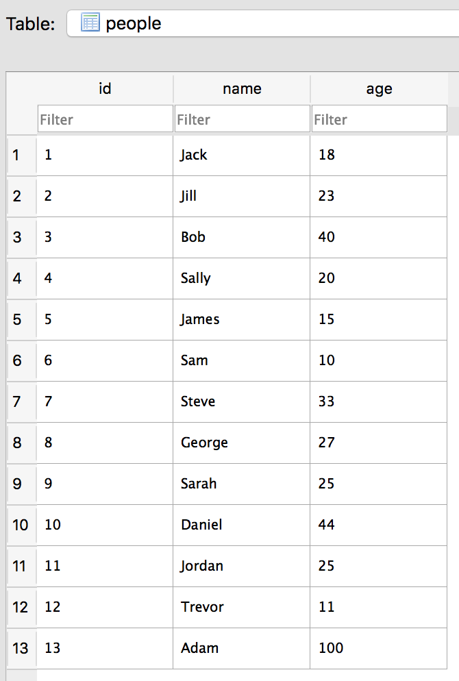

#  Enable Search


### LEARNING OBJECTIVES
*After this lesson, you will be able to:*
- Describe how SearchView works
- Implement and use a SearchView

### STUDENT PRE-WORK
*Before this lesson, you should already be able to:*
- Query a SQLite database using the query method
- Use Cursor Adapters

### INSTRUCTOR PREP
*Before this lesson, instructors will need to:*
- Read through the lesson
- Add additional instructor notes as needed
- Edit language or examples to fit your ideas and teaching style
- Open, read, run, and edit (optional) the starter and solution code to ensure it's working and that you agree with how the code was written
- This lesson can be somewhat tedious since there are a lot of little steps. Prompt the students before each section to give their prediction on how the code for that next section should work. Try to get them involved as much as possible to minimize the time you are writing code without student interaction.

---

### LESSON GUIDE

| TIMING  | TYPE  | TOPIC  |
|:-:|---|---|
| 5 min  | [Opening](#opening-5-mins)  | Discuss lesson objectives |
| 10 min  | [Introduction](#introduction-search-view-setup-10-mins)  | Search View Setup |
| 10 min  | [Guided Practice](#guided-practice-add-your-own-searchview-10-mins)  | Add your own SearchView |
| 15 min  | [Introduction](#introduction-search-view-behavior-15-mins)  | Search View Behavior |
| 15 min  | [Guided Practice](#guided-practice-search-view-behavior-15-mins)  | Search View Behavior |
| 10 min  | [Guided Practice](#guided-practice-performing-a-search-10-mins)  | Performing a search |
| 20 min  | [Independent Practice](#independent-practice-perform-a-search-20-minutes)  | Perform a Search |
| 5 min  | [Conclusion](#conclusion-5-mins)  | Review / Recap |
<a name="opening"></a>
## Opening (5 mins)

Many of the apps we use today have a search component built in to them, and today we will be learning how to implement search in our own apps. We have covered using databases, cursors, and RecyclerViews, and searching uses all of these in tandem.

> Ask the students for examples of where they have seen search in apps before.

> Check: Ask the students how they would implement search with the knowledge they currently have.

Luckily, Android provides some very handy built-in tools to make the process of adding search features much easier.

***

<a name="introduction"></a>
## Introduction: Search View Setup (10 mins)

The first step to building our search is to create the search bar the user will be entering their query in to. While we have the option of manually creating an EditText, and listening for a button click to begin the search, Android provides a much easier solution: Search View.

The Search View is a widget that is placed in the Toolbar. Normally it starts off with a search icon, and when you click on it, it expands into an EditText where you can type your query. When you're done with it, it collapses back into the icon. This allows us to save screen space, and have a smoother user experience.

Our app today will search through a small database filled with the numbers 0-9, and return how many of the number your search for are present.




***

<a name="demo"></a>
## Demo: Add your own SearchView (10 mins)

> Instructor Note: Have everyone do this along with you using the [SearchViewDemo](starter-code) starter code project (they will be using it in their guided practice, too).

Let's try adding our own SearchView!

> Ask the students to predict what file they think the search view should be added in, and why.

#### Menu item

In order to add the search box to the toolbar, we must create a menu layout, and add the search icon to it. The menu has its own layout XML files just like we have been using for the activities. The only difference is that we add `item` elements to them.

The first step is to create a new menu layout if one doesn't already exist, and add the Search View to it. In your resources folder, look for a menu folder.

If one doesn't exist, right click on the res folder, choose new, and then Android Resource Directory. In resource type, choose menu, then press ok. Now, right click on the menu folder, and choose new -> Menu Resource File. We're going to call ours `options_menu`.

Add the menu item to your menu.

```java
<?xml version="1.0" encoding="utf-8"?>
<menu xmlns:android="http://schemas.android.com/apk/res/android"
    xmlns:app="http://schemas.android.com/apk/res-auto">
    <item android:id="@+id/search"
        android:title="Search"
        android:icon="@android:drawable/ic_menu_search"
        app:showAsAction="collapseActionView|ifRoom"
        app:actionViewClass="android.support.v7.widget.SearchView" />
</menu>
```
> Instructor Note: Explain why we use collapseActionView.

#### Inflate the Menu item

The second part of adding the search is to actually make our newly created search icon appear on the screen. We do this through a method which is automatically called when the activity is being created, called onCreateOptionsMenu. This method is what controls all of the menus in the toolbar.

Now we need to use the onCreateOptionsMenu method to inflate our menu.

```java
@Override
public boolean onCreateOptionsMenu(Menu menu) {
    MenuInflater inflater = getMenuInflater();
    inflater.inflate(R.menu.options_menu, menu);

    return true;
}
```

Now we have a SearchView, but it doesn't do anything. This is because we haven't told it how to behave.

> Check: "Fist to Five" on whether the students feel comfortable with the content so far.

***

<a name="introduction"></a>
## Introduction: Search View Behavior (15 mins)

Setting up the Search View's behavior can be broken down into five steps. These steps can be contained in two categories: we need to make our app Searchable (configuration files), then we need to write the logic to perform the actual search. All of these steps might seem like a lot of code. Don't worry!  It will all become much clearer once we see them in action.

Section 1

1. Create searchable XML configuration file
2. Modify Manifest to make the app searchable
3. Set up SearchView in Activity
4. Register the Activity as searchable in the Manifest

Section 2

5. Add the code to perform the search and display the actual search results

The first step to making an app searchable is to create what is called a Searchable Configuration. This is an xml file that contains basic setup information for the search, such as the name of the app or activity we are making searchable, and a hint to tell the user what to search for.

The second step is to add meta-data to the manifest in the activity you want the SearchView to appear in. This meta-data points towards the configuration xml we just created in the step before.

The next step is to add some additional code to the onCreateOptionsMenu. This code will set our previously functionless SearchView to have the correct searchable configuration options we just created.

Next, we want to have our activity respond to a search intent. We do this using an intent-filter.

> Check: In groups, have students discuss why we are doing this instead of just responding to a key press and searching. (It adds the ability to start the search from another activity and to be included in the Global Search on the device).

Finally, our last step is to take the search query the user entered, perform the search, and show the results to the user! Our activity responds to a search request by accepting and processing the Search intent.

> Check: Ask the students to describe what happens in each of the two categories described above.

***

<a name="demo"></a>
## Guided Practice: Search View Behavior (15 mins)

Let's take this one step at a time.

> Check: After showing the code, prompt the students for what they think it does.

First, we create our searchable xml file. To do this, we need to create a new xml resource directory, then create a searchable.xml file.

```xml
<?xml version="1.0" encoding="utf-8"?>

<searchable xmlns:android="http://schemas.android.com/apk/res/android"
        android:label="@string/app_name"
        android:hint="@string/search_hint" />
```

There are many other options we can add to searchable, but for now we just need these two.

Next, we add the following meta-data to our manifest file in **the activity we want our SearchView to be in.** It is possible to have the search results appear in a separate Activity, but we are doing it all in one activity today.

This meta-data is telling the app that we want to use the search settings we created in searchable.xml for any searches.

```xml
<meta-data
      android:name="android.app.searchable"
      android:resource="@xml/searchable"/>
```


Next, we need to add some code to tie our SearchView to use the behavior defined in searchable.xml.

```java
// Associate searchable configuration with the SearchView
SearchManager searchManager =
        (SearchManager) getSystemService(Context.SEARCH_SERVICE);
SearchView searchView =
        (SearchView) menu.findItem(R.id.search).getActionView();
ComponentName componentName = new ComponentName(this,MainActivity.class);
searchView.setSearchableInfo(searchManager.getSearchableInfo(componentName));
```

> Check: Ask the students what they think each of the three lines are doing.

In the last line, the searchableInfo we are getting is gathered from the meta-data tag we just defined.

Our next step is to add the intent-filter to the activity we want to perform the search in. This tells anything trying to perform a search in our app that the following activity is able to receive search queries.

> Check: Ask the students what would happen if we didn't use singleTop in this situation

```xml
<activity android:name=".MainActivity">
  <intent-filter>
      <action android:name="android.intent.action.SEARCH" />
  </intent-filter>
...
</activity>
```

We're almost done! Now we just need to actually search the database.

***

<a name="guided-practice"></a>
## Guided Practice: Performing a search (10 mins)

> Check: Ask the students where the search should be performed on the database

```java
public List<Person> searchForOlderPeople(String query){

  SQLiteDatabase db = this.getReadableDatabase();

  Cursor cursor = db.query(NUMBERS_TABLE_NAME, // a. table
          NUMBERS_COLUMNS, // b. column names
          COL_AGE +" > ?", // c. selections
          new String[]{query}, // d. selections args
          null, // e. group by
          null, // f. having
          COL_AGE, // g. order by
          null); // h. limit

  List<Person> people = new ArrayList<>();

  if(cursor.moveToFirst()){
      while (!cursor.isAfterLast()){
          Person p = new Person(cursor.getString(cursor.getColumnIndex(COL_NAME)),
                  cursor.getInt(cursor.getColumnIndex(COL_AGE)));
          people.add(p);
          cursor.moveToNext();
      }
  }

  return people;
}
```

The search query is delivered in an Intent. When we displaying search results in the same activity we started the search from, it attempts to start a second instance of that activity. This is bad! With a slight modification to the manifest, we can tell the activity to only allow one instance to exist.

```xml
<activity
            android:name=".MainActivity"
            android:launchMode="singleTop">
...
</activity>
```

Just add the launchMode property to singleTop.

Finally, we add the code to handle our search in MainActivity. Since we aren't creating a new instance of the activity, we need to receive the search intent. This is delivered to a method called `onNewIntent`.

> Give the students a few minutes to try to figure out what code goes inside the if statement below.

```java
@Override
protected void onNewIntent(Intent intent) {
    setIntent(intent);
    handleIntent(intent);
}

private void handleIntent(Intent intent){
    if(Intent.ACTION_SEARCH.equals(intent.getAction())){
        String query = intent.getStringExtra(SearchManager.QUERY);
        List<Person> olderPeople = UserInfoHelper.getInstance(this).searchForOlderPeople(query);
        List<Person> similarPeople = UserInfoHelper.getInstance(this).searchSimilarNames(query);

        mAdapter.replaceData(olderPeople);
    }
}
```

***

<a name="ind-practice"></a>
## Independent Practice: Perform a Search (10 minutes)

Now you will perform a different search and display the results. Instead of searching by age, allow the user to enter a partial name and search for anything matching what they entered. For instance, searching "J" could return [Jack, James, Jill], but searching "Ja" would return [Jack, James].


> Check: Have students share out their solutions during the final 3 minutes of this activity. Were students able to create the desired deliverable(s)? Did it meet all necessary requirements / constraints?

***

<a name="conclusion"></a>
## Conclusion (5 mins)

We covered a lot of material, but now you know how to use searching in your apps! With practice, you can extend what you learned today to do many things. For instance, you could allow Android to search content from your app in the global search, which could increase the amount of time your app is used by people who have downloaded it. Another great feature you can add is autocomplete. We have only touched on the most basic search implementation today.

***

### ADDITIONAL RESOURCES
- [Setting up Search](http://developer.android.com/training/search/setup.html)
- [Create a Searchable Activity](https://developer.android.com/guide/topics/search/search-dialog.html#SearchableActivity)
