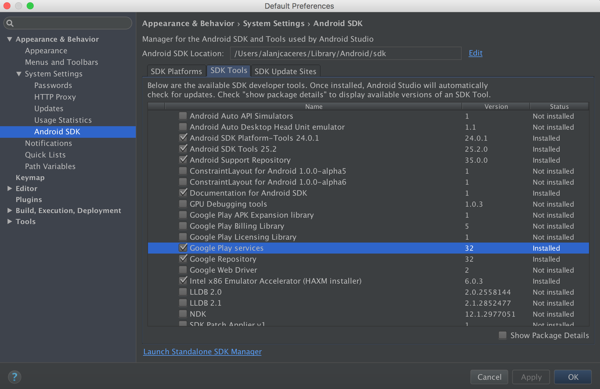
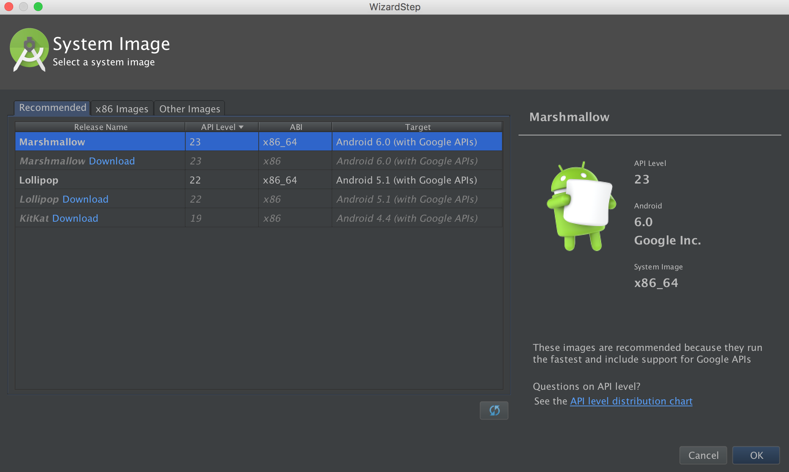
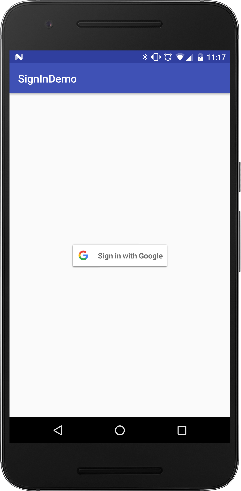
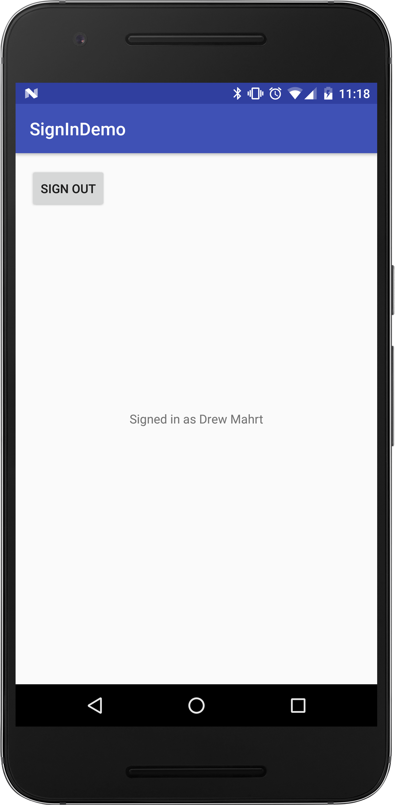

#  Google Play Services

### LEARNING OBJECTIVES
*After this lesson, you will be able to:*
- Describe what features Google Play Services offers
- Set up and use the Analytics API

### STUDENT PRE-WORK
*Before this lesson, you should already be able to:*
- Make APIs calls

---

### LESSON GUIDE

| TIMING  | TYPE  | TOPIC  |
|:-:|---|---|
| 5 min  | [Opening](#opening-5-mins)  | Discuss lesson objectives |
| 15 min  | [Introduction](#introduction-what-are-google-play-services-15-mins)  | What are Google Play Services |
| 5 min  | [Demo](#demo-google-apis-reference-5-mins)  | Google APIs Reference |
| 10 min  | [Guided Practice](#guided-practice-setting-up-your-app-10-mins)  | Setting up your app |
| 30 min  | [Guided Practice](#guided-practice-implementing-the-analytics-api-30-mins)  | Implementing the Analytics API |
| 20 min  | [Independent Practice](#independent-practice-topic-20-mins)  | Topic |
| 5 min  | [Conclusion](#conclusion-5-mins)  | Review / Recap |
<a name="opening"></a>
## Opening (5 mins)

Up until this point, we haven't really differentiated between Android, the open-source operating system, and the version of Android offered by Google. When you use a device certified by Google (the vast majority of phones and tablets you come across), you gain the ability to use many special services offered by Google. Today, we will be learning about some of them, and how to actually use them.

> Check: Think of some specific features they think Google might offer that don't come standard with Android.

***

<a name="introduction"></a>
## Introduction: What are Google Play Services (15 mins)

Google Play Services was first introduced in 2012 to allow new authentication abilities and easier ways to access Google Plus. Since then, it has expanded to include many cool features used by all kinds of apps. These include things like location, Sign In, Drive, Cast, Ads, Wallet, and Fit.

Some devices choose not to use Play Services, such as the Fire line by Amazon. They run a heavily customized version of Android without access to the Play Store or any Play Services.

Any device running Android 2.3 or newer has access to Play Services, and it automatically updates from the Play Store. Previously, new features were primarily rolled out through updates to Android, but with device manufacturers and service providers causing long delays, Play Services allows Google to quickly update all compatible devices.

Google updates Google Play Services often with some very cool features. Let's take a look at a [Youtube video](https://www.youtube.com/watch?v=-xwKQa9Tm5k).

Keep an eye on the Google Developers YouTube channel for new updates about new features from Google.


***

<a name="demo"></a>
## Demo: Google APIs Reference (5 mins)

Before we get started on actually using Google Play Services, [let's take a look at the available services](https://developers.google.com/android/guides/setup). This is a list of all the
Google Play Services we can import into our project.

***

<a name="demo"></a>
## Guided Practice: Setting up your app (10 mins)

We need to complete a few steps to prepare our app to use Google Play Services.

First, we need to check if we have the correct files downloaded in the SDK Manager. Open the SDK Manager, go to the SDK Tools tab, then make sure Google Play Services is checked.



Next, if you use an emulator, make sure you chose an image that includes Google Play Services.



***

<a name="guided-practice"></a>
## Guided Practice: Implementing the Sign In API (30 mins)

We are going to implement Google Sign In into an app using [Google's integration guide](https://developers.google.com/identity/sign-in/android/start-integrating).

We are going to make some modifications to the code included in the guide so our app looks like this:






#### Handling Already Signed In Users

Right now, the login button is shown every time the app is started. Obviously we don't want that to always be the case. Luckily, we can easily check to see if a user is already logged in.

We attempt to retrieve login credentials if they exist, and if they do, we update the UI accordingly.

```java
@Override
protected void onStart() {
    super.onStart();
    OptionalPendingResult<GoogleSignInResult> opr = Auth.GoogleSignInApi.silentSignIn(mGoogleApiClient);
    if (opr.isDone()) {
        GoogleSignInResult result = opr.get();
        handleSignInResult(result);
    }else {
        Log.e(TAG, "onStart: Not logged in");
    }
}
```


***

<a name="conclusion"></a>
## Conclusion (5 mins)

The Google Play Services API have grown to encompass a very large set of features, and they can be difficult to navigate around sometimes, but once you get used to them, they are extremely helpful. With their assistance, you are able to add some extremely powerful capabilities with relatively little effort.

***

### ADDITIONAL RESOURCES
- [Google Play Services](https://developers.google.com/android/guides/overview)
- [Google Play Services Gradle Import List](https://developers.google.com/android/guides/setup)
- [Adding Google Services to your app](https://developers.google.com/mobile/add)
- [Event Tracking](https://developers.google.com/analytics/devguides/collection/android/v4/events)
