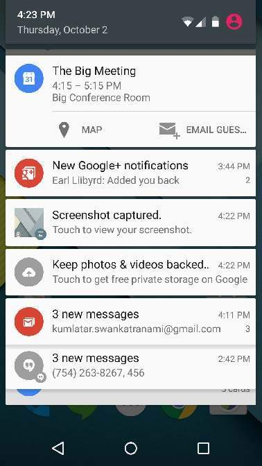
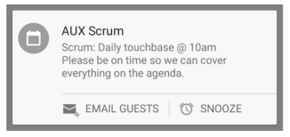
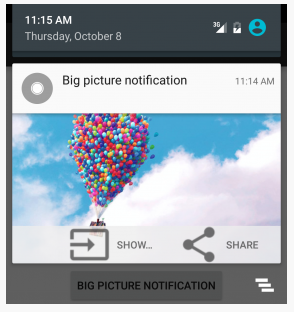
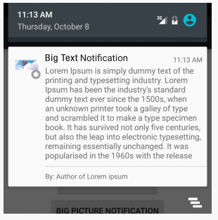
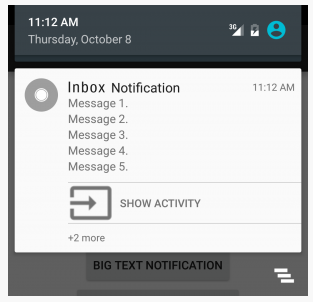

#  Notifications

### LEARNING OBJECTIVES
*After this lesson, you will be able to:*

- Identify types of notifications
- Create and dismiss notifications
- Set a priority for a notifications
- Create expanded notifications

### STUDENT PRE-WORK
*Before this lesson, you should already be able to:*
- Send intents
- Work with bitmaps

### INSTRUCTOR PREP
*Before this lesson, instructors will need to:*
- Create an application to demo creating notifications
- Open and run the solution code to ensure it works

---

### LESSON GUIDE

| TIMING  | TYPE  | TOPIC  |
|:-:|---|---|
| 5 min  | [Opening](#opening-5-mins)  | Discuss lesson objectives |
| 5 min  | [Introduction](#introduction-creating-a-notification-5-mins)  | Creating a Notification |
| 5 min  | [Demo](#demo-create-a-notification-builder-5-mins)  | Create a Notification Builder |
| 15 min  | [Introduction](#introduction-actions-and-priority-15-mins)  | Actions and Priority |
| 10 min  | [Demo](#demo-actions-10-mins)  | Actions |
| 15 min  | [Guided Practice](#guided-practice-create-a-notification-on-button-click-15-mins)  | Create a notification on Button click |
| 10 min  | [Demo](#demo-applying-an-expanded-layout-to-a-notification-10-mins)  | Applying an expanded layout to a notification |
| 20 min  | [Independent Practice](#independent-practice-applying-an-expanded-layout-to-a-notification-20-mins)  | Applying an expanded layout to a notification |
| 5 min  | [Conclusion](#conclusion-5-mins)  | Review / Recap |

## Opening (5 mins)

A notification is a message you can display to the user outside of your application's normal UI. When you tell the system to issue a notification, it first appears as an icon in the notification area. To see the details of the notification, the user opens the notification drawer. Both the notification area and the notification drawer are system-controlled areas that the user can view at any time.

<p align="center">
  
</p>


## Introduction: Creating a Notification (5 mins)

The first step in creating notification is to create a notification builder. Once you have `Builder` object, you can set its notification properties using `Builder` object as per your requirement. It is mandatory to set the following for any notification:

* A small icon, set by `setSmallIcon()`
* A title, set by `setContentTitle()`
* Detail text, set by `setContentText()`

#### Removing notifications

Notifications remain visible until one of the following happens:

* The user dismisses the notification either individually or by using "Clear All" (if the notification can be cleared)
* The user clicks the notification, and you called `setAutoCancel()` when you created the notification
* You call `cancel()` for a specific notification ID; this method also deletes ongoing notifications
* You call `cancelAll()`, which removes all of the notifications you previously issued
* Setting the flag `setAutoCancel(true)` on the builder object will make it so the notification is automatically canceled when the user clicks it in the panel.


## Demo: Create a Notification Builder (5 mins)


In the snippet below, we create a new Notification object (line 1) and then set its properties: icon (line2), title (line3), text(line4). The method `setAutoCancel(true)` dismisses the notification when it is clicked. The method `setOngoing(true)` prevents the notification from being dismissed.

```java
NotificationCompat.Builder mBuilder = new NotificationCompat.Builder(this);
mBuilder.setSmallIcon(android.R.drawable.ic_dialog_alert);
mBuilder.setContentTitle("Notification Alert, Click Me!");
mBuilder.setContentText("Hi, This is Android Notification Detail!");
mBuilder.setAutoCancel(true);

NotificationManager notificationManager =
        (NotificationManager) getSystemService(Context.NOTIFICATION_SERVICE);
    notificationManager.notify(NOTIFICATION_ID, mBuilder.build());
```

You pass the Notification object to the system by calling `NotificationManager.notify()` to send your notification. Make sure you call `NotificationCompat.Builder.build()` method on builder object before notifying it. This method combines all of the options that have been set and return a new Notification object.


#### Priority

If you wish, you can set the priority of a notification. The priority acts as a hint to the device UI about how the notification should be displayed.

To set a notification's priority, call `NotificationCompat.Builder.setPriority()` and pass in one of the NotificationCompat priority constants. There are five priority levels, ranging from PRIORITY_MIN (-2) to PRIORITY_MAX (2); if not set, the priority defaults to PRIORITY_DEFAULT (0).

Priority is an indication of how much of the user's attention should be consumed by this notification. Low-priority notifications may be hidden from the user in certain situations, while the user might be interrupted for a higher-priority notification. The system will make a determination about how to interpret this priority when presenting the notification.

<p align="center">
    
</p>


## Introduction: Actions and Priority (15 mins)

#### Actions

An action allows users to go directly from the notification to an Activity in your application, where they can look at one or more events or continuing interacting with the application.

A notification can provide multiple actions. You should always define the action that's triggered when the user clicks the notification; usually, this action opens an Activity in your application. You can also add buttons to the notification that perform additional actions such as snoozing an alarm or responding immediately to a text message.

<p align="center">
  
</p>

Inside a Notification, the action itself is defined by a `PendingIntent` containing an Intent that starts an Activity in your application. A pending intent is a token that you give to another application (e.g., notification manager, alarm manager or other 3rd party applications), which allows this other application to use the permissions of your application to execute a predefined piece of code.

To associate the PendingIntent with a gesture, call the appropriate method of `NotificationCompat.Builder`. For example, if you want to start an Activity when the user clicks the notification text in the notification drawer, you add the PendingIntent by calling `setContentIntent()`.

Starting an Activity when the user clicks the notification is the most common action scenario. You can also start an Activity when the user dismisses a notification.


## Demo: Actions (10 mins)


```java
Intent intent = new Intent(this, SecondActivity.class);
// use System.currentTimeMillis() to have a unique ID for the pending intent
PendingIntent pIntent = PendingIntent.getActivity(this, (int) System.currentTimeMillis(), intent, 0);

NotificationCompat.Builder mBuilder = new NotificationCompat.Builder(this);
mBuilder.setSmallIcon(android.R.drawable.ic_dialog_alert);
mBuilder.setContentTitle("Notification Alert, Click Me!");
mBuilder.setContentText("Hi, This is Android Notification Detail!");
mBuilder.setContentIntent(pIntent);
mBuilder.setPriority(Notification.PRIORITY_MAX);

NotificationManager mNotificationManager = (NotificationManager) getSystemService(Context.NOTIFICATION_SERVICE);
// NOTIFICATION_ID allows you to update the notification later on.
mNotificationManager.notify(NOTIFICATION_ID, mBuilder.build());
```

In the above snippet we create an intent that will get attached to our notification. Thus, when we click it, the user gets redirected to `SecondActivity.class`. A regular intent gets wrapped up in pending intent, which takes in the following arguments:

* context
* requestCode - private request code for the sender
* intent - intent of the activity to be launched
* flags - to control which unspecified parts of the intent that can be supplied when the actual send happens.

After we create a new pending intent, we pass it to Notification builder through `setContentIntent(pIntent)` method. We also set the highest priority to this notification. As the last step of our notification process, we need to get notification manager and `notify()` it about the message passing in a notification id and notification itself.

To add buttons below the notification, add the following code.

```java
mBuilder.addAction(android.R.drawable.ic_input_add,"Hello",pIntent);
mBuilder.addAction(android.R.drawable.ic_input_get,"Hello2",pIntent);
```


## Demo: Applying an expanded layout to a notification (10 mins)


Notifications can be expanded to a larger view so that you can see more detailed info in the notification drawer. In order to expand notifications, you can use `NotificationCompat.Builder.setStyle()`, which takes in a layout that can be displayed in the expanded view. The expanded notifications are not available on platforms prior to Android 4.1.

There are three styles to be used with the big view:

* **big picture style** - displays a bitmap up to 256 dp tall similar to a screenshot notification:  

<p align="center">
    
</p>

Here's the code to do this:

```java
NotificationCompat.BigPictureStyle bigPictureStyle = new NotificationCompat.BigPictureStyle();
bigPictureStyle.bigPicture(BitmapFactory.decodeResource(getResources(),R.drawable.big_image)).build();
```

* **big text style** - displays a large text block to show the user more details on the item at hand:    
  

Here's the code to do this:

```java
NotificationCompat.BigTextStyle bigText = new NotificationCompat.BigTextStyle();
bigText.bigText("Lorem Ipsum is simply dummy text of the printing and typesetting industry. Lorem Ipsum has been the industry's standard dummy text ever since the 1500s, when an unknown printer took a galley of type and scrambled it to make a type specimen book. It has survived not only five centuries, but also the leap into electronic typesetting, remaining essentially unchanged. It was popularised in the 1960s with the release of Letraset sheets containing Lorem Ipsum passages, and more recently with desktop publishing software like Aldus PageMaker including versions of Lorem Ipsum.");
bigText.setBigContentTitle("Big Text Notification");
bigText.setSummaryText("By: Author of Lorem ipsum");
```

* **inbox style** - displays rows of text like a listView similar to the Gmail notification for multiple emails:    

<p align="center">
    
</p>

Here's the code to do this:

```java
NotificationCompat.InboxStyle inboxStyle = new NotificationCompat.InboxStyle();
inboxStyle.setBigContentTitle("Inbox Notification");
inboxStyle.addLine("Message 1.");
inboxStyle.addLine("Message 2.");
inboxStyle.addLine("Message 3.");
inboxStyle.addLine("Message 4.");
inboxStyle.addLine("Message 5.");
inboxStyle.setSummaryText("+2 more");
```


## Independent Practice: Applying an expanded layout to a notification (20 mins)

Add 3 buttons - Big Text Style, Big Picture Style, Inbox Style - to the project you've been working on. Also, use the code above to help you create 3 types of expanded notifications. When the notification is clicked, it should open another activity (Second Activity). You can use any picture for Big Picture Style notification.

If you get stuck, check out the [solution-code](solution-code).


## Conclusion (5 mins)

- What is a notification?
- Which 3 properties must be set on the builder object?
- What types of expanded notifications you have got familiar with?
- How do you dismiss a notification?
