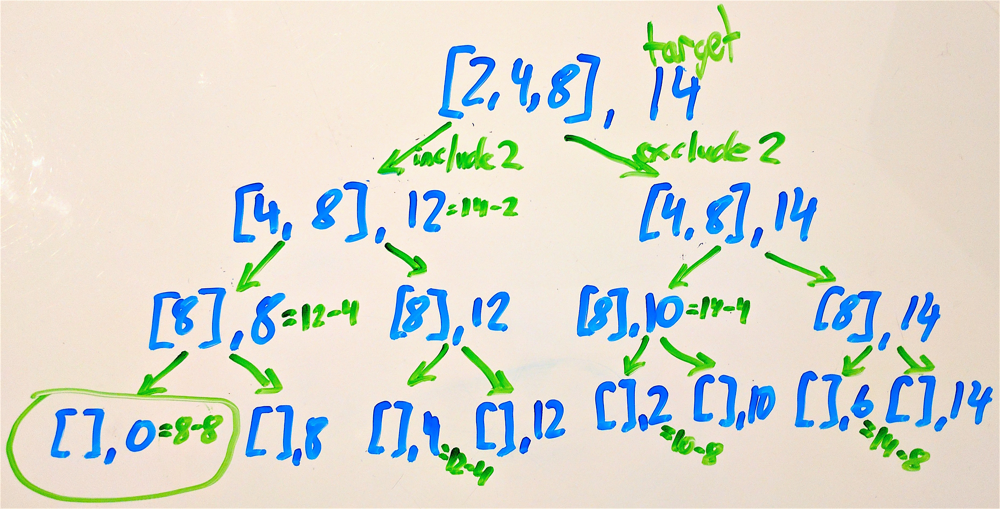

#  Whiteboard Practice: More Recursion

## Exercise

Team up in groups of 2 or 3 and take turns working on the following problems. Pretend you are in an interview setting:
- Keep talking!
- Ask questions (to the instructors, or to your teammates)
- Consider starting with an example, showing the expected outputs for sample inputs
- Consider writing pseudocode before Java to make your steps clear to both you and the interviewer

#### Requirements

Take turns working through these problems on the whiteboard. It's OK if you don't finish them all. Make as much progress as you can.

1. **Count X:** Given a string, compute recursively (no loops) the number of lowercase 'x' chars in the string.
  - `countX("xxhixx")` -> 4
  - `countX("xhixhix")` -> 3
  - `countX("hi")` -> 0

    One possible solution:

    ```java
    public int countX(String str) {
        if (str.length() == 0) {
            // base case: empty string
            return 0;
        } else {
            // otherwise, see if head is 'x' and call again w/ tail
            return (str.charAt(0) == 'x' ? 1 : 0) + countX(str.substring(1));
        }
    }
    ```

2. **End X:** Given a string, compute recursively a new string where all the lowercase 'x' chars have been moved to the end of the string.
  - `endX("xxre")` -> "rexx"
  - `endX("xxhixx")` -> "hixxxx"
  - `endX("xhixhix")` -> "hihixxx"

    One possible solution:

    ```java
    public String endX(String str) {
        if (str.length() <= 1) {
            // base case: empty or 1 char string
            return str;
        } else if (str.charAt(0) == 'x') {
            // if head is x, move to end and call w/ tail
            return endX(str.substring(1)) + "x";
        } else {
            // if head not x, keep at front and call w/ tail
            return str.substring(0, 1) + endX(str.substring(1));
        }
    }
    ```

3. **Group Sum:** Given an array of ints, is it possible to choose a group of some of the ints, such that the group sums to the given target? This is a classic backtracking recursion problem. Once you understand the recursive backtracking strategy in this problem, you can use the same pattern for many problems to search a space of choices. Rather than looking at the whole array, our convention is to consider the part of the array starting at index start and continuing to the end of the array. The caller can specify the whole array simply by passing start as 0. No loops are needed -- the recursive calls progress down the array.

  - `groupSum(0, [2, 4, 8], 10)` -> true
  - `groupSum(0, [2, 4, 8], 14)` -> true
  - `groupSum(0, [2, 4, 8], 9)` -> false

    One possible solution:

    ```java
    public boolean groupSum(int start, int[] nums, int target) {
        if (start >= nums.length) {
            // base case: we've already considered every element in nums
            return target == 0;
        } else {
            // two possibilities: include value at start and proceed,
            // or exclude it and proceed. See if either work.
            return groupSum(start + 1, nums, target - nums[start])
                || groupSum(start + 1, nums, target);
        }
    }
    ```

    Sample call to `groupSum(0, [2, 4, 8], 14)`:
    
    

#### Deliverable

No deliverable - just practice working through problems out loud on a whiteboard
