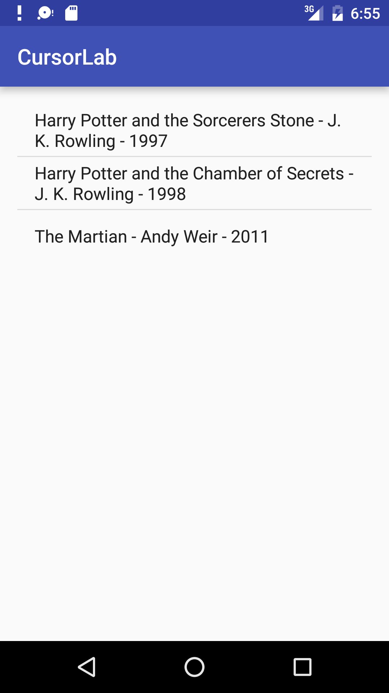

#  Cursors Intro

### LEARNING OBJECTIVES
*After this lesson, you will be able to:*
- Describe the purpose of a Cursor
- Manipulate a Cursor

### STUDENT PRE-WORK
*Before this lesson, you should already be able to:*
- Use arrays and ArrayLists to store and manipulate data
- Use helper methods of an object class

### INSTRUCTOR PREP
*Before this lesson, instructors will need to:*
- Read through the lesson
- Add additional instructor notes as needed
- Edit language or examples to fit your ideas and teaching style
- Open, read, run, and edit (optional) the starter and solution code to ensure it's working and that you agree with how the code was written

---

### LESSON GUIDE

| TIMING  | TYPE  | TOPIC  |
|:-:|---|---|
| 5 min  | [Opening](#opening-5-mins)  | Discuss lesson objectives |
| 5 min  | [Introduction](#introduction-cursors-5-mins)  | Cursors |
| 10 min  | [Demo](#demo-cursors-10-mins)  | Cursors |
| 10 min  | [Independent Practice](#independent-practice-cursor-practice-10-mins)  | Cursor practice |
| 45 min  | [Independent Practice](#independent-practice-more-cursor-practice-45-mins)  | More Cursor practice |
| 10 min  | [Conclusion](#conclusion-10-mins)  | Review / Recap |
<a name="opening"></a>
## Opening (5 mins)

So far we've been introduced to what databases are and how to use SQL to access and manipulate the data. These are all key pieces of information, but how does it all fit into Android? In Android, whenever we query data from the database, it is given back to us in a special object called a Cursor.


***

<a name="introduction"></a>
## Introduction: Cursors (5 mins)

Data retrieved from the SQLite database in Android is always returned to us in a Cursor object. The Cursor gives us a way to access the data in an organized manner with many helper methods.

You can think of it similar to how we have arrays and ArrayLists - instead of containing the results in some raw data type we would manually work through, the Cursor object helps us to do all of this.


<a name="demo"></a>
## Demo: Cursors (10 mins)

Open up the [CursorDemo](starter-code) project.

The first step to using a Cursor is to obtain one. As we mentioned earlier, any query results are returned in a Cursor:

```java
Cursor cursor = db.rawQuery("SELECT * FROM tbl_countries",null);
```

We have the option of using a helper method provided to us, but we will be covering these later.

```java
Cursor cursor = db.query("tbl_countries",null, null, null, null, null, null);
```

At a high level, this syntax connects to and queries the `tbl-countries` data table in your database. We will go into more depth about connecting to and modifying a database in a later lesson.

For now, let's look at some of the helper methods the Cursor object gives us.

To get the number of results in the query:

```java
cursor.getCount()
```

To get the number of columns in the results:

```java
cursor.getColumnCount()
```

We can even get the names of the columns:

```java
cursor.getColumnNames()
```

Since our Cursor has a position, we need to move it to the beginning of the cursor if we want to iterate through the results. Then, we'll be able to use a while loop and `moveToNext` to make your way through the results.

`Get` methods include methods like the ones above and can be used to get individual column values from the position the pointer is currently referencing. The parameter these methods take is the column index, and you pass this as an integer:

Here are the steps for moving through a cursor.

1. Check if data exists in the cursor by attempting to move the cursor to the first position.
2. Start a while loop, making sure the current position isn't after the last spot.
3. Move the cursor to the next position.

```java
if(cursor.moveToFirst()){
  while (!cursor.isAfterLast()) {
    Log.d(TAG,"DB result "+cursor.getString(0));
    cursor.moveToNext();
  }
}
```


We can make a slight modification to this. Right now the index we use in getString is hard-coded. What if new columns are added or they are rearranged? Our code would break!

Cursors provide us an easy way to get around this problem by finding the correct integer for us if we give it the column name. It is called **getColumnIndex**.

```java
cursor.getString(cursor.getColumnIndex("country_name"))
```


The last thing to remember is to always close your cursors when you're finished with them. This helps free up memory because an open cursor still has some connections remaining to the database object.

```java
cursor.close();
```


***

<a name="ind-practice"></a>
## Independent Practice: Cursor practice (10 mins)

Using the [existing code](starter-code/CursorDemo) from the previous example, print out the population of each country along with the name. Use the `getColumnIndex` method to get the correct index.

**Bonus**: See if you can figure out another way we can loop through the cursor.


## Independent Practice: More Cursor practice (45 mins)

> ***Note:*** _This can be a pair programming activity or done independently._

Now that we've learned the basics of obtaining and using Cursors, it's time to try an extended exercise. You've been provided with an app that has a sample database. It contains a book table that has the columns "title", "author", and "year".

You will get a cursor that contains all of the data in the table and insert each row as a String in an ArrayList, which will then be printed to the console using a Log statement. Each row should be in the format **"Title - Author - Year"**.

#### Requirements

- Query all of the data in the table
- Insert each row in an ArrayList as a single String
- Display each row in the console using a Log statement

**Bonus:**

- Sort the results in alphabetical order by title
- Print the results backwards, starting the cursor from the last position and moving to the first

#### Starter code

Use the provided [starter-code](starter-code/CursorExercise) to set up your database.

#### Deliverable

An android app that fulfills the requirements above and looks like this:



Read up on the [Cursors documentation](http://developer.android.com/reference/android/database/Cursor.html) as needed.

<a name="conclusion"></a>
## Conclusion (10 mins)


Cursors make accessing the data retrieved from our databases extremely easy and fast. They are a key part of working with databases in Android.

***

### ADDITIONAL RESOURCES
- [Cursor Documentation](http://developer.android.com/reference/android/database/Cursor.html)
