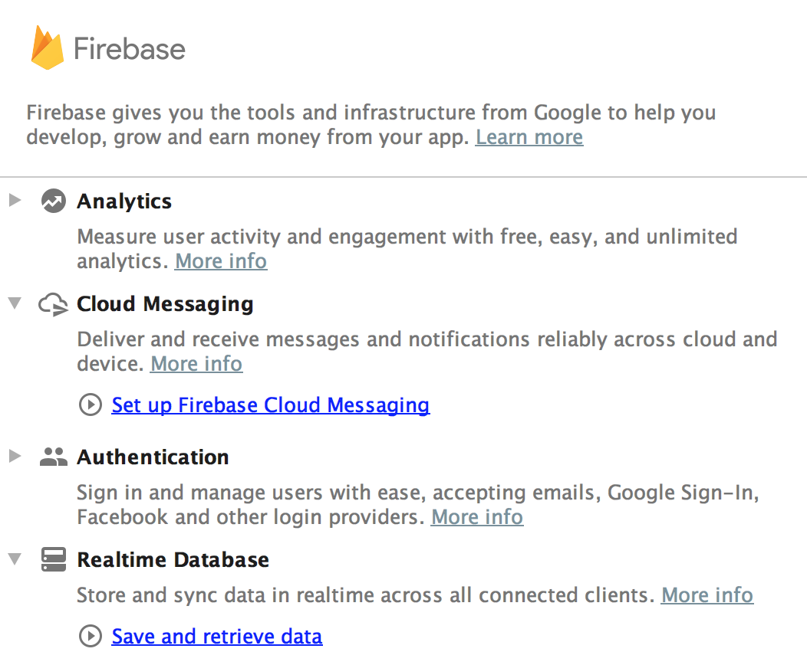
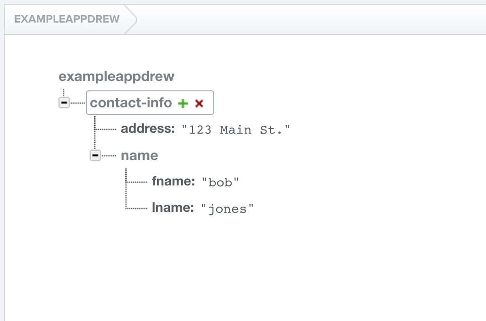

#  Firebase


### LEARNING OBJECTIVES
*After this lesson, you will be able to:*
- List components of the Firebase Platform
- Assess the advantages and disadvantages of Firebase Database
- Explain how data is stored in Firebase
- Integrate Firebase into your apps

### STUDENT PRE-WORK
*Before this lesson, you should already be able to:*
- Describe the basics of databases

### INSTRUCTOR PREP
*Before this lesson, instructors will need to:*
- Read through the lesson
- Add additional instructor notes as needed
- Edit language or examples to fit your ideas and teaching style
- Open, read, run, and edit (optional) the starter and solution code to ensure it's working and that you agree with how the code was written

---

### LESSON GUIDE

| TIMING  | TYPE  | TOPIC  |
|:-:|---|---|
| 5 min  | [Opening](#opening-5-mins)  | Discuss lesson objectives |
| 10 min  | [Introduction](#introduction-what-is-firebase-10-mins)  | What is Firebase |
| 10 min  | [Demo](#demo-setting-up-firebase-10-mins)  | Setting Up Firebase |
| 10 min  | [Introduction](#introduction-storing-data-in-firebase-10-mins)  | Storing Data in Firebase |
| 5 min  | [Demo](#demo-retrieving-data-5-mins)  | Retrieving Data |
| 5 min  | [Demo](#demo-writing-data-5-mins)  | Writing Data |
| 5 min  | [Introduction](#introduction-child-events-5-mins)  | Child Events |
| 5 min  | [Demo](#demo-child-events-5-mins)  | Child Events |
| 10 min  | [Guided Practice](#guided-practice-binding-data-to-a-listview-10-mins)  | Binding data to a ListView |
| 5 min  | [Introduction](#introduction-firebaseui-5-mins)  | FirebaseUI |
| 5 min  | [Demo](#demo-firebaseui-5-mins)  | FirebaseUI |
| 10 min  | [Independent Practice](#independent-practice-topic-10-mins)  | Topic |
| 5 min  | [Conclusion](#conclusion-5-mins)  | Review / Recap |
<a name="opening"></a>
## Opening (5 mins)

Databases can be a crucial part of our apps, but we are normally limited by this data being isolated to each device. The obvious solution would be to host our database on the internet, and access it from the app. While this sounds like a great idea, this can result in long delays. Firebase provides us with a fast, easy to set up answer.


***

<a name="introduction"></a>
## Introduction: What is Firebase (10 mins)

In 2016, Google updated the Firebase platform to include many tools, such as Database, Auth, Cloud Messaging, Analytics, Notifications, Storage, Hosting, Test Lab, Crash Reporting, Remote Config, and Ads. Previously, it was constrained to database and auth purposes. We will be concentrating on the Database portion.

Firebase Database is a quick way to store your app's data on the cloud in a structured, but very flexible manner. While it holds your data in a database, it is fundamentally different from what we're used to in SQLite.

In Firebase, you don't set up Columns, Data types, keys, etc. ahead of time. You simply add and modify the data on-the-fly. Some of the biggest features of Firebase are how fast it is, and how quickly it can automatically sync the data on your apps. As soon as changes are made online, all apps connected to your Firebase database are notified of the changes, and can update their view accordingly. This is not just limited to Android, but reflects across all platforms (iOS, web, etc.).

[Let's watch a quick video.](https://www.youtube.com/watch?v=U5aeM5dvUpA&list=PLl-K7zZEsYLmOF_07IayrTntevxtbUxDL&index=12)
[Tetris Example](https://youtu.be/SLgHfH7KzXU?t=49s)


***

<a name="demo"></a>
## Demo: Setting Up Firebase (10 mins)

Actually setting up Firebase is extremely simple. After creating a new Android Studio project, go to Tools -> Firebase.

Then choose Realtime Database from the right, and then Save and Retrieve Data.



Let's follow the directions on the screen.

This automatically imports the necessary libraries with Gradle, and adds the Internet permission to the Manifest.

First, we need to modify the rules for our database to allow for unauthenticated access. Normally you will not want to do this, but for this example we won't be working with authentication.

In the Firebase console, find your app, then go to Database -> Rules. Modify the text to look like the following:

```json
{
  "rules": {
    ".read": "auth == null",
    ".write": "auth == null"
  }
}
```


***

<a name="introduction"></a>
## Introduction: Storing Data in Firebase (10 mins)

As we mentioned before, data isn't stored in the same column structure we were used to in SQLite. Let's take a look at some sample data.




This is just like JSON data, with nested data structures of key-value pairs. In fact, we can even export it as a json file.


This gives us great flexibility in terms of how we store the data, as well as quickly changing the details of the data, but we lose a lot of the structure and safety checks associated with a normal relational database.

***

<a name="demo"></a>
## Demo: Writing Data (5 mins)

We are going to allow the user to type in text into an EditText, and store it in Firebase. Eventually, we will sync a TextView to display whatever is in the database.

First, let's set up our TextView, and EditText, and a Button to submit the text.

```xml
<EditText
    android:id="@+id/edit_text"
    android:layout_width="match_parent"
    android:layout_height="wrap_content"/>

<Button
    android:id="@+id/submit_button"
    android:layout_width="wrap_content"
    android:layout_height="wrap_content"
    android:layout_below="@id/edit_text"
    android:text="Submit"/>

<TextView
    android:id="@+id/current_text"
    android:layout_width="wrap_content"
    android:layout_height="wrap_content"
    android:layout_centerInParent="true"/>
```

Now we need to set up our references to the views in our MainActivity.

```java
mCurrentText = (TextView) findViewById(R.id.current_text);
mNewText = (EditText)findViewById(R.id.edit_text);
mSubmitButton = (Button)findViewById(R.id.submit_button);
```

The next thing we need to do is create a Firebase object and DatabaseReference. This object is where most of our interaction with Firebase will be funneled through.


```java
FirebaseDatabase database = FirebaseDatabase.getInstance();
        DatabaseReference myRef = database.getReference("currentText");

```

The `currentText` in the second line lets us select which child node we want to access. You can access further children of a node by calling the following code:

```java
myRef.child("someChild");
```

Now let's complete the app by adding the ability to write data.


```java
mSubmitButton.setOnClickListener(new View.OnClickListener() {
            @Override
            public void onClick(View v) {
                myRef.setValue(mNewText.getText().toString());
            }
        });
```


<a name="demo"></a>
## Demo: Retrieving Data (5 mins)

Just like with ClickListeners, Firebase has ValueEventListeners that listen for changes in data on the database. This is called to initially read the data, as well as update it whenever a change is detected.

```java
myRef.addValueEventListener(new ValueEventListener() {
            @Override
            public void onDataChange(DataSnapshot dataSnapshot) {
              String text = dataSnapshot.getValue(String.class);
                mCurrentText.setText(text);
            }

            @Override
            public void onCancelled(DatabaseError firebaseError) {

            }
        });
```

`onDataChange` is triggered whenever data is changed on Firebase, and `onCancelled` is triggered when there is an error with the connection.

Notice how we passed String.class to the getValue method. This is basically like casting the data being retrieved, but it works for **any Java object, even custom ones.** It is very similar to using GSON.

Let's try it out!


That's all there is to reading data!


Take 5 minutes and look through the documentation to see how you would read a value once and not for further updates.

[Link to documentation](https://firebase.google.com/docs/database/android/read-and-write)


```java
myRef.addListenerForSingleValueEvent(...)
```

***

<a name="introduction"></a>
## Introduction: Child Events (5 mins)

The ValueEvents that we just worked with are great for primitives and Objects, but if we want to work with things like lists of data, we want to use ChildEvents. ValueEvents passes back the entire object when a change is made, whereas ChildEvents can give us the individual items.

***

<a name="demo"></a>
## Demo: Child Events (5 mins)

Often our data is nested, and we want to monitor for changes under a node further up in the hierarchy. To do this, we use ChildEventListeners.


Lets try adding a ChildEventListener to our code. It starts off just like our ValueEventListener, but the autocomplete looks very different.


***

<a name="guided-practice"></a>
## Guided Practice: Binding data to a RecyclerView (10 mins)

Let's take our knowledge of ChildEvents and apply it to a RecyclerView.


1. add a RecyclerView to the app, and create a reference to it in our MainActivity.
2. Create a RecyclerView Adapter
3. Create an ArrayList to hold our data
4. Create an instance of the Adapter and use it with our RecyclerView
5. Complete the ChildEventListener
6. Add messages when onChildAdded is called, and call notifyDataSetChanged

```xml
<android.support.v7.widget.RecyclerView
    android:id="@+id/recyclerview"
    android:layout_width="match_parent"
    android:layout_height="wrap_content"
    android:layout_below="@id/submit_button"/>
```

TextRecyclerViewAdapter
```java
public class TextRecyclerViewAdapter extends RecyclerView.Adapter<TextRecyclerViewAdapter.TextViewHolder>{
    List<String> mList;

    public TextRecyclerViewAdapter(List<String> list) {
        mList = list;
    }

    @Override
    public TextViewHolder onCreateViewHolder(ViewGroup parent, int viewType) {
        LayoutInflater inflater = LayoutInflater.from(parent.getContext());
        return new TextViewHolder(inflater.inflate(android.R.layout.simple_list_item_1,parent,false));
    }

    @Override
    public void onBindViewHolder(TextViewHolder holder, int position) {
        holder.mTextView.setText(mList.get(position));
    }

    @Override
    public int getItemCount() {
        return mList.size();
    }


    public static class TextViewHolder extends RecyclerView.ViewHolder{
        TextView mTextView;

        public TextViewHolder(View itemView) {
            super(itemView);
            mTextView = (TextView)itemView.findViewById(android.R.id.text1);
        }
    }
}
```

```java
public class MainActivity extends AppCompatActivity {
    Button mSubmitButton;
    EditText mNewText;
    TextView mCurrentText;
    RecyclerView mRecyclerView;

    List<String> mList;

    TextRecyclerViewAdapter mAdapter;

    @Override
    protected void onCreate(Bundle savedInstanceState) {
        super.onCreate(savedInstanceState);
        setContentView(R.layout.activity_main);

        mSubmitButton = (Button)findViewById(R.id.submit_button);
        mNewText = (EditText)findViewById(R.id.edit_text);
        mCurrentText = (TextView)findViewById(R.id.current_text);
        mRecyclerView = (RecyclerView)findViewById(R.id.recyclerview);

        mRecyclerView.setLayoutManager(new LinearLayoutManager(this,LinearLayoutManager.VERTICAL,false));

        mList = new ArrayList<>();
        mAdapter = new TextRecyclerViewAdapter(mList);
        mRecyclerView.setAdapter(mAdapter);

        FirebaseDatabase database = FirebaseDatabase.getInstance();
        final DatabaseReference myRef = database.getReference("currentText");

        mSubmitButton.setOnClickListener(new View.OnClickListener() {
            @Override
            public void onClick(View v) {
                myRef.push().setValue(mNewText.getText().toString());
            }
        });

        myRef.addChildEventListener(new ChildEventListener() {
            @Override
            public void onChildAdded(DataSnapshot dataSnapshot, String s) {
                mList.add(dataSnapshot.getValue(String.class));
                mAdapter.notifyItemInserted(mList.size()-1);
            }

            @Override
            public void onChildChanged(DataSnapshot dataSnapshot, String s) {

            }

            @Override
            public void onChildRemoved(DataSnapshot dataSnapshot) {

            }

            @Override
            public void onChildMoved(DataSnapshot dataSnapshot, String s) {

            }

            @Override
            public void onCancelled(DatabaseError databaseError) {

            }
        });

    }
}
```

In order to add values to a list with auto-generated keys, you use the following code:

```java
firebaseMessageRef.push().setValue("test value");
```


***

<a name="introduction"></a>
## Introduction: FirebaseUI (5 mins)

ChildEvents work fine when adding data to a list, but certain UI operations such as changing and deleting can quickly become very complicated. Luckily, Firebase provides the FirebaseUI library to help manage UI elements connected to Firebase, perform easy authentication, and other useful things!

[Check out the documentation](https://github.com/firebase/FirebaseUI-Android)


***

<a name="demo"></a>
## Demo: FirebaseUI (5 mins)

First, we need to add FirebaseUI Database to our gradle file.

```
compile 'com.firebaseui:firebase-ui-database:1.0.1'
```

Since we want to change our RecyclerView to work with FirebaseUI, we are going to use the  FirebaseRecyclerAdapter.

## Independent Practice: FirebaseRecyclerAdapter (10 mins)

Look through the [FirebaseUI Database documentation](https://github.com/firebase/FirebaseUI-Android/blob/master/database/README.md#create-a-custom-firebaserecycleradapter) with a partner and implement the FirebaseRecyclerAdapter to show the same data as our RecyclerView Adapter.

***

<a name="conclusion"></a>
## Conclusion (5 mins)

Firebase Database is a very powerful tool for moving our databases to the cloud. The setup is extremely fast, and requires very little effort. Even though the structure is different than what we are used to with databases, our familiarity with JSON makes this transition much easier. Going forwards, consider adding Firebase to your apps to make syncing data much easier.

***

### ADDITIONAL RESOURCES
- [Firebase Quickstart](https://www.firebase.com/docs/android/quickstart.html)
- [Firebase UI](https://github.com/firebase/FirebaseUI-Android)
