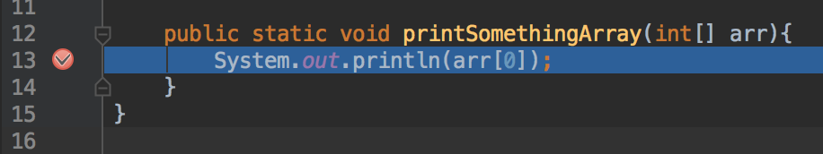
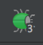
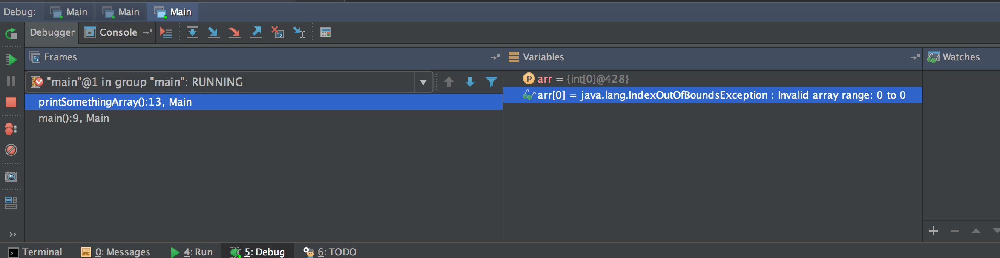
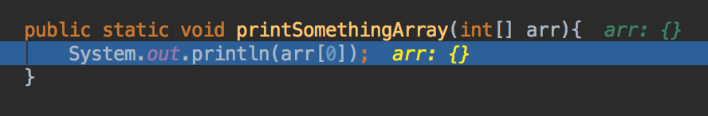

#  Debugging Fundamentals in Java

### LEARNING OBJECTIVES
*After this lesson, you will be able to:*
* Given sample code, set a breakpoint and look at the current state
* Given a stack trace, identify which lines are within your application
* Describe what a stack trace is saying

### STUDENT PRE-WORK
*Before this lesson, you should already be able to:*
- Work with data types and variables
- Write functions that use control flow


### INSTRUCTOR PREP
*Before this lesson, instructors will need to:*
- Read through the lesson
- Add additional instructor notes as needed
- Edit language or examples to fit your ideas and teaching style
- Open, read, run, and edit (optional) the starter and solution code to ensure it's working and that you agree with how the code was written

### LESSON GUIDE

| TIMING  | TYPE  | TOPIC  |
|:-:|---|---|
| 5 min  | [Opening](#opening-5-mins)  | Discuss lesson objectives |
| 10 min  | [Introduction](#introduction-stack-trace-10-mins)  | Stack Trace |
| 5 min  | [Demo](#demo-stack-trace-5-mins)  | Stack Trace |
| 10 min  | [Introduction](#introduction-breakpoints-10-mins)  | Breakpoints |
| 10 min  | [Demo](#demo-breakpoints-10-mins)  | Breakpoints |
| 10 min  | [Independent Practice](#independent-practice-bug-fixing-10-mins)  | Bug Fixing |
| 5 min  | [Conclusion](#conclusion-5-mins)  | Review / Recap |

## Opening (5 mins)

Even the best programmers make mistakes when writing code, and a large amount of development time is often spent fixing mistakes in code, also known as bugs. Therefore, this is called debugging! There are many tools that can be used for debugging, but today we will be concentrating on **reading a stack trace** and **using breakpoints**.

## Introduction: Stack Trace (10 mins)

Making mistakes is a natural part of programming, so an absolutely crucial skill set to have is the ability to debug your code. The first thing we are going to look at is the stack trace. You have probably seen the a stack trace in the past few days without realizing it.

Let's take the following example.

```java
public class Main {

    public static void main(String[] args) {
        printSomething(null);
    }

    public static void printSomething(String s){
        System.out.println(s.length());
    }
}
```

If we run this code, we get the following error in the console:

```
Exception in thread "main" java.lang.NullPointerException
	at Main.printSomething(Main.java:11)
	at Main.main(Main.java:7)
	at sun.reflect.NativeMethodAccessorImpl.invoke0(Native Method)
	at sun.reflect.NativeMethodAccessorImpl.invoke(NativeMethodAccessorImpl.java:62)
	at sun.reflect.DelegatingMethodAccessorImpl.invoke(DelegatingMethodAccessorImpl.java:43)
	at java.lang.reflect.Method.invoke(Method.java:497)
	at com.intellij.rt.execution.application.AppMain.main(AppMain.java:144)
```

While this might seem intimidating at first, you really only need to focus on a few key parts. First is the very top line, it tells you what the error actually was. In this case, we had a Null Pointer Exception, meaning we tried to call a method on a variable that was null.

The second thing to concentrate on are the lines that have our file name(s) in it, Main.java. This is called the Stack Trace because it shows the path of execution for your program. Since the errors in the code are in the files we write, those are the lines we concentrate on. The higher up in the stack trace, the more recent the execution.

The number after the colon next to the file name is the line number the error occurred on. In our example, the error was in Main.java on line 11.


## Demo: Stack Trace (5 mins)

Let's take a look at another example.

```java
public class Main {

    public static void main(String[] args) {
        int[] arr = new int[0];

        printSomethingArray(arr);
    }

    public static void printSomethingArray(int[] arr){
        System.out.println(arr[0]);
    }
}
```


If we run this code, we get the following error.

```
Exception in thread "main" java.lang.ArrayIndexOutOfBoundsException: 0
	at Main.printSomethingArray(Main.java:13)
	at Main.main(Main.java:9)
	at sun.reflect.NativeMethodAccessorImpl.invoke0(Native Method)
	at sun.reflect.NativeMethodAccessorImpl.invoke(NativeMethodAccessorImpl.java:62)
	at sun.reflect.DelegatingMethodAccessorImpl.invoke(DelegatingMethodAccessorImpl.java:43)
	at java.lang.reflect.Method.invoke(Method.java:497)
	at com.intellij.rt.execution.application.AppMain.main(AppMain.java:144)
```


The two errors we just saw, NullPointerException and ArrayIndexOutOfBoundsException are very common, so they are something you will probably see come up in your stack traces.


## Introduction: Breakpoints (10 mins)

The second topic we are going to cover today is the Breakpoint. In general terms, a breakpoint is a position in the code you want to halt execution at.


Adding a breakpoint allows us to do a few very basic things:

- Trace execution of the code, step by step
- Inspect the value of all variables in scope

That second point can make debugging your code much faster. Instead of adding a lot of print statements to monitor your variables, you can just stop your code in place!


## Demo: Breakpoints (10 mins)

Let's continue with the array example from the previous demo. Enabling breakpoints in IntelliJ (as well as Android Studio) is very simple. Simply click in the margin next to the line of code you want to halt the program at. You should see a red dot appear next to it. Go ahead and click the margin next to the line where we access index 0 in the array.



Next, you need to run the program in debugging mode. Instead of pressing the Run icon like normal, you need to press the Debug button.



The program should run, but a new window will pop up on the bottom, and you should see your code change slightly.


<p align="center">

</p>
<p align="center">

</p>

As you can see, the console now shows us the values of the variables, as well as any errors that might show up. Also, in the actual code it shows us what the values of the variables are!

Let's add one more breakpoint in main where we call the printSomethingArray method. If we initialize the array with a few values and re-run the program, you should see these values change, and the error should go away.


## Independent Practice: Using Breakpoints (5 mins)

Modify the program to use a for loop to print all elements in the array. Try using the different tools that are provided with breakpoints to get used to using them.

## Independent Practice: Bug Fixing (10 mins)

You have been provided the starter code for [a simple integer calculator](starter-code). Given that the user enters two numbers, a result is shown depending on what choice the user made from the main menu.

However, the division method is throwing an error in certain cases.

**Hint: The problem occurs when the divisor is a certain number**

Find the bug using the techniques we learned today, and fix the bug.


## Conclusion (5 mins)

Learning to debug well is a crucial skill, and what we covered today is a great way to start. Later in the course we will be covering some Android-specific tools, but what we learned today can apply to almost any programming language you might learn in the future.

## Additional Resources

- [Debugging Toolbar](https://www.jetbrains.com/help/idea/2016.1/debug-tool-window.html)
