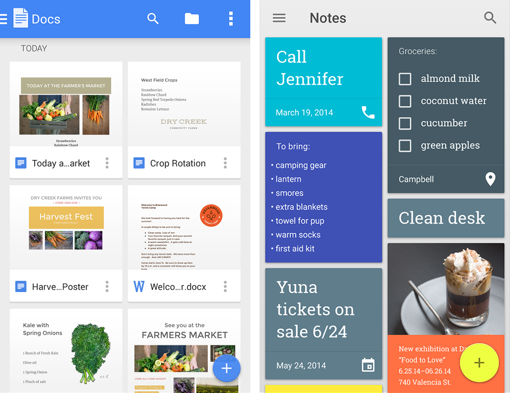
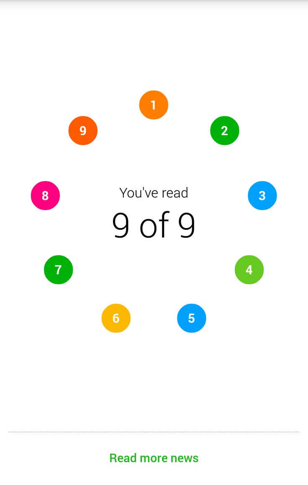
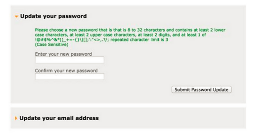
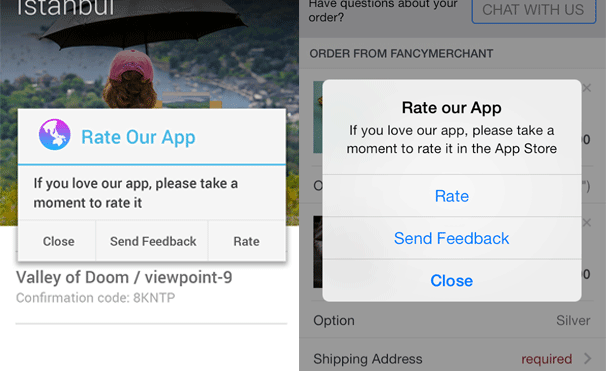
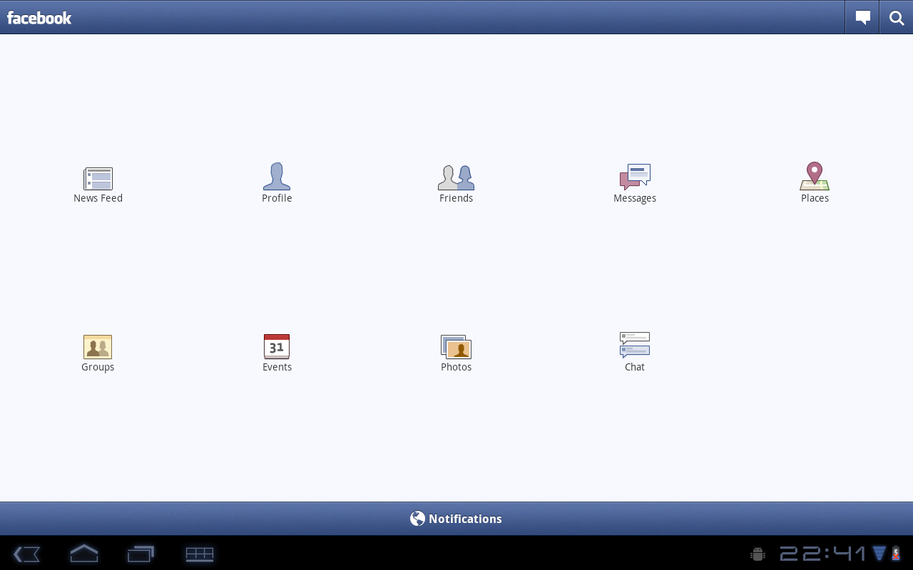

#  Usability Testing

### LEARNING OBJECTIVES
*After this lesson, you will be able to:*
- Explain the value of usability testing
- Evaluate UX using usability heuristics
- Effectively run a usability test

### STUDENT PRE-WORK
*Before this lesson, you should already be able to:*
- Create more than one activity and pass data between the components of the app
- Choose and create the best type of layout for certain use cases
- Use fragments in the app
- Create any View

### INSTRUCTOR PREP
*Before this lesson, instructors will need to:*
- Help students refresh fragment knowledge
- Open and test the provided Android code

---

### LESSON GUIDE

| TIMING  | TYPE  | TOPIC  |
|:-:|---|---|
| 5 min  | [Opening](#opening-5-min)  | Discuss lesson objectives |
| 5 min  | [Introduction](#introduction-why-to-create-usability-tests-5-mins)  | Why to create usability tests? |
| 10 min  | [Guided Demo](#guided-demo-bad-ux-flow-and-ui-10-mins)  | Bad UX flow and UI |
| 5 min  | [Introduction](#introduction-space-allocation-5-mins)  | Space allocation |
| 5 min  | [Guided Demo](#guided-demo-tablets-and-handsets-layouts-5-mins)  | Tablets and handsets layouts |
| 10 min  | [Introduction](#introduction-conducting-tests-10-mins)  | Conducting tests |
| 15 min  | [Independent Practice](#independent-practice-write-tests-for-the-project-and-improve-it-15-mins)  | Write tests for the project and improve it |
| 5 min  | [Conclusion](#conclusion-5-mins)  | Review / Recap |

## Opening (5 min)
In this lesson you will learn why usability tests are important in mobile development, when and how to write them.  

## Introduction: Why to create usability tests? (5 mins)

The usability testing sessions have become an essential component of any mobile product. It gives the unique opportunity to receive feedback at the early stages of the design process, before the development has even been planned. Such experiments teach us about the expectations and preferences of target users while helping us to come up with the right app design.

Before any code is written, there should be some prototype features and screens created on the paper or web app, which could be presented to the testing audience. Later on when the app is written in code, it makes sense to test it on the device and thus give users the feeling of real interaction with the app. Never ask other people to test the app on the emulator because it could prevent users from navigating naturally in the app and as a result, would give negative/false feedback.

The main principles to take into consideration while creating usability tests:

* **Test Early, Test Often.** Test throughout the development process so you can catch problems early, when they are easier to fix. A good approach is to test at each stage of development.

  * Early in the design process, test wireframes of your main screens and button layout. If you have basic navigation problems, it’s best to detect them early. You’ll also get feedback on desired functionality and use cases, navigation structure, preferred design patterns, layout of content, and more, all without needing to swipe or tap anything.

  * You can test your visual designs before they’ve even been animated, to make sure users can understand them at a glance.

  * As you get the designs working, check how they come across to users by testing clickable prototypes. Test button and icon designs, and any interactive widgets you’ve created. Often this is the stage where you’ll debate with your team about design details. You can use user tests to quickly settle those debates.

* **Test competitors.** Before you even start development, do some tests of competitors. You’ll learn your competitor’s strengths and weaknesses, and get ideas for your own product.

* **Test pre-release.** Before you ship, test to make sure everything is working correctly and that you’ve resolved all the problems you identified earlier.

* **Test post-launch.** As you get analytics on what your users are doing, you can employ user tests to figure out why they’re doing it and how they feel about it.

* **Test the Right Platforms.** Make sure you will test your app on the devices of different versions.

> Check: In your own words, why create usability tests?

## Guided Demo: Bad UX flow and UI (10 mins)
Now, before we switch to the guidelines how to write and conduct usability tests, let's take a look at the apps and analyze what should be improved.

> Check: Take 2 minutes with a partner and write down a list of all the things that "stink" about these two apps.

   

   

> Instructor Note: Go over the following issues.

>Image 1: Floating Action Bar overlays other elements of the screen. It is a better practice to make all the elements occupy its own space in the app and not appear on top of other elements. As an alternative, the FAB functionality could be relocated to the menu options.

> Image 2: FAB issue (look image 1). The grid view looks very disproportionate. The layout could be changed to a list (Recycler View) of separate cards (Card View).

> Image 3: Color issue. Two orange circles are located next to each other. There are a lot of colors in the palette that could be used. It is better to make them all unique or provide some symmetric allocation.

> Image 4: The type of the password is very weird. There are a lot of conditions set to satisfy. Such password will be hard to remember for users. It may be very annoying to come up with the right password.

> Image 5: Never interrupt users asking for irrelevant information when users are navigating in your app. If your app is really awesome, people will leave a comment on the page in Google Play Store. If you constantly interrupt users and force them to take actions they don't want to spend their time on, you risk to lose them.

## Introduction: Space allocation (5 mins)  

Special attention should be paid to the space allocation within an app. The Android platform runs on a variety of screen sizes and the system gracefully resizes your application's UI to fit each one.  For example, tablets offer more space in which your application can present multiple sets of information at once, while a handset device usually requires that you split those sets apart and display them separately. So even though a UI designed for handsets will properly resize to fit a tablet, it does not fully leverage the potential of the tablet's screen to enhance the user experience.

It is considered a good practice to build an activity designs based on fragments that you can reuse in different combinations — in multi-pane layouts on tablets and single-pane layouts on handsets. A Fragment represents a behavior or a portion of user interface in an activity. You can think of a fragment as a modular section of an activity (a "fragment" of an activity), which has its own lifecycle and which you can add or remove while the activity is running.

## Guided Demo: Tablets and handsets layouts (5 mins)

> Check: Look at the screenshot and comment on strong and weak sides of the layouts on different devices.

   

> Instructor Note: Go over the following issues:

> Image 1: there is a lot of wasted space between icons. Bad UI design. All the icons could be united in one listView/recyclerView and put on the left side of the screen. The right part could be occupied with other widgets.  
> Image 2: the right allocation of the ui elements. No unused space.

## Introduction: Conducting tests (10 mins)  

It is never too early to test. In the product lifecycle, usability tests should be present at each stage of the development. Before any code is written and any prototypes are created, you are responsible for creating independent screens (usually on the paper or using some web apps) and test them. Otherwise you could waste a lot of time building something that will turn out to be less understandable or appealing to your target users. Remember to test your app with not just random people. Determine what is your target audience, find 5-10 representatives who will test your app. Test your app with each representative separately so that others should not be around and should not get influenced by the person currently testing your app.  

> Check: Take 1 minute and predict best practices for usability tests.

There are different approaches to the way usability tests should be conducted. Below you can find the most important steps to remember and integrate into your test suits:  

1. **Welcome your participants and offer a short icebreaker.** It is important that the user feels comfortable
and behaves naturally when working with your app. Tell your participants that it’s the app that is being
tested, not them, and if they can’t do something, they should know it’s not their fault.

2. **Get the user familiar.** Before diving into tasks, get the user familiar with the app, tell them the scenario and ask for initial feedback on what they would expect from the app.

3. **Focus on key aspects.** While taking notes, focus on a few key aspects like friction points where people hesitate, do something unexpected, get something wrong or get stuck, conflicts between user expectations and your application behavior; facial expressions can be a clue into people’s true feelings about what they are seeing.

4. **Give participants one task at a time.** More than this may intimidate them or be distracting. A user feels more comfortable when he can see the task printed so he doesn’t need to remember the task while you are speaking.

5. **Do not alter the test results by providing clues, suggesting directions or by reacting to things user say or
do.** All feedback you give must be neutral. Do not start shaking your head or nodding :). The only time
you should speak is to help the participant give an opinion, or to clarify a response.

6. **After all the tasks have been completed, gather as much information as possible.** Ask for overall impressions
of the app that will allow you to judge whether expectations have been met. Always ask for suggestions
that may provide insights into how the app can be better.

## Independent Practice: Write tests for the project and improve it (15 mins)

*This exercise is to be done in pairs. You will work with the person sitting next to you.*

Import the project from the [starter code](starter-code) and run it on a handset and a tablet. The main purpose of the app is to provide images of the animals for the users to enjoy them.

Each person in the pair should write down the questions he/she will ask the other person who is to test the app. Remember not to ask all questions at a time. Ask them sequentially and let the person express his/her opinion about the app. Ask the person to rotate the phone and share his/her vision of the way of the app UI changes. Put down the steps you will ask the person to take to test the app.

Switch the roles and take on the role of the person who is going to test the app. After both people have tested the app, create a joint list of features to add/improve in the app. Pair program and improve/implement all the features you added to your joint list.

After you finished import the [solution code](solution-code) project and check if you noticed and corrected all the UI flaws.

> Check: Have one student group share their answers with 2-3 minutes left.

## Conclusion: (5 mins)
It is of vital importance to think about the users the app targets and pay attention to how the app should be navigated. To create an app that will get successfully published on Google Play Store and will not receive negative reviews, create usability tests throughout the whole software development lifecycle.

- Name the main aspects to pay attention to while writing usability tests.
- What are the parts of the app that are prone to imperfections and should be corrected to enhance user experience?
- What questions are to be asked during usability testing?
