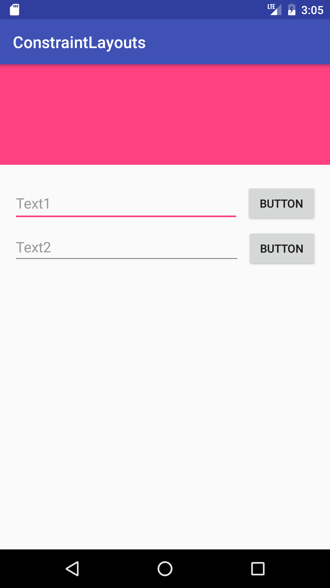
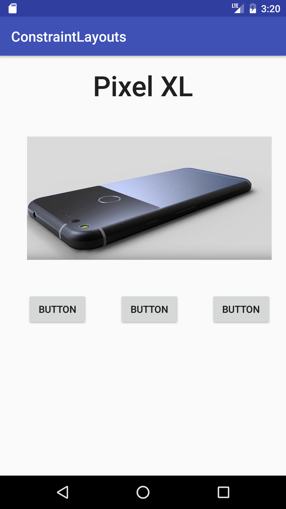
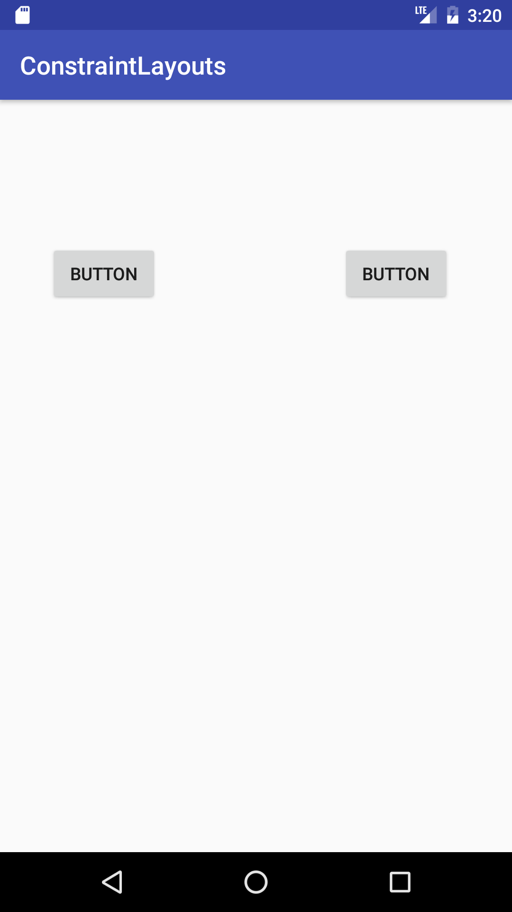
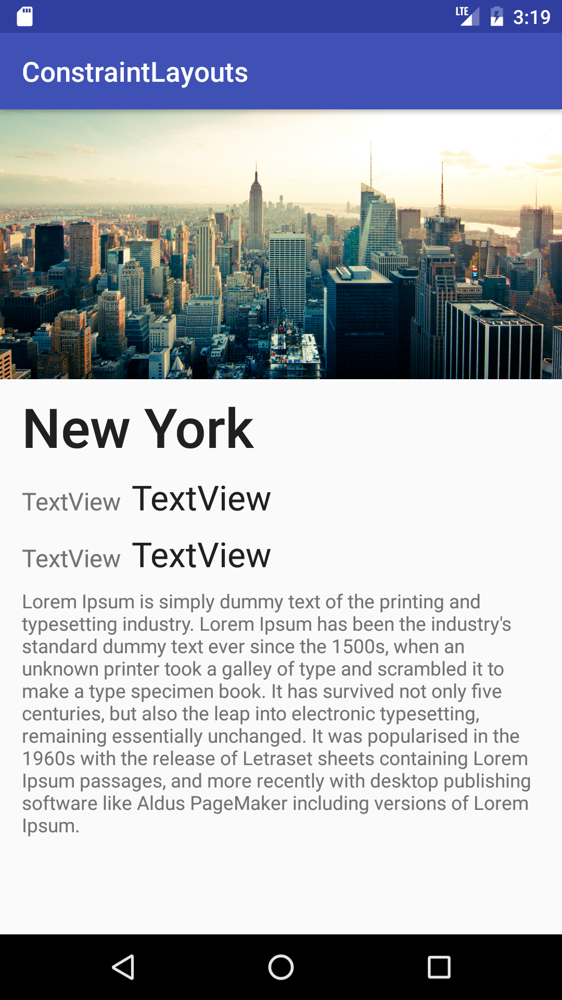

#  Constraint Layouts

### LEARNING OBJECTIVES
*After this lesson, you will be able to:*
- Identify the advantages of a Constraint Layout over other Layouts
- Create layouts using Constraint Layout

### STUDENT PRE-WORK
*Before this lesson, you should already be able to:*
- Create complex, nested layouts

### INSTRUCTOR PREP
*Before this lesson, instructors will need to:*
- Read through the lesson
- Add additional instructor notes as needed
- Edit language or examples to fit your ideas and teaching style
- Open, read, run, and edit (optional) the starter and solution code to ensure it's working and that you agree with how the code was written

---

## Opening (5 mins)

So far we have concentrated mainly on LinearLayout, RelativeLayout, and FrameLayout. While each of these are powerful in their own right, they can be somewhat cumbersome when trying to create complex layouts quickly. Google has been working on a new type of layout that is more straightforward, and easier to use in the design view called the Constraint Layout.


***

<a name="introduction"></a>
## Introduction: Constraint Layout (5 mins)

Constraint layout shares a lot in common with RelativeLayout in the sense that Views are positioned relative to other views or the parent. The difference is in how you make those relations, and some of the extra features that ConstraintLayout supplies.

Some major advantages of ConstraintLayout are:

- **Theoretically** faster than the other layouts (flat files)
- Easier to manage in the design view
- Easy to use bias property for adjusting screen sizes

Every view must have a vertical and horizontal constraint of some sort, otherwise the view will snap to (0,0) when the layout is inflated.

ConstraintLayouts can be broken down into different types of constraints:

1. Parent Constraint
2. Position Constraint
3. Alignment Constraint
4. Baseline Alignment Constraint
5. Guideline Constraint


***

<a name="demo"></a>
## Demo: Parent, Position, and Alignment Constraints (30 mins)

**Before we can get started, you need to add the constraint layout to your Gradle**

```XML
compile 'com.android.support.constraint:constraint-layout:1.0.0-beta1'
```

First, we need to add a Constraint Layout to our layout XML.

```XML
<android.support.constraint.ConstraintLayout
  xmlns:android="http://schemas.android.com/apk/res/android"
  xmlns:app="http://schemas.android.com/apk/res-auto"
  xmlns:tools="http://schemas.android.com/tools"
  android:layout_width="match_parent"
  android:layout_height="match_parent">

</android.support.constraint.ConstraintLayout>
```


1. Parent Constraint

To make a constraint, you drag from the side of one of the views where the small circle appears, and drag it to one of the four sides of the parent view. This makes the view snap to that side.

If you create two constraints on opposing sides, it centers the view, and allows you to give it a bias (set the view to a percentage position on the screen).

Match parent doesn't exist in ConstraintLayout, so you need to assign 0dp to the width/height in order to make it fill the remaining space left in its constraint. This only works when you have opposing constraints set.

2. Position Constraint

With the position constraint, you drag the anchor point from one view to another, and then manually drag that view to give it a specific dp margin from the constraining view.

Position constraints are meant to give constant, exact values for placing views.

3. Alignment Constraint

Alignment constraints are similar to the RelativeLayout in many ways. You once again use the anchor points, but you don't give exact distances. Here you use a combination of margins and opposing constraints with other views to position your constrained view.

Alignment constraints are meant for positioning views relative to each other rather than the parent.


***

## Guided Practice: Basic ConstraintLayout (10 mins)

We are going to make the following layout together.



Keep in mind that giving a view a width of 0 makes it fill the remaining space in its constraint.

***

<a name="ind-practice"></a>
## Independent Practice: Basic ConstraintLayout (15 mins)

Try to recreate the following screenshot. The picture of the phone is included in the images folder for the lesson.




***

<a name="introduction"></a>
## Introduction: Baseline Alignment Constraint  (2 mins)

A different kind of alignment constraint is the baseline alignment. If you align two TextViews of different font sizes, you usually want the base of the text to line up.

To do this, you must drag from the baseline of one TextView to the baseline of the other. If you do this, the baselines will remain aligned no matter what size the font changes to.


***

<a name="demo"></a>
## Demo: Baseline Alignment (5 mins)

Let's add a few TextViews of different sizes to one of our layouts, and change the font size.

***

<a name="introduction"></a>
## Introduction: Guideline Constraint  (2 mins)

Sometimes you need a reference point in the layout to line up multiple views. For instance, if you want many views to start aligned 1/4 of the way into the screen, you could do each constraint individually, or you can use a guideline.

The guideline is essentially an invisible line that you can position by dp or percentages, and anchor constraints to it.

***

<a name="demo"></a>
## Demo: Guideline Constraint (5 mins)

Let's try to put two buttons on the screen, each 1/3 of the way from the left and right sides.




***

<a name="ind-practice"></a>
## Independent Practice: Complex Layout (20 mins)

It's time for you to try making a more complex layout on your own. Try to recreate the screenshot below. Pay attention to where the base lines of the TextViews are aligned.




***


<a name="conclusion"></a>
## Conclusion (10 mins)

ConstraintLayout is still a work in progress, and new features are still being added. It is worth trying to put it in your apps when you find yourself struggling with deeply nested layouts.

***

### ADDITIONAL RESOURCES
- [Constraint Layout Documentation](https://developer.android.com/training/constraint-layout/index.html)
