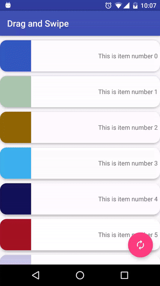

#  Drag & Swipe with a RecyclerView

> ***Note:*** _This can be a pair programming activity or done independently._

## Exercise

We've spent a lot of time setting up basic `RecyclerView`s. Now let's give one some flair! We're going to add _drag-to-reorder_ and _swipe-to-remove_ functionality to a `RecyclerView`. This will also be a chance to practice learning from someone else's documentation.

#### Requirements

- Use this tutorial as a guide: https://medium.com/@ipaulpro/drag-and-swipe-with-recyclerview-b9456d2b1aaf

- Begin with the provided [starter code](starter-code) and add the following functionality:
  - User can drag an item up or down to move it to a new position in the list
  - User can swipe an item left or right to remove it from the list

- To to this, add the following new files:
  - A new class that extends `ItemTouchHelper.Callback`
  - An interface declaring methods for handling when an item is moved (via drag) or removed (via swipe)

- And modify the following existing files:
  - Update `MyRecyclerViewAdapter` to make it implement your new interface
  - Update `MainActivity` to instantiate and use your new `Callback` class

**Bonus:**
- See if you can tell how the spaces between items in the list are created (hint: it's done in a very simplistic, naive way)
- Try to do this in a better way using the [ItemDecoration class](https://www.bignerdranch.com/blog/a-view-divided-adding-dividers-to-your-recyclerview-with-itemdecoration/)

#### Starter code

The [starter code](starter-code) contains a simple app with a `RecyclerView`. Each item in the list has an `ImageView` with a random color. Clicking the `FloatingActionButton` will refresh the list with a new set of random colors.

#### Deliverable

This is just a morning exercise, so no pull request is needed, but your finished app should function like the following gif:

