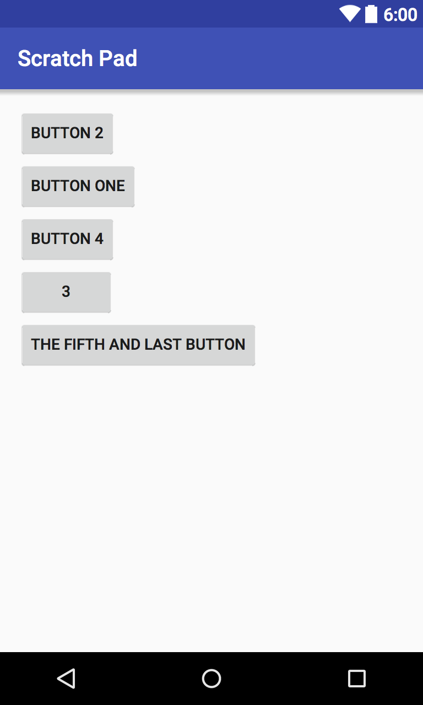
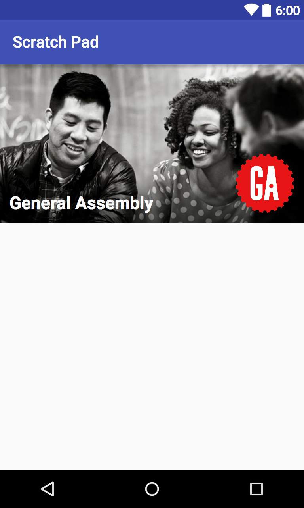
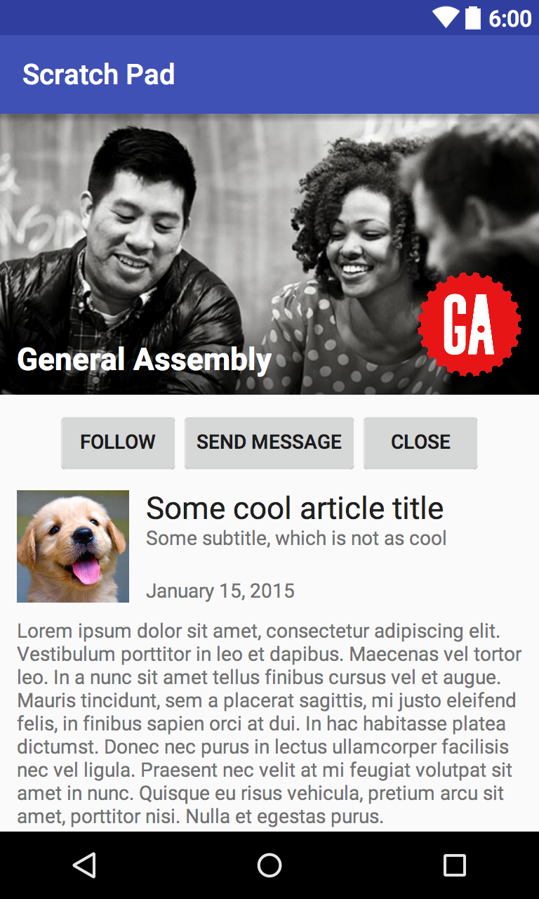

### LESSON GUIDE

| TIMING  | TYPE  | TOPIC  |
|:-:|---|---|
| 5 min  | [Introduction](#introduction-layouts-5-mins)  | Layouts |
| 15 min  | [Demo](#demo-relativelayout-15-mins)  | RelativeLayout |
| 5 min  | [Introduction](#introduction-linearlayout-5-mins)  | LinearLayout |
| 5 min  | [Demo](#demo-linearlayout-5-mins)  | LinearLayout |
| 10 min  | [Guided Practice](#guided-practice-linearlayout-10-minutes)  | LinearLayout  |
| 10 min  | [Introduction](#introduction-framelayout-10-minutes)  | FrameLayout |
| 5 min  | [Demo](#demo-framelayout-5-mins)  | FrameLayout |
| 15 min  | [Guided Practice](#guided-practice-framelayout-15-minutes)  | FrameLayout |
| 5 min  | [Introduction](#introduction-nested-layouts-5-minutes)  | Nested Layouts |
| 15 min  | [Guided Practice](#guided-practice-nested-layouts-15-minutes)  | Nested Layouts  |
| 20 min  | [Independent Practice](#independent-practice-layouts-20-minutes)  | Layouts |
| 5 min  | [Conclusion](#conclusion-5-mins)  | Review / Recap |
---
title: Layouts
type: Lesson
duration: "1:30"
creator:
    name: James Davis
    city: NYC

---

#  Layouts

### Objectives
*After this lesson, students will be able to:*

* Identify the layout options provided by Android
* Given a sketch of some components, determine which layout to use
* Use nested layouts to create more complicated views

### Preparation
*Before this lesson, students should review the following lessons:*

- [Views 101](../views-101-lesson)
- [Views 102](../views-102-lesson)


## Introduction: Layouts (5 mins)

In the past lessons, we have used RelativeLayout as the base of all of our layout file.

In this lesson, we are going to examine three of the main layout types: **RelativeLayout**, **LinearLayout**, and **FrameLayout**.

These layouts are view groups. Exactly how it sounds, they group views and arrange them in a particular way.

## Demo: RelativeLayout (15 mins)

`RelativeLayout` is a view group that arranges its child views to be relative to each other or the layout itself. For example, if you had a `RelativeLayout` with buttons inside of it, the following can be true:

<p align="center">
  <a href="screenshots/relativelayout.png"></a>
</p>

* Button 1 is below Button 2
* Button 3 is to the right of Button 4, which is to the right of Button 1
* Button 5 is centered, relative to the RelativeLayout itself

Here's how it looks in xml:

```xml
<?xml version="1.0" encoding="utf-8"?>
<RelativeLayout xmlns:android="http://schemas.android.com/apk/res/android"
    android:layout_width="match_parent"
    android:layout_height="match_parent">

    <Button
        android:id="@+id/button2"
        android:layout_width="wrap_content"
        android:layout_height="wrap_content"
        android:text="Button 2" />

    <Button
        android:id="@+id/button1"
        android:layout_width="wrap_content"
        android:layout_height="wrap_content"
        android:text="Button 1"
        android:layout_below="@+id/button2" />

    <Button
        android:id="@+id/button4"
        android:layout_width="wrap_content"
        android:layout_height="wrap_content"
        android:text="Button 4"
        android:layout_alignTop="@+id/button1"
        android:layout_toRightOf="@+id/button1"
        android:layout_marginLeft="80dp"/>

    <Button
        android:id="@+id/button3"
        android:layout_width="wrap_content"
        android:layout_height="wrap_content"
        android:text="Button 3"
        android:layout_alignTop="@+id/button4"
        android:layout_toRightOf="@+id/button4" />

    <Button
        android:id="@+id/button5"
        android:layout_width="wrap_content"
        android:layout_height="wrap_content"
        android:text="Button 5"
        android:layout_centerVertical="true"
        android:layout_centerHorizontal="true" />

</RelativeLayout>
```


## Introduction: LinearLayout (5 mins)

`LinearLayouts` show all of its child views linearly.

Think of standing on line somewhere, like a bank or an amusement park. In this analogy, the line is a LinearLayout and the people on line are the views; every person in a straight line, one in front of the other.

LinearLayout, unlike the other layouts, has an orientation attribute. This makes the views line up vertically (from up to down) or horizontally (left to right).

<p align="center">
  <a href="screenshots/linearlayout_vertical.png"></a> <a href="screenshots/linearlayout_horizontal.png"></a>
</p>

*LinearLayouts: (Left) Vertical orientation, (Right) Horizontal orientation*

## Demo: LinearLayout (5 mins)


Here's how it looks in xml:

```xml
<?xml version="1.0" encoding="utf-8"?>
<LinearLayout xmlns:android="http://schemas.android.com/apk/res/android"
    android:layout_width="match_parent"
    android:layout_height="match_parent"
    android:orientation="vertical">		// or android:orientation="horizontal"

    <Button
        android:id="@+id/button2"
        android:layout_width="wrap_content"
        android:layout_height="wrap_content"
        android:text="Button 2" />

    <Button
        android:id="@+id/button1"
        android:layout_width="wrap_content"
        android:layout_height="wrap_content"
        android:text="Button one" />

    <Button
        android:id="@+id/button4"
        android:layout_width="wrap_content"
        android:layout_height="wrap_content"
        android:text="Button 4" />

    <Button
        android:id="@+id/button3"
        android:layout_width="wrap_content"
        android:layout_height="wrap_content"
        android:text="3"/>

    <Button
        android:id="@+id/button5"
        android:layout_width="wrap_content"
        android:layout_height="wrap_content"
        android:text="The fifth and last button" />

</LinearLayout>

```

<!--
## Guided Practice: LinearLayout  (10 minutes)

Let's practice together by creating a quick Activity with a LinearLayout that matches the specifications below (a popular app LinearLayout):

- INSERT SPECS

-->

## Introduction: FrameLayout (10 minutes)

On the Android Developer website, FrameLayout is described as follows:

*FrameLayout is designed to block out an area on the screen to display a single item. Generally, FrameLayout should be used to hold a single child view.*

The idea behind FrameLayout is that it occupies a space on the screen, and its child view can be defined within that space. It is suggested that we only put one child view inside the FrameLayout (much like how a picture ***frame*** can only show one picture).

<p align="center">
  <a href="screenshots/frame_one.jpg"></a>
</p>

However, if you *really* wanted to, you can put multiple pictures in the same picture frame. Each picture could overlap each other, if need be.

<p align="center">
  <a href="screenshots/frame_many.jpg"></a>
</p>

#### Why use this?

The following screenshot is a real world use of a FrameLayout. From bottom to top, there is an `ImageView` with the background, a `TextView` with the title, and another `ImageView` with the logo.

<p align="center">
  <a href="screenshots/framelayout.png"></a>
</p>

`FrameLayout` can be used to easily stack views atop one another.

`FrameLayout` also uses the attribute ``"android:layout_gravity"``. Gravity defines how a view floats within its layout. A view can occupy the `FrameLayout`'s left, right, top, and bottom edges (or any combination of those), or the center of the layout.

In the above example, the "General Assembly" TextView has a gravity of bottom left, and the logo ImageView has a gravity of bottom right.

## Demo: FrameLayout (5 mins)

Here's how the same layout looks in xml:

```xml
<?xml version="1.0" encoding="utf-8"?>
<FrameLayout xmlns:android="http://schemas.android.com/apk/res/android"
    android:layout_width="match_parent" android:layout_height="200dp">

    <ImageView
        android:layout_width="match_parent"
        android:layout_height="match_parent"
        android:layout_gravity="center"
        android:src="@drawable/background_image"
        android:scaleType="centerCrop" />

    <TextView
        android:layout_width="wrap_content"
        android:layout_height="wrap_content"
        android:textAppearance="?android:attr/textAppearanceLarge"
        android:text="General Assembly"
        android:layout_gravity="left|bottom"
        android:textColor="@android:color/white"
        android:textStyle="bold"
        android:layout_margin="12dp" />

    <ImageView
        android:layout_width="75dp"
        android:layout_height="75dp"
        android:layout_gravity="bottom|right"
        android:src="@drawable/logo"
        android:layout_margin="12dp" />

</FrameLayout>
```
<!--
## Guided Practice: FrameLayout (15 minutes)

In pairs, practice together by creating an Activity with a FrameLayout that matches the specifications below:

- INSERT SPECS

> Instructor Note: The instructional team should provide syntax reminders and values/attributes of what will be needed for this.  Starter/solution code too.
-->

## Introduction: Nested Layouts (5 minutes)

Many apps have complicated views that cannot be made with one ViewGroup alone. To get around this, you can nest ViewGroups inside other ViewGroups.

```xml
<LinearLayout
    android:layout_width="match_parent"
    android:layout_height="match_parent"
    android:orientation="vertical">

    <FrameLayout
        android:layout_width="match_parent"
        android:layout_height="wrap_content">

        ...

    </FrameLayout>
</LinearLayout>
```

The idea is that the inner layout (in this case, the FrameLayout) is effected by the properties of the parent layout.

## Guided Practice: Nested Layouts  (15 minutes)

Together, let's examine the image below and figure out its layout. Then, in Android Studio, attempt to build it from scratch. Don't worry about using the correct images, solid backgrounds or placeholders are fine.

<p>
  <a href="screenshots/all_layouts.png"></a>
</p>


## Independent Practice: Layouts (20 minutes)

> ***Note:*** _This can be a pair programming activity or done independently._

Recreate the layout of an app on the Google Play Store - use at least one nested layout. By the way, source images are not required and setting the background as a solid color should suffice.


**Provide screenshot**

## Conclusion (5 mins)
* What are the three layouts went over today?
* How does one use the three layouts?
* What are nested layouts, and why are they used?
