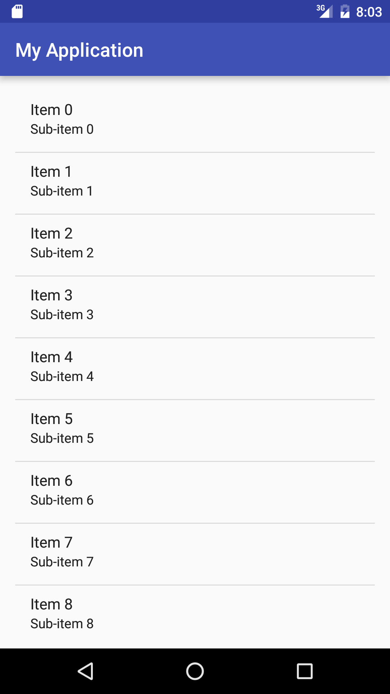

#  Views 103 - ListViews and ListAdapters


### LEARNING OBJECTIVES
*After this lesson, you will be able to:*
- Given some sample data in a Java list, create a view to show this data
- Create a ListAdapter to connect the ListView and data
- Create a BaseAdapter
- Implement `OnItemClickListener` to make the ListView respond to the user

### STUDENT PRE-WORK
*Before this lesson, you should already be able to:*
- Declare and use Java Lists
- Describe the basics of Android Views

### INSTRUCTOR PREP
*Before this lesson, instructors will need to:*
- Open and run the starter and solution code
- Modify sections and checks as needed

---

### LESSON GUIDE

| TIMING  | TYPE  | TOPIC  |
|:-:|---|---|
| 5 min  | [Opening](#opening-5-mins)  | Discuss lesson objectives |
| 10 min  | [Introduction](#introduction-listviews-10-mins)  | ListViews |
| 5 min  | [Demo](#demo-listviews-5-mins)  | ListViews |
| 10 min  | [Introduction](#introduction-listadapters-10-mins)  | ListAdapters |
| 10 min  | [Demo](#demo-listadapters-10-mins)  | ListAdapters |
| 15 min  | [Guided Practice](#guided-practice-listadapters-15-mins)  | ListAdapters |
| 10 min  | [Introduction](#introduction-view-recycling-10-mins)  | View Recycling |
| 20 min  | [Independent Practice](#independent-practice-listviews-and-listadapters-20-minutes)  | ListViews and ListAdapters |
| 5 min  | [Conclusion](#conclusion-5-mins)  | Review / Recap |
<a name="opening"></a>
## Opening (5 mins)

Previously, we learned about how to create and work with Lists in Java. These are a very important part of many Android apps, so Android provides some very useful tools for integrating them into your layouts. Today we will be covering three main topics: ListViews, ListAdapters, and how we interact with them. ListViews and ListAdapters are tied very closely together. The first is, as the name implies, it's a View that contains a List. The second is what ties (or adapts) our List data to the ListView.


<a name="introduction"></a>
## Introduction: ListViews (10 mins)

ListViews are one of the important Views in Android apps that can be used to display collections of data. So many of your daily apps might use ListViews: Contacts, email, music, text messages, and many more. Anything that contain lists of data with repeated visual elements can use a ListView.

There are two major components to a ListView. First, there is the actual ListView item in your Layout. This is just like any other View, with a width, height, and id.

The second component is the item contained in the ListView. For each piece of your data, a copy of the layout for the item is created, populated with your data, and inserted into the list. Combining these two components, you get the ListViews you see every day.




***

<a name="demo"></a>
## Demo: ListViews (5 mins)

Starting with an empty Android project, we will add a ListView to the activity. We won't be populating it until we cover ListAdapters in the next section of this lesson.

First, let's open up the layout XML file and add the ListView

``` XML
<ListView
       android:id="@+id/list_view"
       android:layout_width="match_parent"
       android:layout_height="match_parent"></ListView>
```

Next we're going to discuss the ListAdapter so we can insert our data into the list.


```java
ListView listView = (ListView)findViewById(R.id.list_view);
```

***

<a name="introduction"></a>
## Introduction: ListAdapters (10 mins)

ListAdapters are the other part of the puzzle for showing your List data on the screen. Your data is passed directly into your adapter. After the adapter has your data, and you have specified how you want to display your data, you connect the adapter to your ListView. Once that happens, your Adapter takes an item from your List, creates a new list item, applies the data to the appropriate layout for the item, and inserts it into the ListView. This process repeats for every item in your List.

One important thing to note is that if the data in the list changes, you must tell the adapter so it can refresh the ListView on the screen. To do this, you call a method named notifyDataSetChanged on the adapter. This will be shown in the example in the next section.

You don't actually make instances of a ListAdapter because it is an interface. Instead, other classes implement the ListAdapter interface, such as BaseAdapter. Then, other Adapters extend the BaseAdapter.

One very common example is the ArrayAdapter, which can take your Lists and directly map them to the ListView with very little effort.


<a name="demo"></a>
## Demo: ListAdapters (10 mins)

To complete our example, we will create a LinkedList, create an ArrayAdapter (a specific type of ListAdapter), then set the ArrayAdapter to the ListView. The following code shows these three steps.

```java
LinkedList<String> mStateList;
ArrayAdapter<String> mArrayAdapter;
```

```java
mStateList = new LinkedList<>();
mStateList.add("Arizona");
mStateList.add("New Mexico");
mStateList.add("New York");
mStateList.add("Rhode Island");

mArrayAdapter = new ArrayAdapter<String>(this,android.R.layout.simple_list_item_1,mStateList);

listView.setAdapter(mArrayAdapter);
```
Now, say we wanted to add South Carolina to our list. To do this, we simply call the add method on the list, then notify the adapter.

``` java
exampleList.add("South Carolina");
arrayAdapter.notifyDataSetChanged();
```


<a name="guided-practice"></a>
## Guided Practice: ListAdapters (15 mins)

Use the provided Android project ListViewsAndAdapters, and complete the `MainActivity.java` and `activity_main.xml`. Work with a partner to do do the following:

- Add a ListView where there is a comment in the XML file
- Add an ArrayAdapter to the newly created ListView, using the data in the provided LinkedList
- Implement the onClick method of the provided FloatingActionButton to remove the first element of the list (if one exists), and refresh the ListView on screen.


<a name="introduction"></a>
## Introduction: View Recycling (10 mins)

The examples we have seen so far have relatively small lists of data. Imagine, however, if we had a list with 10,000 items. Does Android create 10,000 list items all at once?

In order to conserve memory and improve performance, Android instead only instantiates enough list items to fill the screen. As you scroll up or down on the list, the adapter retrieves the correct data and replaces the data for the next row, replaces the data in the row that just moved off screen, and moves the updated row to the correct spot. The actual data isn't removed from memory, since it is stored in its own collection.


<a name="introduction"></a>
## Introduction: Base Adapters (10 mins)

The ArrayAdapter we saw before provides us with a lot of convenience, but it is extremely limited in what it can actually do. Another adapter that requires more implementation, but is much more flexible, is the Base Adapter.

- **getCount**: Return the size of the data set
- **getItem**: Return the item from the data set at the given position
- **getItemId**: Return the row id (or index) of the position clicked in the list
- **getView**: Return a complete view to display in the ListView

```java
BaseAdapter b = new BaseAdapter() {
            @Override
            public int getCount() {
                return 0;
            }

            @Override
            public Object getItem(int position) {
                return null;
            }

            @Override
            public long getItemId(int position) {
                return 0;
            }

            @Override
            public View getView(int position, View convertView, ViewGroup parent) {
                return null;
            }
        }
```

## Guided Practice: Base Adapters (5 mins)

Let's try replacing the adapter from the previous example with the list of names to use a Base Adapter.

***

<a name="introduction"></a>
## Introduction: OnItemClickListener (5 mins)

So far we've handled clicking on Views using an `OnClickListener`, but in ListViews, we have a bunch of individual Views. What happens if we try to write an `OnClickListener` for a ListView?


Android Studio tells us that we don't want to use this!

The solution is to use something called the `OnItemClickListener`. Like the OnClickListener, the OnItemClickListener also contains a method where you put the code for what happens when you click. In this case, it's called `OnItemClick`.


<a name="demo"></a>
## Demo: `OnItemClickListener` (20 mins)

Let's walk through the following code:

```java
mListView.setOnItemClickListener(new AdapterView.OnItemClickListener() {
    @Override
    public void onItemClick(AdapterView<?> parent, View view, int position, long id) {
        //Do stuff
    }
});
```

- **parent**: The parent object refers to ListView object. From there we can do things like retrieve items from the data collection, or access the Adapter behind the ListView.

- **view**: This refers to the actual list item that was clicked

- **position**: This refers to the position in the view

- **id**: The position in the underlying data set

Let's make it show a toast.

```java
mListView.setOnItemClickListener(new AdapterView.OnItemClickListener() {
    @Override
    public void onItemClick(AdapterView<?> parent, View view, int position, long id) {
        Toast.makeText(MainActivity.this,"Item clicked",Toast.LENGTH_SHORT).show();
    }
});
```

Now, let's have it say what position we clicked.

```java
Toast.makeText(MainActivity.this,"Item clicked at position "+position,Toast.LENGTH_SHORT).show();
```


<a name="guided-practice"></a>
## Guided Practice: Setting up `OnItemClickListener`s (10 mins)

Let's take our example further - do this with me.

How would we change the text for the item to show "You clicked position X" for each item? We know that one of the parameters of `onItemClick` is a View, but we need to figure out how to use it.

Check it out:

```java
mListView.setOnItemClickListener(new AdapterView.OnItemClickListener() {
  @Override
  public void onItemClick(AdapterView<?> parent, View view, int position, long id) {
    TextView textView = (TextView) view.findViewById(android.R.id.text1);
    textView.setText("Clicked "+position);
  }
});
```


<a name="ind-practice"></a>
## Independent Practice: ListViews and ListAdapters (20 minutes)

Build an activity that contains a ListView with two types of interaction. Pressing the FloatingActionButton should add a new list item containing whatever text the student wants. If the student presses on a specific list item, that item should be deleted. Basic code for the FloatingActionButton and long click detection will be provided in the project ListViewsIndependent.


<a name="conclusion"></a>
## Conclusion (5 mins)

ListViews and Adapters are crucial components to many of the Android apps you will build in your career. They can handle listing data from practically any source you need, and do it with relatively little coding. While we only covered implementing ArrayAdapters today, Android offers other useful built in adapters such as the CursorAdapter for listing information from databases. In addition, you can create your own custom adapters! Basically any data source you have can be used in an adapter.


### ADDITIONAL RESOURCES
- [ListViews Reference](http://developer.android.com/reference/android/widget/ListView.html)
- [ListAdapters Reference](http://developer.android.com/reference/android/widget/ListAdapter.html)
