title | type | duration | creator
----- | ---- | -------- | -------
Simple Animation | lesson | 1:35 | Yuliya Kaleda (New York)

--

<!--  OUTSTANDING

1. Talking points with Demo: Simple animation
2. What is 'it' in Introduction: View Animation (5 mins)
3. Have students quickly explore how these principles apply to their favorite mobile app at the end of the Intro: 12 universal animation principles
4. starter/solution code organization
-->

#  Simple Animation

### Objectives
*After this lesson, students will be able to:*

* Identify the different principles of animation, including object physics and timing.
* Define how animation interacts with layouts
* Modify the following properties of an animation: Duration (ms), Interpolator (curve)
* Create animations within Views


### Preparation
*Before this lesson, students should already be able to:*

- Create or import a project in Android Studio


### LESSON GUIDE

| TIMING  | TYPE  | TOPIC  |
|:-:|---|---|
| 5 min  | [Opening](#opening-why-animation-5-minutes)  | Discuss lesson objectives |
| 15 min  | [Introduction](#introduction-12-universal-principles-of-animation15-mins)  | 12 universal principles of animatio |
| 5 min  | [Guided Practice](#guided-practice-12-universal-principles-of-animation-in-android-5-mins)  | 12 universal principles of animation in Android |
| 5 min  | [Introduction](#introduction-interpolators-5-mins)  | Interpolators |
| 5 min  | [Demo](#demo-interpolators-5-mins)  | Interpolators |
| 5 min  | [Introduction](#introduction-view-animation-5-mins)  | View Animation |
| 10 min  | [Guided Practice](#guided-practice-types-of-view-animation-10-mins)  | Types of view animation |
| 5 min  | [Introduction](#introduction-combining-animation-types-5-mins)  | Combining Animation Types |
| 10 min  | [Demo](#demo-complex-animation-10-mins)  | Complex Animation |
| 5 min  | [Introduction](#introduction-layout-animation-5-mins)  | Layout Animation |
| 5 min  | [Demo](#demo-layout-animation-5-mins)  | Layout Animation |
| 15 min  | [Independent Practice](#independent-practice-layout-animation-15-mins)  | Layout Animation |
| 5 min  | [Check](#check-5-mins)  |   |
| 5 min  | [Conclusion](#conclusion-5-mins)  | Review / Recap |

## Opening: Why animation? (5 minutes)

Adding movement to anything — whether a series of drawings or the transitions between the screens in a digital experience — is not just easy. It’s an art that requires patience, an eye for subtlety and careful study of how objects and people move through space and time. Transitions and subtle motion-based animations are emerging as a new and compelling mobile design material, worthy of being learned and being used with efficiency and grace. The addition of movement to a mobile experience can provide clarity, information about context and a dash of joy and fun.

Some important vocab we'll have to know for this lesson:

- **Pivot point** - origin, relative center where animation starts (can be top left corner, center of a view).

## Introduction: 12 universal principles of animation(15 mins)
*The instructor should explain how all the principles work using the attached images and screenshots.*  
##### Squash and stretch:
People and objects have an inherent mass. When an object moves, the quality of the movement often indicates the rigidity of the object. Consider using this principle when you decide what feeling you want your mobile experience to evoke as users engage with it. Is your mobile experience a world of solid planes, rigid surfaces and sharp, exact movements?

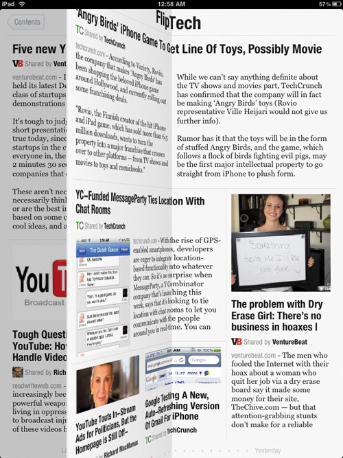  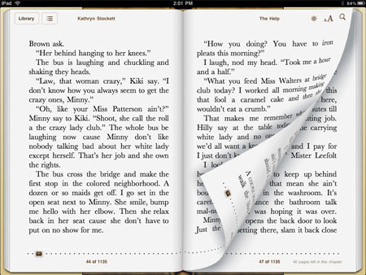  
Screen transitions on Flipboard (image 1) exhibit the principle of squash and stretch to express that the surfaces inside the world of the application are rigid and board-like. By contrast, the screen transitions in Apple’s iBook (image 2) use the principle of squash and stretch to echo the flexible and organic movement of turning the pages of a real paper book.

##### Anticipation:  
Anticipation is all about giving the user insight into what is about to happen next. For example, the principle could be applied to the visual treatment of the interface as the user opens an application. It could also be applied to the transitions between experiences. Because gesture languages are relatively new to users, the principle of anticipation could also be used to provide affordance for gestural UIs. Anticipation gives clues about the speed and direction that objects in a UI can move and the gestural possibilities of those objects.

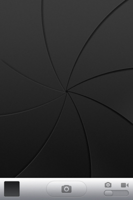  
The aperture animation found in the camera application of many smartphones prepares the user for the action of taking a photograph.

##### Staging:
Staging is most relevant when considering the transitions between screens and interactions. An interaction that is well staged combines light, color, composition and motion to direct the user’s eye to exactly where it needs to be as they interact with the experience. Well-staged mobile experiences have a sense of flow and ease, whereas poorly staged ones feel disjointed.

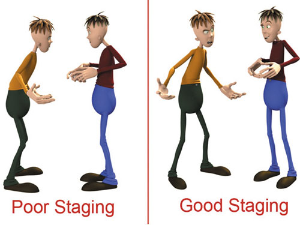    
The well-staged illustration on the right makes the central idea — of two characters engaged in conversation — completely clear. The poorly staged illustration on the left leaves the dynamic between the two characters open to interpretation, making the central idea unclear.  
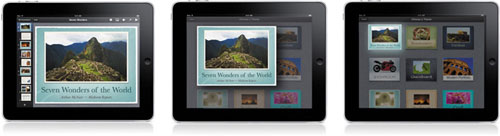  
Good staging used in the iPad version of Keynote enables users to see exactly where the file they are currently working on lives in the application’s file structure. This subtle use of staging makes the user feel grounded in the experience.

##### Straight ahead and pose-to-pose:  
In order to capture fast dynamic action with unusual movement, animators will use the straight-ahead technique and draw every single frame of an animation. The pose-to-pose drawing technique employs the use of keyframes (i.e. the important frames of a sequence) and in-betweens (i.e. the intermediate frames that express movement between the keyframes).  

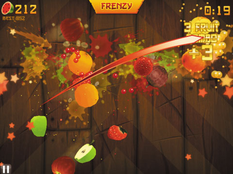  
Popular games such as Plants vs. Zombies for the iPad employ pose-to-pose animation techniques.

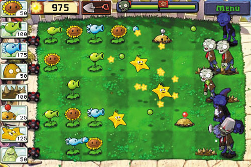  
Games with more complex movement, as in the iPad game Fruit Ninja, use straight-ahead animation techniques to capture dynamic motion.

##### Follow through and overlapping action:  
Overlapping action is the animation principle that captures how parts of an object — such as the dog’s head, tail and legs — move at different rates. Capturing the movement, as well as the slight variations in timing and speed of these parts, makes the objects seem more natural. An action should never be brought to a complete stop before another action has begun.

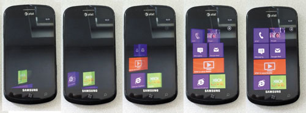  
The transitions to and from the dynamic tiles on the phone employ the principle of overlapping action. The tiles do not travel as one unit, but rather each tile moves at a different rate.

##### Slow in and out:  
Objects in the world need time to accelerate and slow down. A strategy to accurately depict this type of motion is to add more frames of the object near the beginning and end of the movement and fewer in the middle.

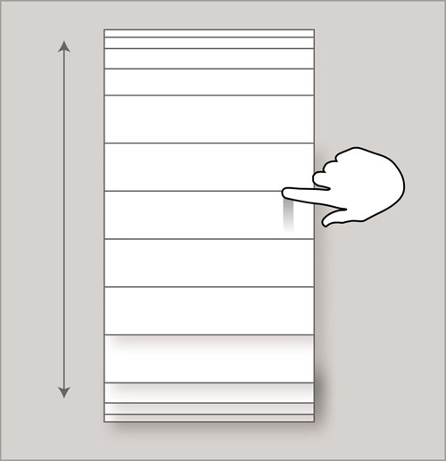  
The principle of slow in and out is applied to the scroll of lists in many mobile UIs. This effect makes the UI appear as if it is governed by the laws of inertia.

##### Arcs:  
When integrating motion into a mobile experience, consider whether the object being animated should reflect organic or mechanical qualities. If the former, then the arc animation principle suggests that the object should move along an arched trajectory. If the latter, then the object would move along a straight path.

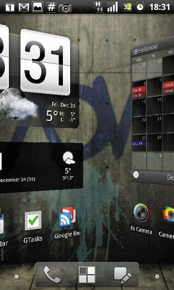  
Interface elements in the Android mobile platform tend to move along straight lines, giving the UI a mechanical feeling.

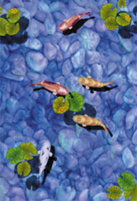  
Natural elements such as the fish and water in this iPhone application move along arched trajectories.  
##### Secondary action:   
  
The primary action of this animation is the movement of the squirrel’s body and legs. The shape and character of the squirrel’s tail as it moves is the secondary action. Together, they make the animation feel more realistic.

The transition that occurs when a user clicks on a URL in an email, activating the browser, is an example of secondary action. The primary action is the browser window swinging forward into view. The secondary action is the email application receding into the background. Both actions occur simultaneously, but the secondary action of the email application supports the primary action of the browser window.

##### Timing:  
In addition to expressing physical characteristics, timing helps communicate the emotional state, mood and personality of an object or character. Whether it’s the speed at which a list scrolls or the pacing of a transition between screens in a mobile application, timing is subtle yet important to master.

##### Exaggeration:  
The classic definition of exaggeration, employed by Disney, is to remain true to reality but to present a wilder form. When applying this principle to movement in a mobile experience, exercise a certain level of restraint. If a scene contains several elements, then the exaggeration of those elements should be balanced relative to each other, to avoid confusing or annoying the viewer.

##### Solid Drawing:  
Solid drawing is about honoring the rules of three-dimensional space and giving objects and characters appropriate dimensionality through volume and weight. Solid drawing requires animators to understand the basics of three-dimensional shapes: anatomy, weight, balance, light and shadow.

##### Appeal:
The appeal of an animated character is similar to the charisma of a live actor. A character who is appealing is not necessarily sympathetic — because villains or monsters can also be appealing. The important thing is that the viewer feels the character is real and interesting.

The last two principles are the most specific to character animation. Thus, they have slightly less relevance to mobile UX.

## Guided Practice: 12 universal principles of animation in Android (5 mins)
Let's think of examples of apps that you have used that follow the principles we have discussed.

## Introduction: Interpolators (5 mins)
An interpolator is an animation modifier defined in XML that affects the rate of change in an animation. This allows your existing animation effects to be accelerated, decelerated, repeated, bounced, etc.

An interpolator is applied to an animation element with the ```android:interpolator``` attribute, the value of which is a reference to an interpolator resource.

All interpolators available in Android are subclasses of the Interpolator class. There are 9 subclasses:
* AccelerateDecelerateInterpolator
* AccelerateInterpolator
* AnticipateInterpolator
* AnticipateOvershootInterpolator
* BounceInterpolator
* CycleInterpolator
* DecelerateInterpolator
* LinearInterpolator
* OvershootInterpolator

Let's take two minutes and watch this video about different types of [interpolators](https://www.youtube.com/watch?v=6UL7PXdJ6-E) to get familiar with them.

> Instructor Notes: There should be 2 minutes' pause to show the video on the projector.

## Demo: Interpolators (5 mins)  
Now let's see how interpolators work in code. Open the [InterpolatorApp](starter-code/InterpolatorApp) project from the [starter code](starter-code) and run the project.  
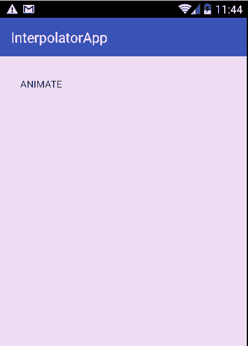

> Instructor Notes: Discuss 4 xml files in the folder res/anim: **pull_right.xml**, **pull_left.xml**, **push_out_left.xml**, **push_out_right.xml**. The transition between 2 activities is sliding from left to right. Pay students' attention to the fact that each anim file has an ```android:interpolator``` attribute.

## Introduction: View Animation (5 mins)
Android lets you define properties of Views that should be animated using a technique called tween animation. You implement the animation by specifying transformations on your View at the start and at the end of the animation. It also calculates the animation with information such as size and rotation. This can be done in XML resource files or programmatically. So, if you have a TextView object, you can move, rotate, grow, or shrink the text. If it has a background image, the background image will be transformed along with the text.
The animation XML file belongs in the ```res/anim/``` directory of your Android project. The file must have a single root element: this will be either a single ```alpha```, ```scale```, ```translate```, ```rotate``` and interpolator element.  
The following code will reference animation and apply it to any view from the layout.
```
Animation animation = AnimationUtils.loadAnimation(this, R.anim.animation);
textView.startAnimation(animation);
```

## Guided Practice: Types of view animation (10 mins)
*The demo project and the source code is in the [ViewAnimation project] (starter-code/ViewAnimation)*

Let's look at different types of animation:    
1 Scale - inscreasing/decreasing the size of the view.  
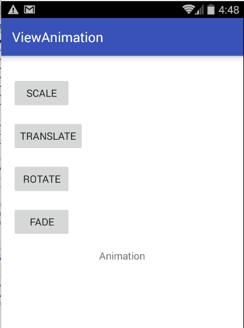    
The XML file for scaling a View from 0 to 100% will look like this:    
```
<?xml version="1.0" encoding="utf-8"?>
<scale xmlns:android="http://schemas.android.com/apk/res/android"
  android:interpolator="@android:anim/accelerate_decelerate_interpolator"
  android:duration="300"
  android:fillAfter="true"
  android:fromXScale="0.0"
  android:fromYScale="0.0"
  android:toXScale="1.0"
  android:toYScale="1.0" />
```
2 Rotate -  moving a view around a pivot point.  
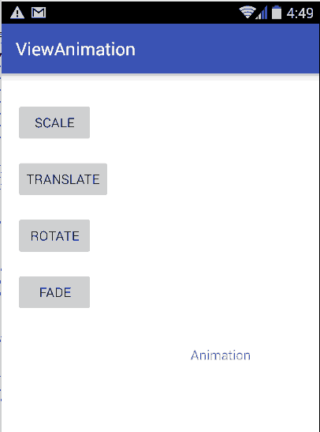    
The XML file for rotating a View will look like this:    
```
<?xml version="1.0" encoding="utf-8"?>
<rotate xmlns:android="http://schemas.android.com/apk/res/android"
  android:interpolator="@android:anim/accelerate_decelerate_interpolator"
  android:duration="300"
  android:fillAfter="true"
  android:fromDegrees="0"
  android:toDegrees="360"
  android:pivotX="25%"
  android:pivotY="25%" />
```
3 Translate - moving the view from one location of the screen to another.  
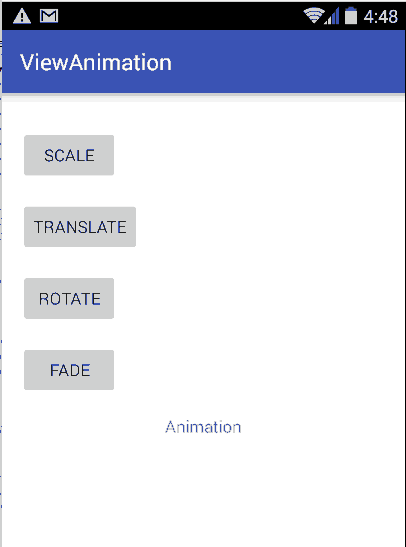  
The XML file for translating a View will look like this:    
```
<?xml version="1.0" encoding="utf-8"?>
<translate xmlns:android="http://schemas.android.com/apk/res/android"
  android:interpolator="@android:anim/accelerate_decelerate_interpolator"
  android:duration="300"
  android:fillAfter="true"
  android:fromXDelta="10"
  android:fromYDelta="0"
  android:toXDelta="100%"
  android:toyDelta="100%" />
```
4 Alpha - fading in or fading out a view by changing its transparency over time.  
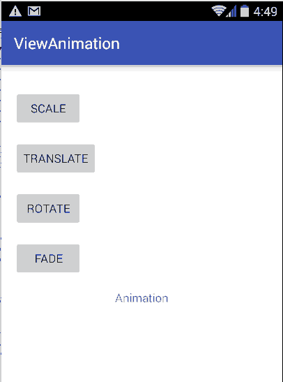  
The XML file for fading a View will look like this:    
```
<?xml version="1.0" encoding="utf-8"?>
<alpha xmlns:android="http://schemas.android.com/apk/res/android"
  android:interpolator="@android:anim/accelerate_decelerate_interpolator"
  android:duration="1000"
  android:fillAfter="false"
  android:fromAlpha="1.0"
  android:toAlpha="0.0" />
```

## Introduction: Combining Animation Types (5 mins)
Each of the animation types above have good uses on their own but the real power of animations lies in combining multiple animations into one. The ```set``` XML element lets you create animations that are made from multiple effects, either simultaneously or one after the other. The ```set``` element allows to combine the other animation types into groups. By default, all animation instructions are applied simultaneously. To make them occur sequentially, you must specify the startOffset attribute, as shown in the example below.

## Demo: Complex Animation (10 mins)  
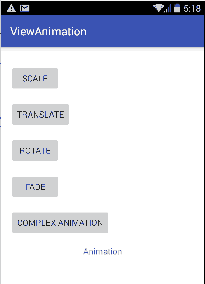  
As we can see from the gif, the text view is animated in different ways, not just in one direction/way. It is a great example of a complex animation.   
If we look at the code, we can see that the xml file is the only file to get changed to make animation complex. The parent xml element ```set``` unites ```scale``` type of animation with another ```set```, which includes two types of animation in its turn: ```scale``` and ```rotate```. As you might have already noticed the two child elements have their own interpolators: ```accelerate_decelerate_interpolator``` and ```decelerate_interpolator```.  
```
<set android:shareInterpolator="false">
    <scale
        android:interpolator="@android:anim/accelerate_decelerate_interpolator"
        android:fromXScale="1.0"
        android:toXScale="1.4"
        android:fromYScale="1.0"
        android:toYScale="0.6"
        android:pivotX="50%"
        android:pivotY="50%"
        android:fillAfter="false"
        android:duration="700" />
    <set android:interpolator="@android:anim/decelerate_interpolator">
        <scale
           android:fromXScale="1.4"
           android:toXScale="0.0"
           android:fromYScale="0.6"
           android:toYScale="0.0"
           android:pivotX="50%"
           android:pivotY="50%"
           android:startOffset="700"
           android:duration="400"
           android:fillBefore="false" />
        <rotate
           android:fromDegrees="0"
           android:toDegrees="-45"
           android:toYScale="0.0"
           android:pivotX="50%"
           android:pivotY="50%"
           android:startOffset="700"
           android:duration="400" />
    </set>
</set>
```

## Introduction: Layout Animation (5 mins)
A layout animation is a pre-loaded animation that the system runs each time you make a change to the layout configuration. All you need to do is set an attribute in the layout to tell the Android system to animate these layout changes, and system-default animations are carried out for you.   
In your activity's layout XML file, set the ```android:animateLayoutChanges``` attribute to ```true``` for the layout that you want to enable animations for. For instance:
```
<LinearLayout android:id="@+id/container"
    android:animateLayoutChanges="true"
    ...
/>
```
It can be done in java classes programmatically. LayoutTransition class enables automatic animations on layout changes in ViewGroup objects. To enable transitions for a layout container, you will need to create a LayoutTransition object and set it on any ViewGroup by calling ```setLayoutTransition(LayoutTransition)```. This will cause default animations to run whenever items are added to or removed from that container. For instance:
```java
LayoutTransition layout = new LayoutTransition();
layout.enableTransitionType(LayoutTransition.CHANGING);
view.setLayoutTransition(layout);
```

## Demo: Layout Animation (5 mins)  
The layout code animation app could be found in [ViewAnimation] (starter-code/ViewAnimation) in the *LayoutAnimationActivity* and *layout_animation_activity.xml*.  
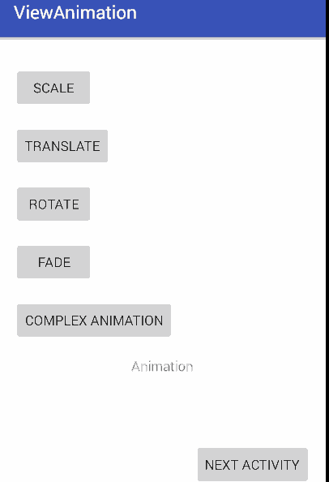  

## Independent Practice: Layout Animation (15 mins)  
Open the project [ViewAnimation] (starter-code/ViewAnimation), click the button "nextActivity" and you will be redirected to the activity that deals with layout animation. Every time you click the button "add button", another button gets added to the view group. Create another button "delete button"  that will remove a button from the same view group. Look at the screenshot:   
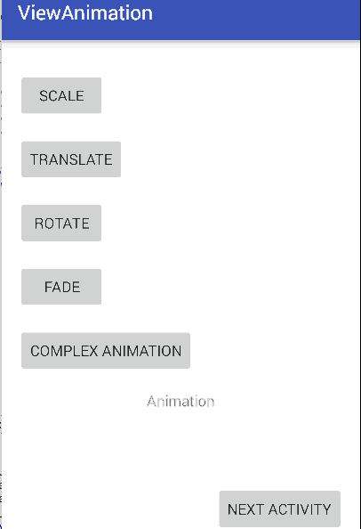

> Instructor Notes: The solution code to independent practice can be found in the [IndependentPracticeSolution project] (solution-code/IndependentPracticeSolution).

## Check (5 mins)
 1. What are the 12 universal principles of animation?
 2. What types of view animation exist?
 3. What is an interpolator?
 4. How does layout animation work on Android platform?

## Conclusion (5 mins)  
View and Layout animation let you create visually appealing features and transitions in you apps. Using these animations in the right places can turn your good looking app into an outstanding and highly usable app. There are a lot of great apps already existing, but there are not that many apps that could demonstrate great animated features. Make sure your app is as natural and appealing as it can be and the number of the downloads of your app will go up!

---

## Additional Resources
- [12 Principles of Animation Video Playlist](https://www.youtube.com/playlist?list=PL-bOh8btec4CXd2ya1NmSKpi92U_l6ZJd)
