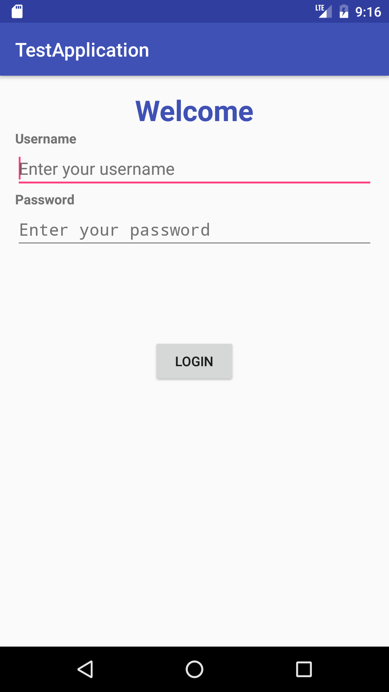

### LESSON GUIDE

| TIMING  | TYPE  | TOPIC  |
|:-:|---|---|
| 15 min  | [Introduction](#introduction-views-15-minutes)  | Views |
| 10 min  | [Guided Practice](#guided-practice-lets-draw-a-few-layouts-10-minutes)  | Let's draw a few Layouts |
| 20 min  | [Introduction](#introduction-layouts-and-xml-20-minutes)  | Layouts and XML |
| 15 min  | [Guided Practice](#guided-practice-lets-program-some-layouts-15-minutes)  | Let's program some layouts |
| 20 min  | [Independent Practice](#independent-practice-define-your-own-layouts-20-minutes)  | Define your own layouts |
| 5 min  | [Conclusion](#conclusion-5-mins)  | Review / Recap |
---
title: Views 101
type: Lesson
duration: "1:30"
creator:
    name: James Davis
    city: NYC

---

#  Views 101

### Objectives
*After this lesson, students will be able to:*

* Identify what a view is and what it’s used for
* Match sections of the view XML to what’s on the screen

### Preparation
*Before this lesson, students should already be able to:*

- Create or import a project in Android Studio


## Introduction: Views (15 minutes)

#### What is a view?

A **View** is the basic building block for any app's user interface (UI). Views define components that can be seen by the user, such as text fields, buttons, and images.

<a href="screenshots/tweet-screenshot.png"></a> <a href="screenshots/tweet-screenshot_highlighted.png"></a>

*(Left) A screen in Twitter, (Right) the same screen with common views highlighted*

#### What are the types of views?

Some of the most commonly used views are:

* TextView
* EditText
* Button
* ImageView
* CheckBox and Switch
* ProgressBar
* WebView

#### TextViews

Simply, they display text that's provided to them. You can change the text, text color, typeface, size, etc. Think of it like changing fonts in a word processor.

#### Buttons

Buttons are fancy TextViews. Just like a TextView, you can set its text and change its font attributes.

Buttons, by default, have a background that react to a user's touch. (i.e., it looks like you are pressing a physical button). You can create your own custom button backgrounds. That is covered in a future lesson.

#### How are views laid out on screen?

* A Layout defines how other views are shown on screen.
* There is a parent/child relationship. Layouts are parent views that contain child views.
* **RelativeLayout** arranges views relative to each other. Examples:
	* This TextView is below this ImageView
	* This Button is to the right of another button
	* This ImageView is centered, relative to the RelativeLayout itself.

*For the purposes of this lesson, we will only look at RelativeLayout. We talk about the other layouts more in depth in the Layouts lesson.*

Refer to [this](https://s3-us-west-1.amazonaws.com/udacity-content/PDFs/Common+Android+Views+Cheat+Sheet+(1).pdf) online cheat sheet for help remembering different types of views and the corresponding syntax.

## Guided Practice: Let's draw a few Layouts (10 minutes)

In pairs, on your desks, draw and identify the components of the following UIs using the views we just learned:

* A post on Facebook or Twitter
* A dating card on Tinder
* The description on a YouTube video

You should have an idea of popular components for well-known applications.

## Introduction: Layouts and XML (20 minutes)

#### How do I create my UI using layouts?

*Here's a quick refresher on XML files: [XML Lesson](#)*

The easiest way to place views are by using XML based layout files. Each element represents a different view or layout; attributes define how the views and layouts are displayed to the user.

Here's an example of how a TextView is represented in xml:

```xml
<TextView
        android:id="@+id/textView"
        android:layout_width="wrap_content"
        android:layout_height="wrap_content"
        android:text="Hello World!" />
```

Elements that don't hold other views, like TextView, can be defined as empty tags.  Most attributes are in the XML namespace, "android:". This denotes default attributes provided by Android.


Every element ***is required*** to have **layout_width** and **layout_height** attributes. Otherwise, the app will not compile.

`layout_width` and `layout_height` can be defined in 3 ways:

* An exact dimension, in pixels (talked about in depth in Views 102)
* **wrap_content**, where it takes up only the amount of space it needs. For instance, with a TextView, setting its width to wrap_content makes it as wide as its text.
* **match_parent**. Remember, layouts are considered parents. Using this makes the width or height match the parent's width or height, respectively.

The **id** attribute is not mandatory, but is important. It is used whenever you want to reference a view or layout, either within a layout or in Java.

Here's a more detailed example of a full xml layout:

```xml
<?xml version="1.0" encoding="utf-8"?>
<RelativeLayout xmlns:android="http://schemas.android.com/apk/res/android"
    android:layout_width="match_parent"
    android:layout_height="match_parent">

    <TextView
        android:id="@+id/textView1"
        android:layout_width="wrap_content"
        android:layout_height="wrap_content"
        android:layout_centerHorizontal="true"
        android:text="Top" />

    <TextView
        android:layout_width="wrap_content"
        android:layout_height="wrap_content"
        android:layout_below="@id/textView1"
        android:layout_centerHorizontal="true"
        android:text="Bottom"
        android:textSize="20sp"
        android:textColor="#000000"
        android:textStyle="bold" />

</RelativeLayout>

```


In this example, take note of the following:

* The layout is defined as a RelativeLayout that is the width and height of the device's screen
* The RelativeLayout is the parent of two children: Two TextViews
* The top TextView, with id "textView1", is centered horizontally in the relative layout. It's width and height wraps around its text, "Top".
* The bottom TextView, with no id, is also centered horizontally in the relative layout. It's width and height wraps around its text, "Bottom".

	* Because it is a TextView, it also defines its optional parameters: text size is 20 scaled pixels (Views 102), text color is the hex code for black, and the text style is bold.
	* Because its parent is a RelativeLayout, the text view can be placed relative to other views. In this case, it is directly below the view with id "textView1".

## Guided Practice: Let's program some layouts (15 minutes)

Let's go over adding views and layouts in Android Studio. We will start off dragging views in the Android Studio Designer Tool, then switch over to the XML view to see how they are related. Then, we will add views via xml and see how the look in the preview.

## Independent Practice: Define your own layouts (20 minutes)


Work with the person next to you and try to recreate the screenshot below:



**Bonus**: Add more customization to the screen.

## Conclusion (5 mins)
- What is a view?
- How does a RelativeLayout work?
