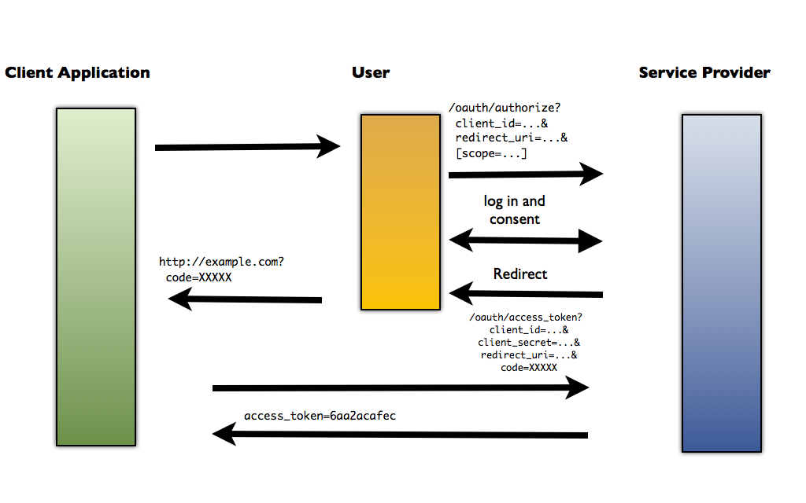

#  OAuth

### LEARNING OBJECTIVES
*After this lesson, you will be able to:*
- Explain OAuth 2.0 flow
- Implement OAuth 2.0 with Instagram
- Use the authentication to access the Instagram API

### STUDENT PRE-WORK
*Before this lesson, you should already be able to:*
- Explain HTTP requests
- Use and explain API documentation

### INSTRUCTOR PREP
*Before this lesson, instructors will need to:*
- This lesson relies heavily on Instagram's API, which is subject to change. **Before you teach this lesson, be sure to test out all of the code below, as you may need to make adjustments to accommodate any changes that Instagram makes to its API.** Instagram also now requires new applications to undergo approval before granting full API access, so it's strongly recommended that you set up your API credentials in advance (or use a set of credentials that have already been approved). API credentials that are sandboxed awaiting approval will be able to access the authenticated user's photos but not all public photos, so the below exercise should still work, albeit with a limited amount of content.

---


### LESSON GUIDE

| TIMING  | TYPE  | TOPIC  |
|:-:|---|---|
| 5 min  | [Opening](#opening-5-min)  | Discuss lesson objectives |
| 15 min  | [Introduction](#introduction-oauth-15-min)  | OAuth |
| 15 min  | [Demo](#demo-lets-get-to-building-15-min)  | Let's Get to Building! |
| 5 min  | [Demo](#demo-setting-up-our-view-5-min)  | Setting up our View |
| 10 min  | [Demo](#demo-login-activity-10-min)  | Login Activity |
| 15 min  | [Guided Practice](#guided-practice-pseudocode-15-minutes)  | Pseudocode |
| 20 min  | [Independent Practice](#independent-practice-retrieving-the-image-20-min)  | Retrieving the image |
| 5 min  | [Conclusion](#conclusion-5-min)  | Review / Recap |
<a name = "opening"></a>
## Opening (5 min)

We already have some background in consuming an API's data, but we need to go over what to do when an API requires you to make authenticated requests. Often times when dealing with third-party API's (Google, Twitter, etc.) access to certain data are contingent upon being authenticated by the third-party's server.

> Check: What does this mean, in laymen's terms?

What this means is that for every time we use the API, it wants to know who we are, and more specifically, that we have the authority to interact with their endpoints. This process of authenticating with a third-party API is known as OAuth (Open Authorization). For today's lesson we will gain an understanding of how OAuth works, as well as other related API authentication concepts by building an app which shows user's Instagram photos posted in the vicinity of their current location.

---

<a name = "introduction"></a>
## Introduction: OAuth (15 min)

*OAuth is an open standard for authorization. OAuth provides client applications a 'secure delegated access' to server resources on behalf of a resource owner. It specifies a process for resource owners to authorize third-party access to their server resources without sharing their credentials.* - [Wikipedia](https://en.wikipedia.org/wiki/OAuth)

For any company that wants to track the usage of their API on a user level, they will implement OAuth. So how exactly does it work? Let's breakdown the following diagram:


Credit: [Thenu's Blog](http://thenuzan.blogspot.com/2014/08/oauth-10-vs-20.html)

> Check: Turn to the person next to you, and try to explain this diagram in your own words. Take two minute and be ready to share out.  

Let's review the OAuth Flow:

- User is redirected from our application to the third-party API we wish to authenticate with (let's go with Instagram), passing Client ID and  Secret.
- User logs into Instagram.
- Instagram redirects user back to our application with a code.
- User sends a POST request to Instagram that includes the code, and receives an **access token** back.
- User can now make requests for resources from the third-party API with the provided access token. The access token is used by the Instagram server to verify User's authentication and authority to make requests.
- User receives resources from Instagram.

***Note:*** Having an access token does not mean you can perform any HTTP method on the resource provider's API, nor does it mean your request for any type of data will be granted. Each access token is accompanied with a "scope" of authority. This scope varies per API and user consent.

For example, if you have ever logged into an app using OAuth (maybe you've logged into Spotify with Facebook) you are asked whether or not it is okay for the application to obtain certain information from the third-party API (profile picture, friends list, etc.).

---

<a name = "setup"></a>
## Demo: Let's Get to Building! (15 min)

> Instructor Note: Students should do this *with* you.

The app we will be making will show our user their most recently posted image.

Here are the steps we'll take in this endeavor:

- Gather our Instagram developer credentials
- Create our initial view which will have a way for our user to perform OAuth
- Contact Instagram endpoint with access token
- Parse through API response for our image and put them into the view

#### What Instagram Endpoint Do We Hit?


Our idea is to find Instagram photos based off the user's most recent photo. How do we go about figuring out if it's possible to do this? Well, we already know from our previous API lesson that in order to receive a resource from an API, the API must expose a specific endpoint that can be pinged for the wanted data. If we Google "Instagram endpoints," you should be able to find Instagram's [documentation on endpoints](https://instagram.com/developer/endpoints/). Take 5 minutes to explore the API with your partner and find which one we need.

> Check: Give the students 5 minutes to look through the API and come up with an answer.

[Solution](https://www.instagram.com/developer/endpoints/users/#get_users_media_recent_self)

As we inspect the Instagram endpoint, we can see that as long as we pass the access token, we can get the most recent media from our own account.

#### Get Instagram Credentials

> Instructor Note: Students should have already signed up for Instagram API credentials as homework. You will now quickly review the sign up process with them, to ensure they understand what all the information they entered in is and why it is needed.

The first step in working with a third-party API that requires authentication is to register your application with the API. The purpose of this is so what that the API, in this case Instagram, can give our app credentials to use in future requests so it can recognize who is asking for what information. Let's go ahead and get our credentials.

First and foremost, you must have an Instagram account. If you don't already have one, please sign up. Once you are signed in, visit Instagram's [developer site](https://instagram.com/developer/). Here you will see an option in the navbar to "Manage Clients". Click it. Once [here](https://instagram.com/developer/clients/manage/) register your application by clicking on the "Register a New Client" button. You should see the following:


After you fill out the form you'll have:


Most of the fields values should be pretty self-explanatory. However, _Valid Redirect URIs_ may not be as obvious. If you can recall the OAuth flow we went over earlier, do you remember the process of obtaining our beloved access token?

 After our user leaves our app to log in to Instagram, Instagram redirects them back to our app with the access token. So how does Instagram know where to send the authenticated user? Well that input value, `http://localhost:3000`, is how. We have not yet covered what `http://localhost:3000` is, but for now just know that it is the URI that our app will be connected to and so it is the URI we want Instagram to redirect to.

> Instructor Note: Make sure students don't miss the colon (":") in `http://localhost:3000`. This will likely trip up some students who haven't run a local server before!


Once you have completed registering your client, you will see your `CLIENT ID`, `REDIRECT URI ` and other information pertaining to your Instagram app on the ["Manage Clients"](https://instagram.com/developer/clients/manage/) view. In order to obtain an access token for our app, we must pass the client id of our app in our access token request to Instagram. Once again, the reason Instagram wants you to pass this credential with your request, is so that Instagram can track which third-party application (our application) is associated with which access token.

The process will consist of four steps:

- Sending our user to Instagram with the given URI (https://instagram.com/oauth/authorize/?client_id=your_client_id&redirect_uri=your_callback&response_type=code&scope=public_content) to authenticate. Note how we pass our client id and redirect URI as query values.
- Upon authentication we will receive a response back that contains our access code.
- We send our access code, client secret, client id, grant type (what we're asking for), and the redirect url in the header.
- If successful, we will receive the access token we can use to access all available Instagram data.

> Check: Do all students have their credentials properly set up? (Client ID, etc.)

---
<a name = "demo"></a>
## Demo: Setting up our View (5 min)

Alright, now that all our Instagram configuration is setup, go ahead and open the starter code. It contains two layouts, one for the login screen, another for displaying our image.

```xml
<?xml version="1.0" encoding="utf-8"?>
<RelativeLayout xmlns:android="http://schemas.android.com/apk/res/android"
    xmlns:tools="http://schemas.android.com/tools"
    android:layout_width="match_parent"
    android:layout_height="match_parent"
    android:paddingBottom="@dimen/activity_vertical_margin"
    android:paddingLeft="@dimen/activity_horizontal_margin"
    android:paddingRight="@dimen/activity_horizontal_margin"
    android:paddingTop="@dimen/activity_vertical_margin"
    tools:context="drewmahrt.generalassemb.ly.instagramexample.LoginActivity">

    <WebView
        android:id="@+id/webview"
        android:layout_width="match_parent"
        android:layout_height="match_parent"></WebView>

</RelativeLayout>
```

The login activity contains a webview that will allow the user to type in their Instagram login credentials and give our app access to their account.

```xml
<?xml version="1.0" encoding="utf-8"?>
<RelativeLayout xmlns:android="http://schemas.android.com/apk/res/android"
    xmlns:tools="http://schemas.android.com/tools"
    android:layout_width="match_parent"
    android:layout_height="match_parent"
    android:paddingBottom="@dimen/activity_vertical_margin"
    android:paddingLeft="@dimen/activity_horizontal_margin"
    android:paddingRight="@dimen/activity_horizontal_margin"
    android:paddingTop="@dimen/activity_vertical_margin"
    tools:context="drewmahrt.generalassemb.ly.instagramexample.MainActivity">

    <ImageView
        android:id="@+id/image"
        android:layout_width="match_parent"
        android:layout_height="match_parent"
        android:layout_centerInParent="true"
        android:scaleType="centerCrop"/>
</RelativeLayout>
```
The main activity contains an image view to show our latest user image.

> Check: Do all students have an image view that shows their latest user image?

---

<a name = "demo"></a>
## Demo: Login Activity (10 min)

Before we look at the code, open the InstagramAppData file, and fill in your apps information.

```java
protected void onCreate(Bundle savedInstanceState) {
        super.onCreate(savedInstanceState);
        setContentView(R.layout.activity_login);

        mWebView = (WebView) findViewById(R.id.webview);
        mWebView.setWebViewClient(new WebViewClient() {
            @Override
            public boolean shouldOverrideUrlLoading(WebView view, String url) {
                if(url.contains("code=")){
                    System.out.println(url);
                    int index = url.indexOf("=");
                    System.out.println(url.substring(index+1));
                    String code = url.substring(index+1);
                    getAccessToken(code);
                    return true;
                }else {
                    return false;
                }
            }
        });
        mWebView.loadUrl(ADD YOUR URL HERE);
    }
```

> Check: With the person next to you, take a minute to predict what the code above does?

The code above does three things. It gets a reference to our webview, allows us to control what happens when it tries to move between pages, and finally, loads the actual page.

> Check: Take 5 minutes with your partner and try to figure out what should be passed into the loadUrl method. [Use the authentication section of the documentation](https://www.instagram.com/developer/authentication/).

---

## Guided Practice: Pseudocode (15 minutes)

With your partner, take 5 minutes to write out the pseudocode for the steps we need to get the access token now that we have our access code.  Also, pseudocode what we should do next!

[Solution](getAccessToken.java)

> Instructor Note: Have a student share out their solution.

> Check: Ask the students what we could do to eliminate doing these checks every time the app opens.

---

<a name = "lab"></a>
## Independent Practice: Retrieving the image (20 min)

Now that we've had some experience with the Instagram API and making calls to it, it's time for you to try it on your own. Work with a partner to figure out how to use the API call we found earlier to retrieve the image and put it in the image view.


> Check: Have one student share their answer. Were all of the students able to complete the assignment?

---

<a name = "conclusion"></a>
## Conclusion (5 min)

- Describe the OAuth flow.
- Why do some third-party APIs require authentication?
