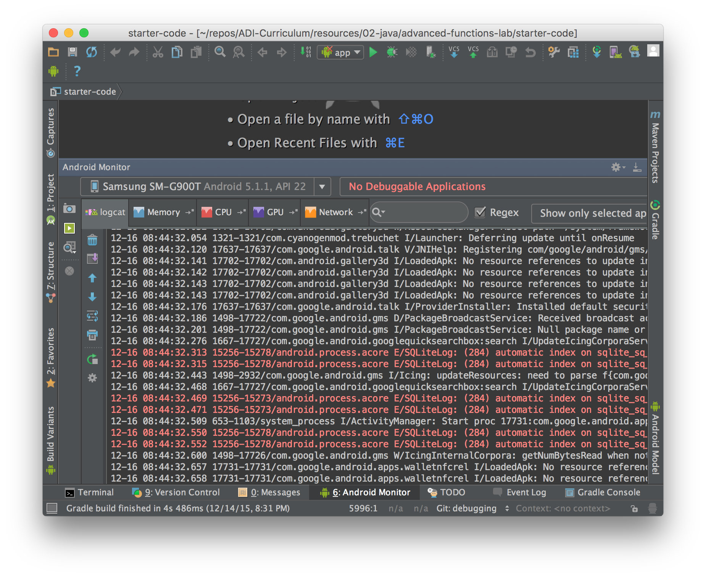

#  Debugging in Android Studio

### LEARNING OBJECTIVES
*After this lesson, you will be able to:*
* Add logging statements to code
* Show toast messages

### STUDENT PRE-WORK
*Before this lesson, you should already be able to:*
* Have Android Studio installed
* Have at least one emulator image downloaded

### INSTRUCTOR PREP
*Before this lesson, instructors will need to:*
- Gather materials needed for class
- Complete Prep work required
- Prepare any specific instructions

---

## Introduction: Logs and LogCat (5 minutes)

<a href="screenshots/logcat.png"></a>

Android provided a way to view messages sent from a device. This is called [logcat](http://developer.android.com/tools/help/logcat.html).

An app can send messages to the logcat system to provide useful information to a developer. For instance, if an app crashed, the app would send a message saying that it crashed and that it crashed at a particular line of code!

#### Demo: What do Log messages look like? (5 minutes)

Like this:

```
W/EmailActivity: Could not fetch emails successfully.
```

Let's break this down.

``W``: The type of message (discussed in the next section). This can be V, D, I, W, or E.

``EmailActivity:``: This is the tag of the message. A tag is just a way of saying where you are in the code. Usually, the tag says what screen is currently visible and/or what method is currently being called. There's no science to it; it should be descriptive so you know what the message relates to.

``Could not fetch emails successfully.``: This is the message. This describes what is being logged, and why.

#### Introduction: Types of Log messages (5 minutes)

There are 5 types of Log messages. In order of severity:

* Verbose
* Debug
* Info
* Warning
* Error

**Verbose**: Generally, the most descriptive. Used to log as much info needed for a particular section.

**Debug**: Probably the most useful. Used to show debugging messages, like variable values or noting when you hit certain parts of the app.

Debug messages are visible on debug versions of an app. Release versions do not show debug messages.

**Info**: Used to show informative messages. Messages like "successfully connected to server" or "Could not delete item from list."

**Warning**: Use this when something that should not happen just happens (or may happen), but it is not a full fledged error. An example would be warning the developer that they are using too much memory, and are in danger of crashing the app.

**Error**: Used when an error happens. These show up as red text in the logcat.

## Demo: Logcat (15 minutes)

Let's show how to open LogCat and how to filter messages to be useful to them.

## Using Log statements

Sometimes, for any reason, you will need show your own messages while you are running your app.

To do this, you would use [Log Statements](http://developer.android.com/reference/android/util/Log.html).

A Log Statement is a line of code that, when run, it displays a given message to the logcat. Here's how to send a debug log to logcat:

```java
Log.d("MainActivity", "The onCreate() method was called");
```

Let's break this up:
* All Log statements belong to the static class, [Log](http://developer.android.com/reference/android/util/Log.html).
* The Log class contains methods that match the types of Log messages:
  * Log.v() for Verbose
  * Log.d() for Debug
  * Log.i() for Info
  * Log.w() for Warning
  * Log.e() for Error
* Each of these methods take two String parameters: the Tag and the message

## Guided Practice: Adding log statements (10 minutes)

Using the [provided sample code](starter-code), which is filled with functions calling each other, let's add log statements to the code.

> Instructor Note: The teacher will ask the students about expected output, what logs show, etc.

## Introduction: Displaying messages to the User (10 minutes)

#### Toasts

Toasts are messages that pop up to the user, showing the user information that is important to them.

<p align="center">
  <a href="screenshots/toast.png"></a>
</p>

For an email client, for example, the toast "Email sent" would be shown after the email is sent successfully. A lot of times, you would see a toast pop up, saying "No Network Connection" if you try to do something that requires internet.

To display toasts, you do the following:

```java
Toast
  .makeText(MainActivity.this, "Saved email to drafts folder.", Toast.LENGTH_SHORT)
  .show();
```

As usual, let's break this up:

* The class Toast has a static method called `makeText`. This method takes three parameters:
  * Context: Usually the Activity.
  * The message to show
  * The amount to time the toast should be shown. Either LENGTH_SHORT or LENGTH_LONG, which is 2 seconds or 3.5 seconds, respectively.
* The `makeText` method creates a new Toast object, but does now show it on the screen. So, you have to call Toast's `show` method.

## Guided Practice: Adding toasts (10 minutes)

Using the [provided sample code](starter-code), which is a screen with four buttons, lets add a few toasts!


## Conclusion (5 mins)
- What is a log statement?
- What is a toast?

---

### Additional Resources
- [Toasts](https://developer.android.com/reference/android/widget/Toast.html)
- [Log Statements](https://developer.android.com/studio/debug/log.html)
