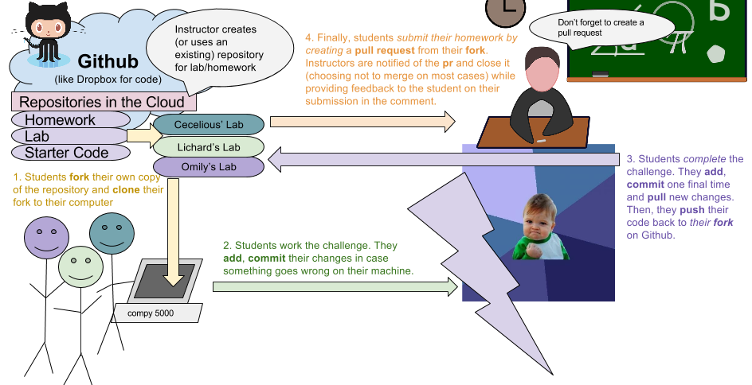

### LESSON GUIDE

| TIMING  | TYPE  | TOPIC  |
|:-:|---|---|
| 10 min  | [Introduction](#introduction-git-vs-github-and-version-control-10-mins)  | Git vs GitHub and version control |
| 15 min  | [Demo](#demo-why-is-git-tricky-to-understand-15-mins)  | Why is Git tricky to understand? |
| 15 min  | [Guided Practice](#guided-practice-lets-use-git-15-mins)  | Let's use Git |
| 10 min  | [Guided Practice](#guided-practice-making-and-cloning-repositories-10-mins)  | Making and cloning repositories  |
| 5 min  | [Introduction](#introduction-what-is-forking-5-mins)  | What is forking? |
| 15 min  | [Guided Practice](#guided-practice-working-with-forks-and-creating-pull-requests-on-github-15-mins)  | Working with Forks and Creating Pull Requests on GitHub |
| 10 min  | [Independent Practice](#independent-practice-assess-10-mins)  | Assess |
| 10 min  | [Introduction](#introduction-git-ignore-file-10-mins)  | Git Ignore file |
| 5 min  | [Conclusion](#conclusion-5-mins)  | Review / Recap |
---
title: Git and GitHub Intro
type: lesson
duration: "1:35"
creator:
    name: Micah Rich
    city: LA
competencies: Workflow
---

#  Git and GitHub Intro

### LEARNING OBJECTIVES
*After this lesson, you will be able to:*
- Explain basic git commands like init, add, commit, push, pull and clone
- Distinguish between local and remote repositories
- Create, copy, and delete repositories locally, or on GitHub
- Fork and clone remote repositories

### STUDENT PRE-WORK
*Before this lesson, you should already be able to:*
- Install a text editor (Sublime or Atom works well for this one!)
- Use the command line
- Use a text editor

## Introduction: Git vs GitHub and version control (10 mins)

As developers, we often have to make changes to many files, each of which can have a major impact on the project. In order to keep track of these changes, we use version control systems. There are many different version control systems; we will be concentrating on Git.

> Describe Subversion

#### What is Git?

[Git](https://git-scm.com/) is:

- A program you run from the command line
- A distributed version control system

Programmers use Git so that they can keep the history of all the changes to their code. This means that they can rollback changes (or switch to older versions) as far back in time as they started using Git on their project.

You know how Google Docs allow you to have a "version history" and move between different versions whenever you want?  Git enables you to do that with any folder - and its contents - on your computer!

A codebase in Git is referred to as a **repository**, or **repo**, for short.

Git was created by [Linus Torvalds](https://en.wikipedia.org/wiki/Linus_Torvalds), the principal developer of Linux.

#### What is GitHub?

[GitHub](https://github.com/) is:

- A hosting service for Git repositories
- A web interface to explore Git repositories
- A social network of programmers
- We all have individual accounts and put our codebases on our GitHub account
- You can follow users and star your favorite projects
- Developers can access codebases on other public accounts
- GitHub uses Git

#### Can you use git without GitHub?

> Instructor Note: Explain the differences between 'remote' and 'local'.

Git is a software that enables version control on local folders on your machine.  GitHub is a place to host your Git repositories, remotely. You can certainly have local files, that are using Git, that are not sent to or stored on GitHub.

Read [this](http://stackoverflow.com/questions/11816424/understanding-the-basics-of-git-and-github) when you have time!

> Check: Describe how remote files compare to local files.  Describe how Git compares to GitHub.

## Demo: Why is Git tricky to understand? (15 mins)

Git is tricky to understand because describing 'how' it works would require the use of strange and technical-sounding words like:

- [Directed acyclic graph](https://en.wikipedia.org/wiki/Directed_acyclic_graph)
- [SHA-1](https://en.wikipedia.org/wiki/SHA-1)
- blob
- tree

However, you don't actually need to know how it works under the hood in order to use it.

#### Trees?!

Even though you don't need to know how they work, it is useful to know that your local repository consists of three "trees" maintained by Git.

- **Working Directory**: which holds the actual files.
- **Index**: which acts as a staging area
- **HEAD**: which points to the last commit you've made.


#### So many commands?!

There are also a lot of commands you can use in Git. You can take a look at a list of the available commands by running:

```bash
$ git help -a
```

Even though there are lots of commands, on the course we will really only need about 10.


#### Git File Lifecycle

To understand how Git works, we need to talk about the lifecycle of a Git-tracked file.


Schema From [git-scm.com](https://git-scm.com/book/en/v2/Git-Basics-Recording-Changes-to-the-Repository)

There are 4 main stages of Git version controlled file:

1. **Untracked**: The file will not be added in the next commit
2. **Staged**: Staged files have not yet been committed to memory but they are "on deck" so to speak for your next commit
3. **Unmodified**: The file has already been committed and has not changed since the last commit
4. **Modified**: You have changes in the file since it was last committed, you will need to stage them again for the changes to be added in the next commit

Once you have committed a file and it becomes "unmodified" then it's contents are saved in Git's memory.

- **Not saved in git memory**: Your file is not saved until you commit the file to Git's memory
- **Saved in git memory**: Only once you have committed a file, it becomes saved in Git's memory

> Check: Work with the person next to you, get on the web, and take 3 minutes to come up with a one-sentence explanation of the difference between untracked and stage files. Get ready to share out.

## Guided Practice: Let's use Git (15 mins)

First, we need to set a few things. We need to have a name and email address set so any changes we make show up under our name!

Type in the following commands:

1. git config --global user.name "YOUR NAME"
2. git config --global user.email "YOUR EMAIL ADDRESS"

**Make sure the email address is the same as the one you used to sign up with on Github!**

Now, create a directory on your Desktop:

```bash
$ cd ~/Desktop
$ mkdir hello-world
```

You can place this directory under Git revision control using the command:

```bash
$ git init
```

Git will reply:

```bash
Initialized empty Git repository in <location>
```
> Check: Did students get this message?

You've now initialized the working directory.

#### The .git folder

If we look at the contents of this empty folder using:

```bash
ls -A
```

We should see that there is now a hidden folder called `.git` this is where all of the information about your repository is stored. There is no need for you to make any changes to this folder. You can control all the git flow using `git` commands.

#### Add a file

Let's create a new file:

```bash
$ touch a.txt
```

If we run `git status` we should get:

```bash
On branch master

Initial commit

Untracked files:
  (use "git add <file>..." to include in what will be committed)

	a.txt

nothing added to commit but untracked files present (use "git add" to track)
```

This means that there is a new **untracked** file. Next, tell Git to take a snapshot of the contents of all files under the current directory (note the .)

```bash
$ git add .
```

This snapshot is now stored in a temporary staging area which Git calls the "index".

#### Commit

To permanently store the contents of the index in the repository, (commit these changes to the HEAD), you need to run:

```bash
$ git commit -m "Please remember this file at this time"
```

You should now get:

```bash
[master (root-commit) b4faebd] Please remember this file at this time
 1 file changed, 0 insertions(+), 0 deletions(-)
 create mode 100644 a.txt
```

> Check: Did students get this message?

#### Checking the log

If we want to view the commit history, we can run:

```bash
git log
```

You should see:

```bash
* b4faebd (HEAD, master) Please remember this file at this time
```

> Check: Did students get this message?

To exit this view, you need to press:

```bash
q
```

#### Make changes to the file

Now let's open a.txt in a text editor.

Inside the file, write something.

If you press `return` in the terminal, you will now see that you have untracked changes.

Running `git status` again will show you that a.txt has been **modified**.

> Check: Have the students add and commit the change.

## Guided Practice: Making and cloning repositories  (10 mins)

Let's do this together:

1. Go to your GitHub account
2. In the top left, hit the + button and select `New repository`

3. Name your repository `hello-world`

4. Click the big green Create Repository button

We now need to connect our local Git repo with our remote repository on GitHub. We have to add a "remote" repository, an address where we can send our local files to be stored.

```bash
git remote add origin https://github.com/github-name/hello-world.git
```

#### Pushing to GitHub

In order to send files from our local machine to our remote repository on GitHub, we need to use the command `git push`. However, you also need to add the name of the remote, in this case we called it `origin` and the name of the branch, in this case `master`.

```bash
git push origin master
```

> Check: Did students get a success message?

#### Pulling from GitHub

Let's add a README.md in our repo on github. We need to first `pull` that file to our local repository to check that we haven't got a 'conflict'.

```bash
git pull origin master
```

** If a document opened in your terminal, press Shift + : , then type q and press Enter.**

Once we have done this, you should see the README file on your computer. Now you can push your changes:

```bash
git push origin master
```

Refresh your GitHub webpage, and the files should be there.

> Check: Were students able to get their code on GitHub?


#### Cloning your first repository

Now that everyone has their first repository on GitHub, let's clone our first repository!

Cloning allows you to get a local copy of a remote repository.

Navigate back to your Desktop and **delete your hello-world repository**:

```bash
cd ~/Desktop
rm -rf hello-world
```

Now ask the person sitting next to you for their GitHub name and navigate to their repository on GitHub:

```bash
https://www.github.com/<github-username>/hello-world
```

On the right hand side you will see:


Ensure that you have SSH checked and copy this url.

#### Clone their repo!

To retrieve the contents of their repo, all you need to do is:

```bash
$ git clone https://github.com/alexpchin/hello-world.git
```

Git should reply:

```bash
Cloning into 'hello-world'...
remote: Counting objects: 3, done.
remote: Total 3 (delta 0), reused 3 (delta 0), pack-reused 0
Receiving objects: 100% (3/3), done.
Checking connectivity... done.
```

> Check: Did students get this message?

You now have cloned your first repository!


## Introduction: What is forking? (5 mins)

The `fork` and `pull` model lets anyone fork an existing repository and push changes to their personal fork without requiring access be granted to the source repository.

Most commonly, forks are used to either propose changes to someone else's project or to use someone else's project as a starting point for your own idea.

> Check: Could someone explain the difference between forking and cloning?

#### Cloning vs Forking

When you fork a repository, you make a new **remote** repository that is exactly the same as the original, except you are the owner. You can then `clone` your new fork and `push` and `pull` to it without needing any special permissions.

When you clone a repository, unless you have been added as a contributor, you will not be able to push your changes to the original remote repository.

#### Pull requests

When you want to propose a change to a repository (the original project) that you have forked, you can issue a pull request. This basically is you saying:

_"I've made some changes to your repository, if you want to include them in your original one then you can pull them from my fork!"_


## Guided Practice: Working with Forks and Creating Pull Requests on GitHub (15 mins)



Let's practice the flow that you'll be using in all our classes to get assignments and submit your work. Let's do it:

The goal is to get the work from [this](https://github.com/ga-students/forking-exercise) repo onto your local machine, make a change, and submit a pull request.

1. First, click on a link to this repository:  https://github.com/ga-students/forking-exercise
2. Click on the fork button in the top right corner (After you do, notice that you have a new repo that you own forked from ga-students/forking-exercise!)
3. Find the "Copy to clipboard" button to get the clone URL
4. Jump back to the terminal, and from your root directory, type in: `git clone URL`
5. `cd` into the cloned repository and open the `forking-exercise` folder in a text editor
6. Type in your name in the `readme.md` file
7. `add`, `commit`, and `git push origin master`

> Check: Do students have their changes on their GitHub fork of the forking-exercise repo?

Remember, before you can open a pull request from your fork, you must commit new code to your local clone of your fork, and push that code to your fork on GitHub.  Now, to create a pull request:

1. Visit the repository you pushed to
2. Click the "Compare, review, create a pull request" button in the repository 

3. You'll land right onto the compare page - you can click Edit at the top to pick a new branch to merge in, using the Head Branch dropdown.
4. Select the target branch your branch should be merged to, using the Base Branch dropdown
5. Review your proposed change
6. Click "Click to create a pull request" for this comparison
7. Enter a title and description for your pull request
8. Click 'Send pull request'

> Check: Does the https://github.com/ga-students/forking-exercise have  new pull requests from your students?

Think about this flow because we'll be using it throughout the course!

## Independent Practice (10 mins)

Use the skills you just learned to turn in the command line lab. It's fine if you haven't finished it yet, you can continue to make commits and have them show up in your pull request.

## Independent Practice: Assess (10 mins)

Use the internet and what you've learned today to answer the following questions with a partner:

* How do I send changes to the staging area?
* How do I check what is going to be committed?
* How do I send the commits to GitHub?
* How do I go back to the previous commit?
* How do I check the configuration on a specific machine?
* How does GitHub know that I am allowed to push to a specific repo?

> Check: Call on various students to reveal their answers.

## Introduction: Git Ignore file (10 mins)

Before we wrap things up, let's have a chat about the .gitignore file.

When you create a new project, most IDEs usually generate files specific to your computer (i.e. setup files, temporary files, compiled code, etc). These kind of files should not be pushed to the remote Git repository, as they are specific to you alone and might affect other peoples' ability to use the project.

This is where the .gitignore file comes in.

The .gitignore file lists the type of files that should not be uploaded to your Git repo (i.e., what to _ignore_).

You can put .gitignore files in your repo, so whoever clones your project will ignore unnecessary files. You can also set up your computer so you always ignore certain files for all of your projects - a "global gitignore". Let's do the latter now.

Go to [gitignore.io](https://www.gitignore.io/), a website that generates .gitignore files. Type in the types of projects you'll be working with (Android, Intellij, OSX, Windows), and press _Generate_. Copy all of the generated text.

Okay, now open Terminal and create the .gitignore file wherever you want; I tend to run `touch ~/.gitignore`. Then, open it and paste the generated text into the file. Make sure to save it!

Now, you have to register the file with Git. In Terminal, run:

```bash
  git config --global core.excludesfile ~/.gitignore
```

All of your future projects will ignore the files listed.

*Note*: For local .gitignore files, you don't have to register them with Git. Just put them in the root folder of your Git project.

## Independent Practice: Turning in an assignment (5 mins)

Using your new Github skills, turn in the command line lab from yesterday. Fork and clone the lab repo, move the folders/files you created into the local repo, then push the changes. Finally, make a pull request.

If you have time, do the same with the homework, otherwise do that later.

> Check: Were students able to turn in their assignment?

## Conclusion (5 mins)

As a developer, you'll have to use Git pretty much everyday - the learning curve is steep and all the principles of version control can be a bit blurry sometimes, so we ask students to push their homework everyday and to commit regularly during project time.

Don't be frustrated by all the new commands because we will definitely have the time to practice during this course.

- Explain the difference between forking and cloning.
- Describe the steps to initialize a Git repository and link your local repository to a GitHub remote location.
