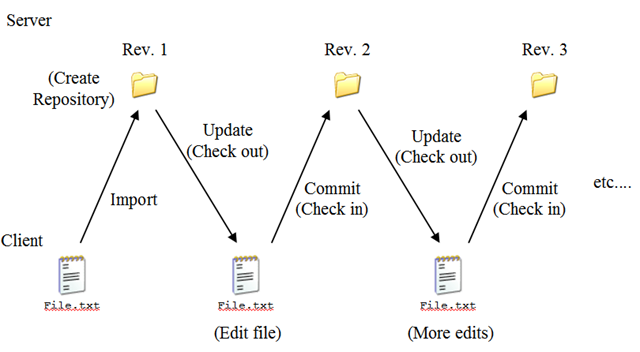
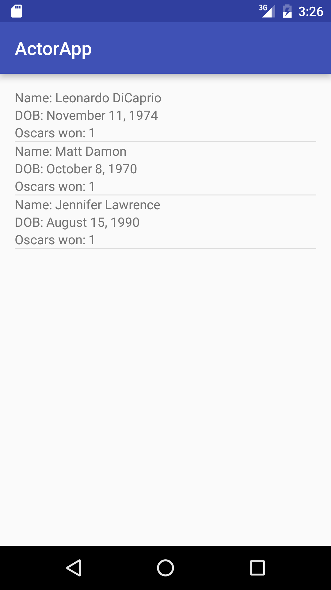

#Git Team Workflow Part 1

### Objectives
*After this lesson, students will be able to:*
- Describe the git flow model to organize code changes and collaborate as a team
- Use branches to isolate changes tied to specific features
- Efficiently and correctly resolve merge conflicts

### Prerequisites
*Before this lesson, students should already be able to:*
- Use Git/GitHub to fork, clone, push and pull
- Read through the following:
  1. https://www.atlassian.com/git/tutorials/using-branches
  2. https://www.atlassian.com/git/tutorials/comparing-workflows
  3. https://www.atlassian.com/git/tutorials/merging-vs-rebasing ('Conceptual Overview section)
  4. http://nvie.com/posts/a-successful-git-branching-model/
  
### LESSON GUIDE

| TIMING  | TYPE  | TOPIC  |
|:-:|---|---|
| 5 min  | [Review Basic Git Workflow - Intro](#review-basic-git-workflow-intro-5-mins)  |   |
| 15 min  | [Structure of a Git Repo with Branching - Demo](#structure-of-a-git-repo-with-branching-demo-15-mins)  |   |
| 1 min  | [Pull Requests and Merging - Intro](#pull-requests-and-merging-intro-10mins)  |   |
| 10 min  | [Create a Pull Request and Merge your work - Codealong](#create-a-pull-request-and-merge-your-work-codealong-10-mins)  |   |
| 5 min  | [Merge Actors! Independent Practice](#merge-actors-independent-practice-5-mins)  |   |
| 10 min  | [Merge Conflicts and Fetch - Demo](#merge-conflicts-and-fetch-demo-10-mins)  |   |
| 15 min  | [`fetch`, `checkout`, `merge` from the command line - Codealong](#fetch,-checkout,-merge-from-the-command-line-codealong-15-mins)  |   |
| 5 min  | [Conclusion](#conclusion-5-mins)  | Review / Recap |

## Review Basic Git Workflow - Intro (5 mins)

Although you've all been using Git and GitHub for over a month, it's still worthwhile to take a look at some of the core ideas of Git.

> Check: Have the students turn to their partner and explain how we have used git so far. What commands have we used?

#### Why Use Version Control?
When you're working on a project, you sometimes want to be able to retrace your steps, or even revert your project to a previous state.  And often (particularly in the workplace) you need a way to effectively collaborate on a single project without stepping on each others' toes. Version control tools address all of these needs.

#### Why Git?
Git, apart from being free and open source, is also in many ways a superior system to many older version control tools (such as Subversion) because it is a "distributed" version control tool. This means that there is no centralized approval structure for making changes to the project; instead, every student who clones the repository has their own complete copy, which they can then edit and change. This makes it much easier to use when working in groups.

**Subversion work flow**


>In addition, Git is much better at handling branching and merging, two big topics we'll be covering today.

#### How Does Git Work?
Git works by creating ['snapshots'](https://git-scm.com/book/en/v1/Getting-Started-Git-Basics), which record the current state of a repo. Each snapshot represents the state of the project at some moment in time.

To create a new snapshot, we use `git add` to select (or "stage") a file or files that have changed since our last snapshot, and `git commit` to actually create a new snapshot which includes those changes.

## Structure of a Git Repo with Branching - Demo (15 mins)

Remember, a Git repository can be imagined as a tree of interconnected nodes, each representing a commit/snapshot. Each of these nodes refers back to one (usually) previous node, which represents the state of the repository before that commit was made.


Each commit also has a unique name (which allows us to identify it) and a commit message (which tells us what changes the commit makes). `master`, above, is a __branch__ : a reference pointing to some commit in the 'tree' of our repository. New commits can only be made at the end of a branch.


#### Branching


In the diagram above, alongside `master`, there's another reference called `HEAD`.
`HEAD` indicates the point on the repository that we're reading from.
When we run `git branch`, new branches get added at wherever `HEAD` points.
For instance, if we were to run `git branch structure` on the repo above, here's what would happen.


In addition to specifying where new branches go, if HEAD is pointing at the end of a branch, it also means that new commits will be added to that branch.
If we want to start adding commits to our new `structure` branch instead of our `master` branch, we have to move `HEAD`; this is done using the command `git checkout`.
In particular, we want to check out the `structure` branch, so we would run `git checkout structure`.
Also, we could have created the `structure branch` and switched the head to that branch all in one command with `git checkout -b structure`.


New commits would then be placed onto the `structure` branch:

```bash
git add .
git commit -m 'Adds a folder for holding images
(using a .gitkeep as a placeholder until I put files there).'
```


> Check: Ask the students to describe how they could have used branching in their email apps

#### Adding Contributors

Adding contributors to a repo gives them write access to modify the files stored in the repo. This is located in the settings tab for each repo on GitHub.

### Create Actors List! Independent Practice (20 mins)

In the independent practice sections, throughout the rest of the lesson and the following lab, you'll work with the student next to you to create a working app by adding code to an existing project and using Git/GitHub to collaborate. Use the screenshot below as a guide for what we will be building.



You will need to work your way through creating layouts, an activity, and an adapter

To start:

- One student should make a new Android Studio project, then add it to a new GitHub repo on their account.
- Add the second student as a contributor to this repository
- The second student should clone the new repo, so they have a local copy and can start working. **Just clone the repo, do not fork it**

To practice using Git/GitHub as a team, you'll each split the work and build it on feature branches:

**Student 1** should create a new branch called `actor-layouts` and complete a layout for the Main Activity, as well as a custom layout to be used in the adapter.

**Student 2** should create a new branch called `actor-adapter-and-model` and create an `Actor` class as well as an `ActorRecyclerViewAdapter` class.

Now, each student should `git push origin <branch name>`.

## Pull Requests and Merging - Intro (10mins)

Take a look at the GitHub repository - new branches are created for you when you push from your local branches!  Now, you'll need a way to bring your changes to one version of the project. One way that Git allows us to do this is by __merging__ branches.


Merging creates a **new commit on your current branch** (on top of existing commits) that includes all of the changes made by another branch.
The syntax for doing this is `git merge some_branch`; in the context of this example, you'd have to `git checkout master` first because `some_branch` is the branch that you're pulling into your master branch.


This doesn't destroy your original branch; all those commits are still there. However, they're not carried over to the current branch, only their data is.

But wait!  GitHub has made a sweet web interface, that utilizes Pull Requests, to make this more approachable...

## Create a Pull Request and Merge your work - Codealong (10 mins)

#### What is a Pull Request?

From GitHub.com:

_"Pull requests let you tell others about changes you've pushed to a repository on GitHub. Once a pull request is sent, interested parties can review the set of changes, discuss potential modifications, and even push follow-up commits if necessary."_

If you pushed your branches up correctly and check your GitHub repo, you should see something like this:


<p align="center">

</p>

Click into either of the "Compare & pull request" buttons - you'll see a nice interface where you can compare branches, add a description for your pull request, and leave some extra text:

<p align='center'>

</p>

## Merge Actors! Independent Practice (5 mins)

Now it's time for you to create a pull request for `actor-layouts` branch and merge it in.  

By the way, you should always delete your remote branches after merging them into your master branch (so, do that now!).

Now, create and merge a pull request for the `actor-adapter-and-model` branch.  Click through your web repo to see that the work you and your partner did on the models is now in the master branch.

But, think about it: locally, your master branch is missing the merged version of the project. So, checkout the master branch and `git pull` to update your local copy.  Now, check to see that you have your partners work on your machine.

## Merge Conflicts and Fetch - Demo (10 mins)

Let's revisit our `master/structure` example.  What if someone got overzealous and made a change to `master` before we merged in `structure`? Well, if the change doesn't conflict with anything in `structure` - as in, we didn't edit the same files being worked on in `structure` probably nothing! Git tries very hard to merge automatically. However, sometimes there are conflicts that Git can't resolve on its own.


In those cases, instead of directly merging, Git asks the user to manually resolve the conflicts. In your project files, after trying to merge, those conflicts usually look something like this:

```java
  <<<<<<< HEAD
  int x = 1;
  int y = 2;
  =======
  int x;
  >>>>>>> other_branch
```

The first section is the version that exists on the current branch; the second section is the version that exists on the branch you're trying to pull in. Figure out which version of the code makes the most sense moving forward, delete the version that doesn't and all the extra stuff that Git adds (`<<<<<<<`, `=======`, etc.) and run `git commit` to finalize the merge.

For example, if we decided we only needed `int x`, delete the other "stuff":

```java
  int x;
```

## `fetch`, `checkout`, `merge` from the command line - Codealong (15 mins)

Remember when we said GitHub is really helpful - check it out:

<p align='center'>

</p>

Simply follow the directions to make this work!

```bash
git fetch origin
git checkout -b some-branch origin/some-branch
git merge master
```

> Note: Explain line by line what this is doing.

In the simplest terms, `git pull` is just like running `git fetch` followed by `git merge`:

_"When you fetch, Git gathers any commits from the target branch that do not exist in your current branch and stores them in your local repository. However, it does not merge them with your current branch. This is particularly useful if you need to keep your repository up to date, but are working on something that might break if you update your files. To integrate the commits into your master branch, you use merge."_ - StackOverflow.com

```bash
Auto-merging SOME_FILE
CONFLICT (content): Merge conflict in SOME_FILE
Auto-merging ANOTHER_FILE
CONFLICT (content): Merge conflict in ANOTHER_FILE
Automatic merge failed; fix conflicts and then commit the result.
```

Now, we have only the code we need and can `git commit`.  

>If, for whatever reason, you hit a merge conflict, Git and GitHub are _super_ helpful in helping you resolve your conflicts.

> Check: How could teams avoid causing merge conflicts?


## Conclusion (5 mins)

- Describe why branching is important in a team workflow.
- Identify the syntax needed to create a new branch. How about creating a new branch and switching to it?
- Why should you never work on the same files on different branches?
