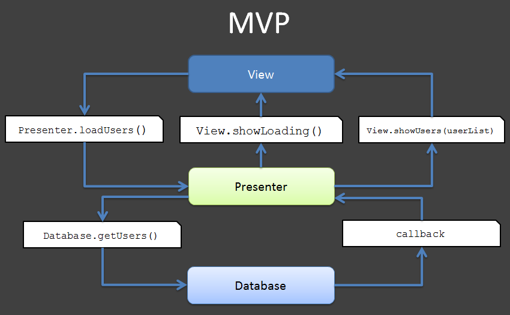

#  Model-View-Presenter Architecture

### LEARNING OBJECTIVES
*After this lesson, you will be able to:*
- Describe the downsides of Activities controlling everything
- Explain how MVP addresses those downsides
- Write a contract based on user stories
- Implement a View and Presenter to fulfill a contract

### STUDENT PRE-WORK
*Before this lesson, you should already be able to:*
- Write and implement Interfaces
- Use a local database
- Make network calls to an API

### INSTRUCTOR PREP
*Before this lesson, instructors will need to:*
- Read through the lesson
- Add additional instructor notes as needed
- Edit language or examples to fit your ideas and teaching style
- Open, read, run, and edit (optional) the starter and solution code to ensure it's working and that you agree with how the code was written

### LESSON GUIDE

| TIMING  | TYPE  | TOPIC  |
|:-:|---|---|
| 5 min  | [Opening](#opening)  | What problems does MVP solve? |
| 20 min  | [Introduction](#introduction)  | What is MVP? |
| 20 min  | [Demo](#demo)  | MVP in Action |
| 15 min  | [Guided Practice](#guided-practice)  | Writing a New Contract |
| 25 min  | [Independent Practice](#ind-practice)  | Implement the New Contract |
| 5 min  | [Conclusion](#conclusion-5-mins)  | Review / Recap |

---

<a name="opening"></a>
## Opening (5 mins)

Think about how you've organized your code in the apps you've built so far.
Most likely, your activities act as central hubs for the majority of "decision making" logic in your apps.
It's the activity that populates the views, responds to user events, reads/writes from a database, makes network calls to APIs, etc.
And on top of all that, it has to deal with its own lifecycle.

Decisions about how to respond to user input, what data to show when, and how to format data for the user are called **Business Logic**. 
This type of logic is really the heart of your app, and directly ties to your user stories.
Therefore, it's really important to write automated tests for your business logic!

There are two big downsides to putting all your business logic in your activities:
- Activity classes become very large and unwieldy
- Business logic becomes very hard to test since activities can't be unit tested; they require cumbersome Espresso testing

This common approach of letting the activity handle all the business logic and data storage decision making is sometimes called **Model-View-Controller** or MVC architecture, where the activity fills the role of the Controller.

If you google "software architecture patterns" or "Android architecture patterns" you'll see that developers have come up with many different solutions for these problems.
One of these solutions is **Model-View-Presenter** architecture, or **MVP** (not to be confused with minimum viable product, which is a design concept).

---

<a name="introduction"></a>
## Introduction: What is MVP? (20 mins)

MVP puts a new entity in the middle of the action, the **Presenter**.
This is the new home for the business logic, so it doesn't have to live in the activity.
It's the middle-man between the **View** (your fragment/activity) and your **Model** (your custom model class(es), your database, etc.), and makes all the decisions about how to respond to user input, and what data to give the user.

Crucially, this new Presenter class will be free of any Android framework code, so it can be _unit tested_ and doesn't require Espresso testing.



_Image credit: http://tech.vg.no/2015/07/17/android-databinding-goodbye-presenter-hello-viewmodel/_

In this approach "View" refers not just to the `android.view.View` class and its children (`TextView`, `ImageView`, etc.), but also to the classes which directly put data into those views.
Since we've removed business logic from activities and fragments, these "dumbed down" objects are now part of the View.
Your View simply shuttles data around:
- Receive data from the presenter, put it into a view
- Receive user input (clicks, typing in `EditText`s, etc.), pass it to the presenter.

#### Enforcing Roles with Contracts
How do you keep track of which responsibilities belong to the Presenter, and which belong to the View?

The answer is to begin by writing _interfaces_ that each entity must implement.
These interfaces act as **Contracts** that explicitly define what each entity _must_ do.
If any classes fail to implement all of the methods declared in their respective interface, it will lead to a compilation error, so you as the developer (or your teammate) are forced to adhere to the contract interface.

> Check: How would your contracts relate to your user stories? What might go wrong if you _don't_ write contracts?

There will be a pair of View and Presenter entities for each screen the user sees.
You'll have a 1 to 1 relationship between Views and Presenters in your app.

Your Presenter interface will be implemented by a new Java class for the Presenter.
Your View interface, on the other hand, will be implemented by a class you'd already have anyway, typically an activity or a fragment.
In our demo today we'll use fragments as our Views, but you can definitely use activities instead if that suits your app better.

#### Moving Data Storage Logic Out of the Presenter
So we've moved Business Logic out of the activity/fragment and into the Presenter.
What about logic to control how and where data is stored, like when to read/write to a database, and when to GET/POST to an API?
If we leave this in the Presenter, then it might end up just as unwieldy as our activities used to be. 

The answer, inevitably, is more interfaces! :)
We can write another contract that defines the responsibility of a data storage, or data repository entity.
The Presenter can then call the repository's methods whenever it needs to get or save data, and the Presenter no longer needs to worry about the specifics of where or how data is stored.


_Image credit: https://github.com/googlesamples/android-architecture/tree/todo-mvp/_

Moving all decisions about the logistics of data storage out of the Presenter enforces the separation between the **Presentation Layer** and the **Data Layer**.
The View and Presenter are no longer dependent on _how_ the Data Layer does its job, as long as the Data Layer continues to satisfy its contract.

> Check: Say we want to update an app to use a fancy new NoSQL database like Realm rather than SQLite. Under the above approach, would the Presenter need to be modified at all?

#### Wait, Why Are We Making So Many Classes and Interfaces???
The generic term for splitting up your code into distinct layers is **Separation of Concerns**.
This offers many advantages, including:

- _Maintainability:_ Changing the way one layer is implemented requires no changes at all to other layers, as long as the contract interfaces are upheld.

- _Simplified teamwork:_ You can work on implementing the Presenter even before your coworker has finished implementing the data layer, because you already know what methods you can call from the data entity thanks to the contract.

- _Flexibility for testing:_ When unit testing your Presenter, you can give it fake, or [**mock**](https://developer.android.com/training/testing/unit-testing/local-unit-tests.html#mocking-dependencies) implementations of its dependencies (the View and the data storage entity) so you can test the Presenter in isolation.

---

<a name="demo"></a>
## Demo: MVP in Action (20 mins)
Enough talk! What does the code look like?

In our demo app, the user can see trending products on one screen, and their favorite products on another screen.
Open up the [starter code](starter-code) and you'll see three sub-packages: `data`, `favorites`, and `trending`. 

Inside the packages you'll find (among other things):
- `trending` package
  - `TrendingContract` with interfaces for `TrendingContract.View` and `TrendingContract.Presenter`
  - `TrendingPresenter` which implements `TrendingContract.Presenter`
  - `TrendingFragment` which implements `TrendingContract.View`
- `data` package
  - `ProductsDataSource` interface as contract for the data layer
  - `MyProductsDataSource` which implements that interface
- In the `favorites` package, we'll update the following as practice later
  - `FavoritesContract` with interfaces for `FavoritesContract.View` and `FavoritesContract.Presenter`
  - `FavoritesPresenter` which will implement `FavoritesContract.Presenter`
  - `FavoritesFragment` which will implement `FavoritesContract.View`

You'll also notice `BaseView`, `BasePresenter`, and `BaseActivity` in the top level package.
These define functionality common to all other classes of their respective types.
They aren't part of the MVP concept, just an effort to adhere to the DRY (don't repeat yourself!) principle.

One very important note: there is no broad agreement on exactly what MVP should look like in an Android app.
Everyone does it differently.
You'll see both commonalities and stark differences between this demo and other samples you find online.
Feel free to deviate from this demo if you find a good reason to do so.
The concept of Separation of Concerns matters more than the exact implementation details.

#### Dependency Injection
Look at line 36 of `TrendingActivity`.
When we instantiate `TrendingPresenter` we give it View and DataSource objects as parameters to its constructor, rather than having the Presenter create those things itself.

This is an example of **Dependency Injection**, where the objects an entity depends on are injected into it, so the entity doesn't have to instantiate those dependencies.
In this case, we did it manually, but there are also libraries like [Dagger](http://google.github.io/dagger/) that can automate this process for you.

> Check: Why do you think dependency injection might be useful? How does it relate to mocking dependencies?

#### Callbacks
Now take a look at `ProductsDataSource` in the `data` package.
A class that implements this contract should do most of its work _asynchronously_, on a worker thread, since it requires slow operations like network calls and database access.
The problem with an asynchronous approach is that somehow these methods will still need to pass data back to their caller when they complete.

To solve this, we have the two sub-interfaces for **Callback** objects.
The idea is to have the caller write an _anonymous implementation_ of the Callback interface when it makes its call (sort of like when you write an anonymous implementation of `OnClickListener` when you want to set one on a view).
The data entity can then do work on a background thread, then upon completion call the method from the anonymous Callback object back on the main thread.

---

<a name="guided-practice"></a>
## Guided Practice: Writing a New Contract (15 mins)
Let's write the `FavoritesContract` to make sure it satisfies the [user stories](starter-code/user-stories.md).

```java
interface FavoritesContract {

  interface View extends BaseView<Presenter> {

        // Per user stories, user must be able to view a list of favorites products
        void displayProducts(@NonNull List<Product> products);

        // Per user stories, the list should update when a product is removed from favorites
        void removeProductFromList(int productId);

        // Per user stories, the user should receive a message when a product is removed from favorites
        void notifyUserProductWasRemoved(@NonNull String message, @NonNull Product product);
    
  }

  interface Presenter extends BasePresenter {

        // Per user stories, the user must be able to click an icon to remove a product from favorites
        void onProductUnFavoriteIconClicked(@NonNull Product product);

        // Per user stories, the user must have the opportunity to UNDO a removal
        void onProductRemovalReversed(@NonNull Product product);
  }
}
```
> Check: Why were the responsibilities divided up this way? Why is it the Presenter, not the View, that has the `onProductUnFavoriteIconClicked()` method?

---

<a name="ind-practice"></a>
## Independent Practice: Implement the New Contract (25 minutes)
> Note: This can be a pair programming activity or done independently.

Update the stub Java class `FavoritesPresenter` to make it implement `FavoritesContract.Presenter`. 
Add and implement the necessary methods.
Remember you can call methods from the injected `mView` and `mDataSource` objects when needed.

Next, go to line 90 of `FavoritesFragment`.
This class should implement `FavoritesContract.View`.
The necessary method stubs are there, but their bodies are empty.
Finish the implementation by writing the bodies of these methods.

> Check: Were students able to implement the contracts successfully?

---

<a name="conclusion"></a>
## Conclusion (5 mins)
MVP is one of many architecture patterns that can help you achieve Separation of Concerns and make your job easier in the long run, albeit at the expense of a steep learning curve in the short run.
It's grown popular in the Android community over the last few years, and getting comfortable with it will not only make you more marketable, but will help move you along the spectrum from developer to true software engineer.

> Check: Recap the new concepts from this lesson
- Business Logic
- MVC
- MVP
- Contracts
- Separation of Concerns
- Dependency Injection
- Callbacks

---

### ADDITIONAL RESOURCES
- [Google's Android Architecture Samples](https://github.com/googlesamples/android-architecture) - full code for a demo app written in a variety of different architectures - incredibly helpful learning tool!
- [Clean Architecture](https://8thlight.com/blog/uncle-bob/2012/08/13/the-clean-architecture.html) - core principles for writing maintainable, testable code
- [MVP vs MVVM](http://tech.vg.no/2015/07/17/android-databinding-goodbye-presenter-hello-viewmodel/) - another pattern to consider: Mode-View-ViewModel
- [Mocking Dependencies for Testing](https://developer.android.com/training/testing/unit-testing/local-unit-tests.html#mocking-dependencies)
