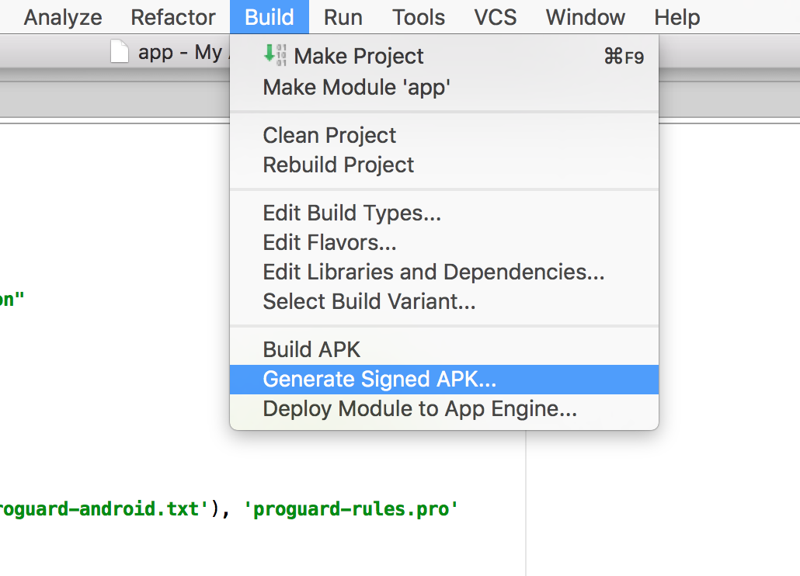
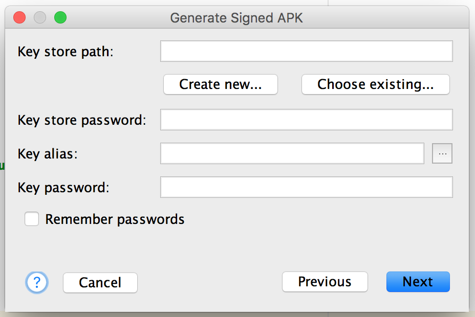
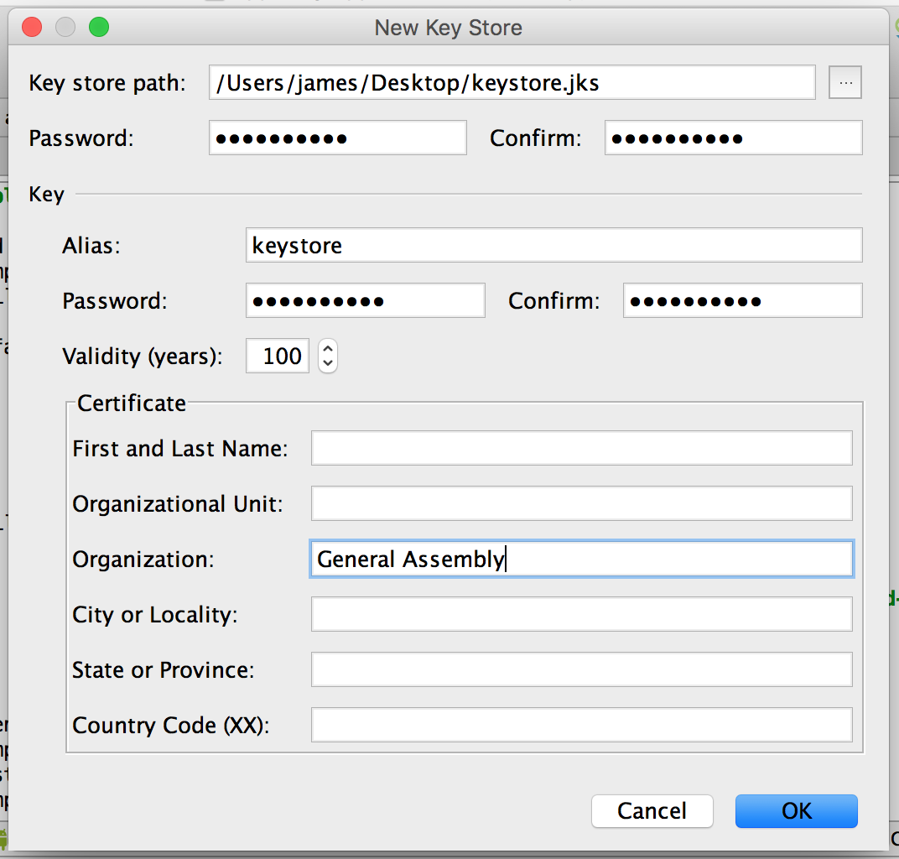
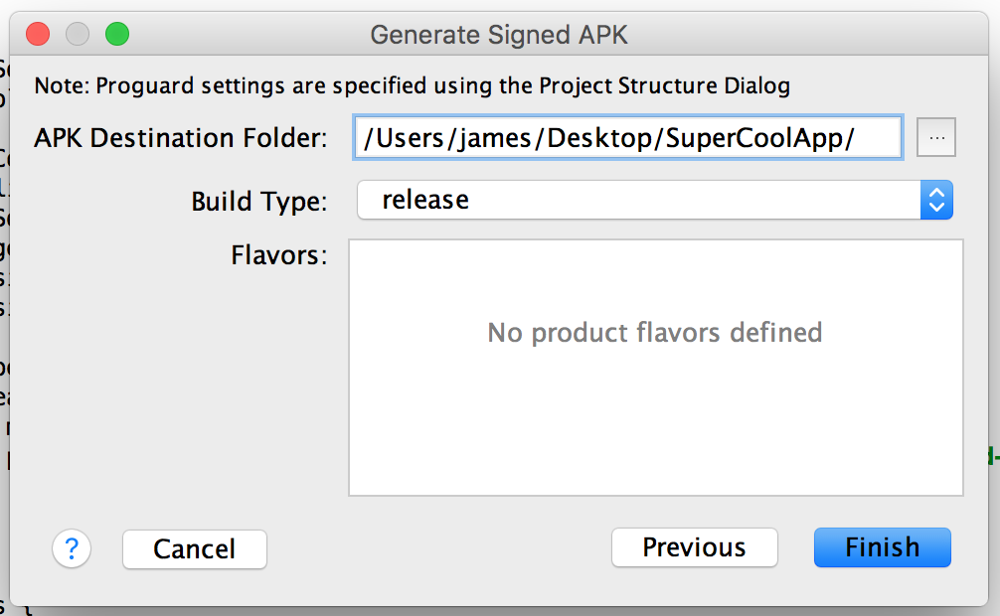
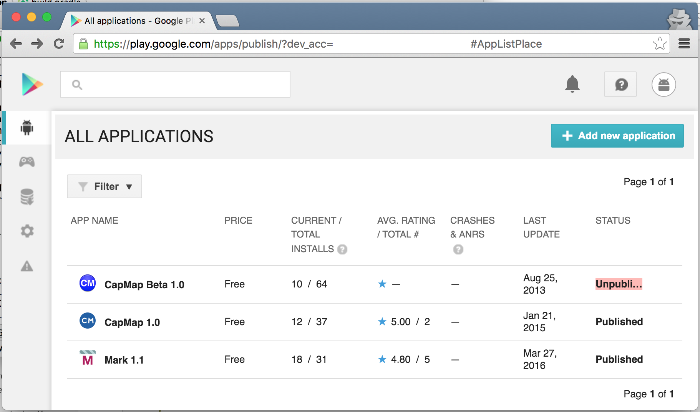
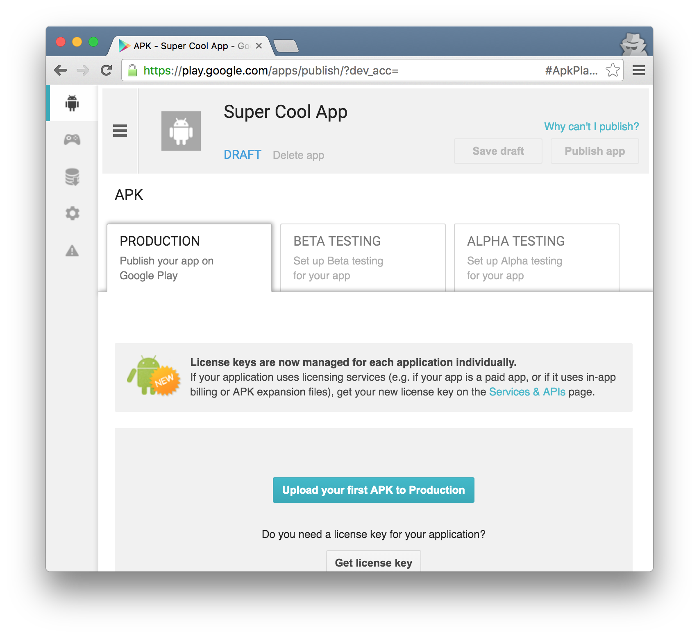

#  Releasing your apps

### LEARNING OBJECTIVES
*After this lesson, students will be able to:*

- Build a shareable, executable APK of an app
- Explain the basics of the Google Play Developer Console
- Upload an app to the Play Store

### STUDENT PRE-WORK
*Before this lesson, students should:*

- Have a Google Play Developer account
  - Instructions here: https://support.google.com/googleplay/android-developer/answer/6112435?hl=en
  - There's a $25 one-time fee.

### INSTRUCTOR PREP
*Before this lesson, instructors will need to:*
- Read through the lesson
- Add additional instructor notes as needed
- Edit language or examples to fit your ideas and teaching style
- Open, read, run, and edit (optional) the starter and solution code to ensure it's working and that you agree with how the code was written
- Note: This lesson is very dense; be sure students know this will be mostly a walk through because there are so many steps and each step is important

---

### LESSON GUIDE

| TIMING  | TYPE  | TOPIC  |
|:-:|---|---|
| 10 min  | [Opening](#opening-10-mins)  | Discuss lesson objectives |
| 35 min  | [Demo](#demo-preparing-your-app-for-release-35-mins)  | Preparing your app for release |
| 5 min  | [Conclusion](#conclusion-5-mins)  | Review / Recap |

## Opening (10 mins)

At this point, you should know how to develop apps! You have come a long way, and are probably ready to share your work with the world.

When looking for a job in app development, employers usually require that you have one app released and downloadable from some app store ([Google Play](https://play.google.com/), [Amazon's Appstore](http://www.amazon.com/mobile-apps/b/ref=nav_shopall_adr_app?ie=UTF8&node=2350149011), [Apple's App Store on iTunes](http://www.apple.com/itunes/), etc.).


This is important for a few reasons:

* Having an app on the store shows that you are confident in your skills. Your app is at a point where you feel it is widely usable.
* Apps in a store are much more accessible than receiving a file, or source code.
* If you have multiple apps, they are all on one place.
* It shows that you are able to finish something! You executed a plan and delivered on it.
  * There are so many cases where developers have a good, stable app, but they never upload it because they always have "just one more feature" to make it perfect.
  * Know when you are done. Aim for a minimum viable product, make it pretty, then release it! If your users can use it right now, give them the app now. Any features you want to implement can be added later.
  * Sorry I can't stop typing! Another point: it's usually better to upload the simplest version of your app now, instead of cramming as many features as possible before release. Too many features might be overwhelming to the user, and may not be needed in the first place.

This lesson, you will learn how to build your app, bundle it up, and send it off to an app store (namely, Google Play).

## Demo: Preparing your app for release (35 mins)

Before you upload your app anywhere, you have to wrap it up and put a bow on it. There are a few steps you have to take before stores like Google Play consider your app.

### Step 1: Clean up your app's metadata

There are a couple of values that are automatically pulled from your app - its version and package name. Hopefully, this should be setup correctly already. However, if you are not careful, these fields can prevent you from uploading your app!

Open your final projects to follow along. You can also create a new project with all of the default options. It doesn't matter, but you might want to do this in your final project!


##### app/build.gradle

Open the app's build.gradle. Here's an example for a new project's file:

```gradle
  apply plugin: 'com.android.application'

  android {
      compileSdkVersion 23
      buildToolsVersion "23.0.3"

      defaultConfig {
          applicationId "ly.generalassemb.myapplication"
          minSdkVersion 16
          targetSdkVersion 23
          versionCode 1
          versionName "1.0"
      }
      buildTypes {
          release {
              minifyEnabled false
              proguardFiles getDefaultProguardFile('proguard-android.txt'), 'proguard-rules.pro'
          }
      }
  }

  dependencies {
      compile fileTree(dir: 'libs', include: ['*.jar'])
      testCompile 'junit:junit:4.12'
      compile 'com.android.support:appcompat-v7:23.3.0'
  }
```

The important fields are in the `defaultConfig` block: `versionCode` and `versionName`.

* `versionCode` is the version number of your app. It can be any positive number. The idea is that, for every release, you increment the number by 1.
  * This is not very important the first time (and should be left as 1). However, if you already have an older version of your app on Google Play, then the version you're uploading ***must*** have a higher number. Otherwise, Google Play will refuse your upload!
  * One random, yet devastating, rule of thumb: Keep your version numbers as low as possible. The highest number you can use is `Integer.MAX` (which is 2,147,483,647). There is no integer higher than this. So, if you upload an app with `versionCode 2147483647`, then you cannot upload anything more for that app _ever again_... _EVER. AGAIN._
* `versionName` is a String representation of your app's version. This is shown to the user. There's no real restriction; you app's version name can me "2.0", "3.5 Beta", "Lollipop", "Anything I want 3.2", etc. Just make sure it's descriptive enough so your users know that it's an upgrade.

Okay! Before we move on, look at the `dependencies` block. If you have any dependencies that you aren't using, remove them now (or comment them out). No need to upload an app with unnecessary code in it. Make your app as small as possible.


##### app/src/main/AndroidManifest.xml

In your manifest, there's only one required field to look out for: package name.

```xml
  <manifest xmlns:android="http://schemas.android.com/apk/res/android"
      package="ly.generalassemb.myapplication">

      <application >
          ...
      </application>

  </manifest>

```

When you made your project, if you chose any package that does not start with `com.example`, then you are good! Google Play will look at your app and spit it back at you if it starts with the default package.

Literally choose _anything else_ that's not taken. Remember, the package does not have to correspond to an actual website; `generalassembly.com` does not have to exist for you to use the `com.generalassembly.myapp` package. `com.yourname.appname` or `com.firstname.lastname.appname` are usually safe bets.

The hard part about this is if you already have `com.example.` as your package name, you can't just change it here. You'll have to change it throughout _your entire app_: every class, every xml file, every reference to it.

Fixing this is outside the scope of this lesson. However, here's a guide (with pictures) on how to change your project's package name fairly easily: http://stackoverflow.com/a/29092698/6104622

Alright, before we move on again, this is the perfect time to look at your app permissions and prune the ones you are not using:

```xml
  <manifest xmlns:android="http://schemas.android.com/apk/res/android"
      package="ly.generalassemb.myapplication">

      <uses-permission android:name="android.permission.ACCESS_COARSE_LOCATION" />
      <uses-permission android:name="android.permission.ACCESS_FINE_LOCATION" />
      <uses-permission android:name="android.permission.INTERNET" />
      <uses-permission android:name="android.permission.CALL_PHONE" />

      <application >
          ...
      </application>
  </manifest>

```


Well, the Facebook Permission Controversy comes to mind. In 2013, a [Huffington Post article](http://www.huffingtonpost.com/sam-fiorella/the-insidiousness-of-face_b_4365645.html), written by someone not very tech savvy, struck horror in millions of users of the Facebook Messenger app. Having so many permissions seemed suspicious, as if Facebook was trying to access everything about a user. In reality, the app does need all of those permissions, but it still put people on edge.

Moral of the story: remove the permissions you do not need. If a user sees that your app needs to access their contacts, and the app doesn't have to, it might spark unnecessary hate!


#### Step 2: Create your app's APK file

##### What is an APK?

An [Android Application Package](https://en.wikipedia.org/wiki/Android_application_package) file, or APK file, is how we distribute and install Android apps.

Think of it like an EXE file for Windows, or a DMG file for Mac OSX.

If you download an APK onto your phone, you can open and install an app from it directly. You provide these files to a store so it can be downloaded and installed easily.

You've been creating APKs throughout this course: every time you press the Run (Play) button! When you build your app, an APK can be found in `app/build/outputs/apk/` folder of your project.

These files are Debug APKs, meaning that they can be installed but are not suitable for release. You could not upload these to Google Play. You'll have to...

##### Build Release-Ready APKs

Let's do this step-by-step.

First, in Android Studio, go to `Build > Generate Signed APK...`.

<p align="center">
  
</p>

Select the app module and press _next_. You should see the `Generate Signed APK` window.

<p align="center">
  
</p>

This window introduces the concept of a Keystore.

A **Keystore** is a binary file that contains a set of private keys. A **Key** is a collection of information about the developer or company uploading the app.

It's a password-protected file that contains the keys of all of the apps you develop with it. You use it to sign your app, which says that your app is officially your app, and no one else's.

If someone tried uploading an unsigned APK to Google Play, it would be rejected. So, you sign your app before uploading.

The thing about this file is that it's highly sensitive; if someone you don't know has your keystore and your password, they can distribute your apps as their own! You'll have to put it in a safe place.

Okay, the Keystore path is probably empty. If you don't have a Keystore file, click on "Create new..."

<p align="center">
  
</p>

Fill out the fields:

* Key store path: Where you want to save the Keystore
* The password for the Keystore
* The new Key information:
  * Key alias: What you call the Key
  * Password for the Key
  * Validity: How long you want the key to be valid. There's no limit, so I usually say 100 years.
  * Certificate Information: The description of you, the uploader.
    * You don't have to fill out everything. You do, however, have to fill out at least one of these fields.

    Remember these aliases and passwords, as you'll need them for your future apps.

Once you're done, press OK.

The _Generate Signed APK_ window should be all filled out now. Click Next.

You'll be asked to setup a Master Password. Up to you, but not required. Fill out or leave blank. Click Next.

<p align="center">
  
</p>

The final screen, finally. Select an existing folder where you want to save your APK. Select the `release` Build Type. Ignore the rest. Click _Finish_.

After a short song and dance, the APK is generated in the folder you specified. Great!

Let's finish this!

#### Step 3: Upload your APK to Google Play

_NOTE: Again, there are a few places to upload your app. We'll be using Google Play._

Open the [Google Developer Console, https://play.google.com/apps/publish/](https://play.google.com/apps/publish/). Sign in to your account.

<p align="center">
  
</p>

Here's the first screen of the console. Here's you can see a list of your past apps, if any, and a bunch of other stuff.

It's worth saying that uploading APK files are just the tip of the iceberg. There are many things you can do; many things that are not in the scope of this lesson. You can look at Google's info on it here: [http://developer.android.com/distribute/googleplay/developer-console.html](http://developer.android.com/distribute/googleplay/developer-console.html).

Click "Add new application..."

Enter your app's name in the _Title_ field. This is how it's displayed in the store.

Click on "Upload APK", and you'll be brought to the APK management screen for your app. Here, you'll see a list of versions of your app, if any.

<p align="center">
  
</p>

You will see three tabs: Production, Beta Testing, and Alpha Testing. You can upload your APK in any of these tabs.

* The *Production* tab houses the apps you have that are live on the store right now.
* *Beta Testing* is similar to Production. Users can provide feedback, just without affecting your rating.
* *Alpha Testing* just releases your app to a small group of people (a test group) that you choose.

I'll click on Alpha Testing. Click _Upload APK to Production_. A dialog should pop up; upload your APK.

Afterward, you will see your APK uploaded.

However, the "Publish App" button on the top right is disabled. If you look on the left, there's now a checklist.

<p align="center">
  
</p>

Everything with a grey check is required before your app is featured publicly on the store. This is mostly just setting up your page with a description, pics of your app, pricing (if any), and rating.

These are fairly straightforward. Go to each section and fill out the required fields.

After everything is set and all of the checkmarks are green, the "Publish App" button will be highlighted. Click the button and your app is published!

It might take anywhere from 20 minutes to a few hours before your app is visible on the store, so be patient.

## Conclusion (5 mins)

- What is an APK?
- What is the Google Play Console?
- What is the difference between Production, Beta, and Alpha?

## Additional resources

* [Google Play Developer Console - https://play.google.com/apps/publish/](https://play.google.com/apps/publish/)
* [Android Developer - Distribution](http://developer.android.com/distribute/index.html)
