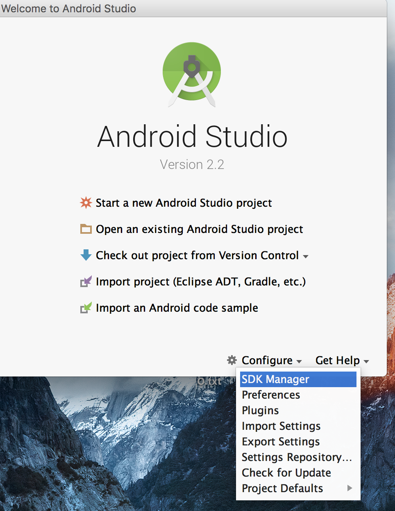
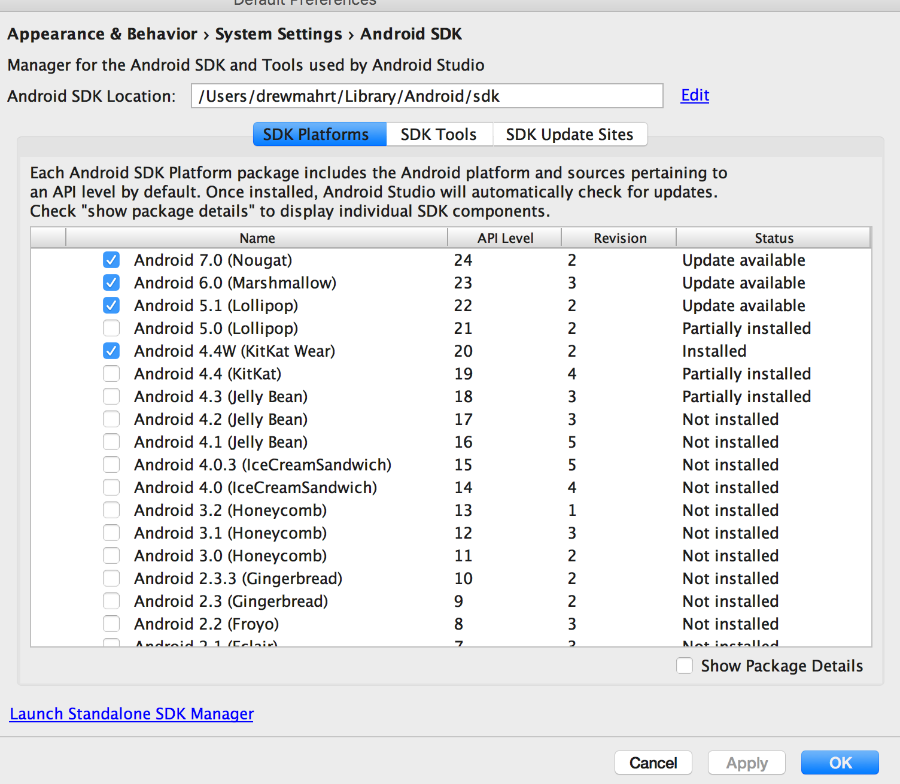
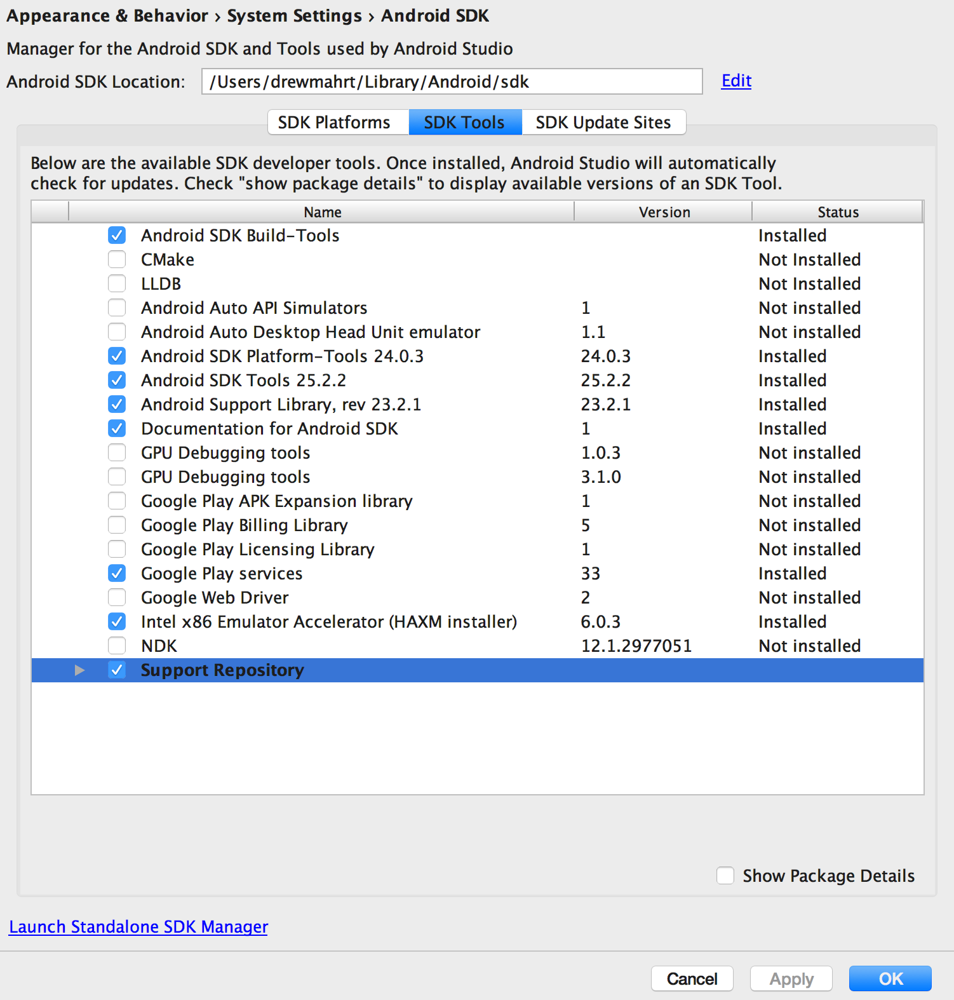

# Android SDK Installation

Follow the steps below to set up your Android SDK.

Open Android Studio, and click Configure -> SKD Manager

Select the SDK Platforms tab at the top, and check "Android 7.0 (Nougat)". You can check additional versions if you would like, but you must install 7.0. Press apply and let the SDK download.

Select the SDK Tools tab at the top, and select the options in the screenshot. Press apply once you have selected them, and let the tools download.
